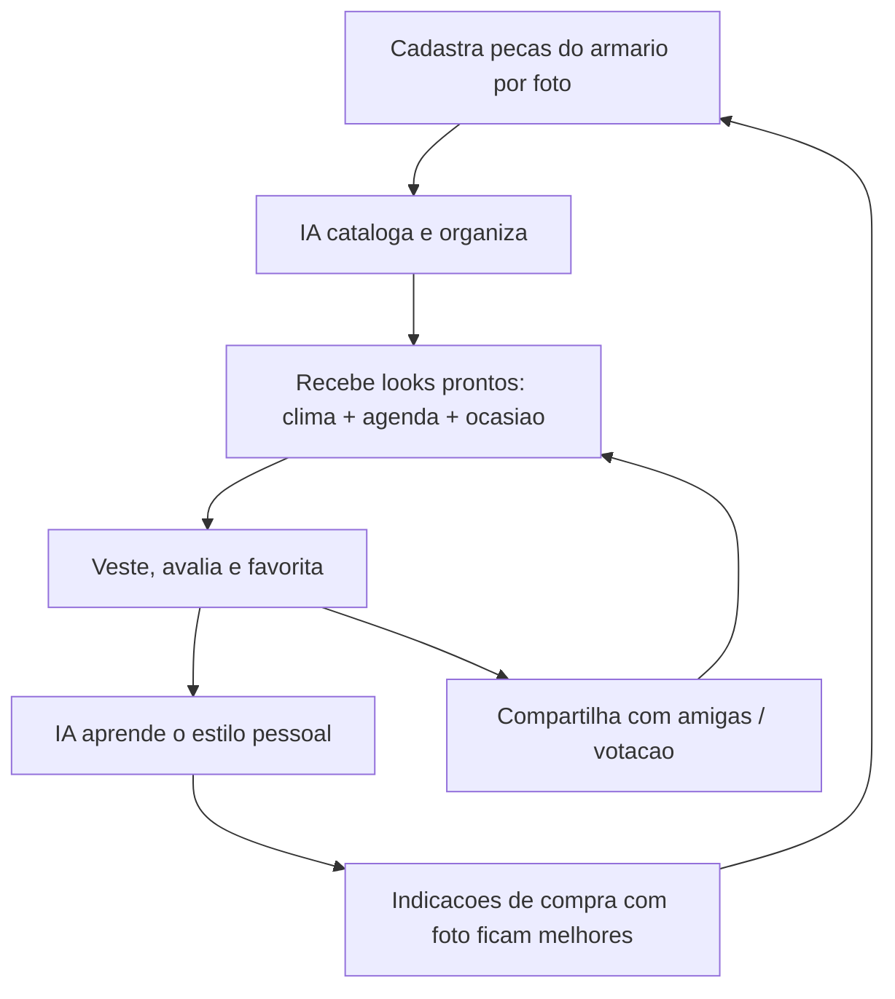

# Visão e Ideias — App de Montagem de Looks (público feminino)

> [!abstract] Resumo executivo
> App mobile brasileiro que monta looks para mulheres, combinando **armário virtual + IA + indicações fotográficas das melhores opções do mercado**, com **segurança e privacidade como pilar central** (fotos pessoais são dado sensível). Três planos: **Grátis**, **Medium R$ 19,90/mês** e **Premium R$ 24,90/mês** — detalhamento em [[04-assinaturas-precos]]. Cenário competitivo em [[03-concorrentes]].

## 1. Visão e posicionamento

### 1.1 Declaração de visão

Ser o aplicativo em que a mulher brasileira decide **o que vestir em menos de 2 minutos**, com confiança: o app conhece o armário dela, o clima da cidade, a agenda do dia e o estilo pessoal — e mostra **fotos reais de looks recomendados**, não listas de texto.

### 1.2 Posicionamento

- **Para quem**: mulheres brasileiras de 18 a 45 anos que perdem tempo todo dia decidindo o que vestir, compram peças que nunca usam ou querem se vestir melhor sem gastar mais.
- **O que é**: um stylist de bolso que monta looks com as peças que ela já tem e indica, com fotos, as melhores opções do mercado quando falta algo.
- **Diferente de**: apps de e-commerce (querem vender sempre) e apps de closet gringos (não entendem clima, marcas, numeração e bolso do Brasil).
- **Por quê acreditar**: privacidade tratada como produto (LGPD by design, ver [[06-seguranca]]), indicações fotográficas curadas e IA que aprende com o feedback da usuária.

### 1.3 Pilares do produto

| Pilar | O que significa na prática |
| --- | --- |
| Indicações fotográficas | Todo look recomendado chega como imagem (real ou gerada), nunca só texto; feed visual tipo lookbook |
| Segurança máxima | Fotos pessoais criptografadas, consentimento granular, nada de treino de IA com foto da usuária sem opt-in explícito; LGPD como requisito de MVP ([[06-seguranca]]) |
| Melhores opções do mercado | Curadoria de peças e marcas (nacionais e fast fashion presentes no BR) com preço em R$, parcelamento e link de compra |
| Assinatura acessível | Grátis generoso para criar hábito; Medium R$ 19,90 e Premium R$ 24,90 com valor claro por degrau ([[04-assinaturas-precos]]) |

### 1.4 Loop central do produto

> [!important] Regra de ouro do posicionamento
> O app **monta looks primeiro, vende depois**. A indicação de compra só aparece quando resolve um problema real ("falta um blazer neutro no seu armário"), nunca como vitrine agressiva. Isso é o oposto do e-commerce e é o que gera confiança.

## 2. Personas

### Persona 1 — Camila, 27, analista de marketing (São Paulo, SP)

| Atributo | Detalhe |
| --- | --- |
| Perfil | CLT híbrido (3x escritório), classe B, mora sozinha em apê alugado na Zona Oeste |
| Renda | R$ 5.500/mês; gasta R$ 250–400/mês com roupa, quase sempre parcelado |
| Comportamento | Pinterest e TikTok para referência; compra em Shein, Renner e Zara; guarda-roupa cheio mas "sem nada para vestir" |
| Dores | Perde 20 min toda manhã decidindo o look; repete as mesmas 10 peças; compra por impulso e se arrepende |
| Objetivos | Parecer bem-vestida no trabalho e nos rolês sem estourar o cartão; usar o que já tem |
| Gatilho de assinatura | Plano Medium quando perceber que o "look do dia com clima + agenda" economiza tempo real toda manhã |
| Sensibilidade à privacidade | Média — aceita subir fotos das peças, mas selfie de corpo só com garantia clara de privacidade |

### Persona 2 — Renata, 38, advogada e mãe (Belo Horizonte, MG)

| Atributo | Detalhe |
| --- | --- |
| Perfil | Sócia de escritório, casada, dois filhos (4 e 9), agenda apertada, viaja a trabalho 1–2x/mês |
| Renda | R$ 18.000/mês; compra menos vezes, tíquete maior (Animale, Cori, alfaiataria) |
| Comportamento | Zero paciência para apps confusos; paga por conveniência sem pestanejar; corpo mudou pós-gestações e as referências antigas não servem mais |
| Dores | Não tem tempo de pensar em roupa; mala de viagem é sempre estresse; eventos (audiência, jantar, festa da escola) exigem looks diferentes no mesmo dia |
| Objetivos | Abrir o app e ter a semana resolvida; mala de viagem montada em 5 minutos |
| Gatilho de assinatura | Premium direto — quer stylist virtual, mala de viagem e prioridade; R$ 24,90 é irrelevante perto do tempo economizado |
| Sensibilidade à privacidade | Alta — advogada, conhece LGPD; a garantia de segurança é condição de uso, não bônus |

### Persona 3 — Larissa, 21, universitária e estagiária (Recife, PE)

| Atributo | Detalhe |
| --- | --- |
| Perfil | Estuda ADM à noite, estágio de dia; mora com os pais; muito ativa em redes sociais |
| Renda | R$ 1.400/mês de bolsa; roupa via brechó, Shein e trocas com amigas |
| Comportamento | Cria conteúdo de look no TikTok; ama desafios e votação entre amigas; clima quente o ano todo muda tudo (nada de look de "outono europeu") |
| Dores | Orçamento mínimo com desejo máximo de variedade; sente que apps de moda ignoram o Nordeste e corpos reais |
| Objetivos | Maximizar combinações com poucas peças; achar peça boa e barata (brechó incluso); engajar amigas |
| Gatilho de assinatura | Fica no Grátis por meses; converte para Medium por recurso social/IA que virar hábito (votação, foto vestindo o look) |
| Sensibilidade à privacidade | Baixa declarada, alta real — compartilha muito, mas um vazamento a faria desinstalar e detonar o app publicamente |

> [!tip] Implicação direta das personas
> Camila valida o **hábito diário** (retenção), Renata valida o **Premium** (receita), Larissa valida o **social/viral** (aquisição). Cada fase do roadmap deve mirar uma delas explicitamente.

## 3. Banco de ideias de features (43 ideias)

Legenda — **Fase**: MVP / v2 / v3 · **Tier**: Grátis / Medium / Premium (tier indica onde o recurso fica liberado por completo; versões limitadas podem existir no tier abaixo — regra detalhada em [[04-assinaturas-precos]]).

### 3.1 Montagem de looks

| # | Ideia | Descrição | Fase | Tier |
| --- | --- | --- | --- | --- |
| 1 | Montagem manual (canvas) | Arrastar e soltar peças do armário num canvas para compor o look; salvar e nomear | MVP | Grátis |
| 2 | Look automático por IA | Botão "monte para mim": IA combina peças do armário respeitando cor, estilo e histórico | MVP | Grátis (3/semana) → Medium (ilimitado) |
| 3 | Looks por ocasião | Templates: trabalho, entrevista, culto, casamento, festa junina, praia, academia, date | MVP | Grátis |
| 4 | Looks por clima (API de tempo) | Integração com API de previsão (ex.: OpenWeather) pela cidade da usuária; look do dia considera chuva, calor e amplitude térmica | MVP | Medium |
| 5 | Looks por calendário/agenda | Lê a agenda (Google Calendar, com consentimento) e sugere look por compromisso: reunião 9h + jantar 20h = 1 base com troca de peças | v2 | Premium |
| 6 | Notificação "look do dia" | Push matinal com o look pronto (clima + agenda); horário configurável | MVP | Medium |
| 7 | Cápsula / mix & match | Gera matriz de combinações a partir de N peças escolhidas ("essas 8 peças dão 22 looks") | v2 | Medium |

### 3.2 Armário virtual

| # | Ideia | Descrição | Fase | Tier |
| --- | --- | --- | --- | --- |
| 8 | Cadastro de peça por foto | Fotografar a peça no app; upload em lote da galeria | MVP | Grátis (até 40 peças) → Medium (ilimitado) |
| 9 | Remoção automática de fundo | Recorte da peça no upload para visual limpo no canvas e no catálogo | MVP | Grátis |
| 10 | Catalogação automática por IA | IA classifica categoria, cor, estampa, tecido aparente e estação; usuária só confirma | MVP | Medium (no Grátis, classificação manual) |
| 11 | Importação por e-mail/nota de compra | Encaminha e-mail de pedido (Renner, Shein etc.) e o app cadastra a peça com foto do produto | v3 | Premium |
| 12 | Estatísticas do armário | Dashboard: distribuição por cor/categoria, valor total estimado, peças por estação | v2 | Medium |
| 13 | Etiqueta/código de barras | Escanear etiqueta de peça nova para cadastro instantâneo com dados oficiais do produto | v3 | Medium |

### 3.3 Indicações com fotos (pilar do produto)

| # | Ideia | Descrição | Fase | Tier |
| --- | --- | --- | --- | --- |
| 14 | Feed de looks recomendados | Feed visual personalizado com fotos de looks (reais e geradas) filtrado por estilo, corpo, clima e orçamento | MVP | Grátis (com anúncios) → Medium (sem anúncios) |
| 15 | Lookbooks de influenciadoras | Coleções assinadas por influenciadoras brasileiras, atualizadas semanalmente | v2 | Medium |
| 16 | Shop-the-look (afiliados) | Toda foto de indicação tem as peças identificadas com preço em R$ e link afiliado (Renner, C&A, Amazon, Shein, Dafiti) | MVP | Grátis (é receita, não paywall) |
| 17 | Comparador de preços | Mesma peça (ou similar) em várias lojas, ordenado por preço e frete | v2 | Medium |
| 18 | Alerta de promoção | Peça favoritada entra em promoção → push com a foto e o novo preço | v2 | Medium |
| 19 | "Complete o look" | IA detecta a lacuna do armário ("falta calça alfaiataria preta") e indica as 3 melhores opções do mercado com foto | v2 | Premium |

### 3.4 Social

| # | Ideia | Descrição | Fase | Tier |
| --- | --- | --- | --- | --- |
| 20 | Compartilhar look | Exportar card bonito do look para stories/WhatsApp com marca d'água do app (aquisição orgânica) | MVP | Grátis |
| 21 | Seguir amigas e perfis | Rede interna: seguir amigas e criadoras, ver looks públicos (privado por padrão) | v2 | Grátis |
| 22 | Votação "qual look?" | Publica 2–4 opções e amigas votam em enquete com tempo limite; resultado com estatística | MVP | Grátis |
| 23 | Desafios semanais | Desafio temático ("look monocromático", "peça mais antiga do armário") com ranking e selos | v2 | Grátis (premiação melhor p/ assinantes) |
| 24 | Comunidades por estilo | Grupos: minimalista, romântica, streetwear, plus size, evangélica, corporativa | v3 | Medium |
| 25 | Batalha de looks | Duelo 1x1 de looks dentro de um tema; ranking mensal | v3 | Grátis |

### 3.5 Inteligência artificial

| # | Ideia | Descrição | Fase | Tier |
| --- | --- | --- | --- | --- |
| 26 | Stylist virtual por chat | Chat em PT-BR: "tenho casamento na praia em novembro, o que uso?" — responde com fotos e peças do armário dela | v2 | Medium (20 msgs/mês) → Premium (ilimitado) |
| 27 | Análise de coloração pessoal | Selfie com luz natural → cartela (inverno escuro, primavera clara etc.) aplicada como filtro em looks e indicações | v2 | Premium |
| 28 | Análise de body shape | Medidas ou foto (opt-in explícito) → silhueta e recomendações de caimento; linguagem positiva, nunca "esconda o corpo" | v2 | Premium |
| 29 | Provador virtual AR | Sobreposição de peças em tempo real pela câmera | v3 | Premium |
| 30 | Foto sua vestindo o look (IA generativa) | Gera imagem realista da usuária com o look montado; consentimento granular, processamento seguro, imagem nunca usada para treino ([[06-seguranca]]) | v3 | Premium (recurso âncora do plano) |
| 31 | Busca visual | Fotografou um look na rua/Pinterest → app encontra peças iguais/similares no mercado e no armário dela | v3 | Medium |
| 32 | Recomendação de tamanho | Cruza medidas da usuária com tabela real de cada marca BR ("na Renner você é M, nessa Shein peça G") | v3 | Premium |

### 3.6 Utilidades

| # | Ideia | Descrição | Fase | Tier |
| --- | --- | --- | --- | --- |
| 33 | Mala de viagem | Informa destino + datas + eventos → app monta a mala com looks por dia usando clima do destino; checklist de itens | v2 | Premium |
| 34 | Custo por uso | Preço da peça ÷ vezes usada; mostra "essa blusa de R$ 90 já custou R$ 4,50/uso" | v2 | Medium |
| 35 | Peças paradas | Alerta de peças sem uso há 90+ dias com sugestão: montar look com ela, vender no brechó ou doar | v2 | Medium |
| 36 | Compra consciente | Antes de indicar compra, mostra "você já tem 3 peças parecidas"; score de aproveitamento do armário | v2 | Grátis (bandeira de confiança da marca) |
| 37 | Planner semanal de looks | Planejar domingo à noite os looks da semana em grade; sincroniza com a notificação diária | MVP | Medium |
| 38 | Diário de looks | Registro do que usou em cada dia/evento ("não repetir look no aniversário da sogra"); busca por evento | v2 | Grátis |

### 3.7 Monetização extra

| # | Ideia | Descrição | Fase | Tier |
| --- | --- | --- | --- | --- |
| 39 | Brechó integrado | Marketplace C2C de peças do armário virtual (já fotografadas e catalogadas); comissão de 10–15% por venda | v3 | Grátis (comissão menor p/ Premium) |
| 40 | Personal stylist humana | Sessão por vídeo/chat com stylist parceira; agendamento e pagamento no app (take rate 20%) | v3 | Premium (1 sessão/trimestre com desconto) |
| 41 | Cashback de compras | Parte da comissão de afiliado volta como cashback em dinheiro ou desconto na assinatura | v3 | Medium |
| 42 | Assinatura presente | Comprar 3/6/12 meses de Medium/Premium para presentear (Dia das Mães, amiga secreta) | v2 | n/a (canal de venda) |
| 43 | Drops e colabs | Coleções-cápsula com marcas/influenciadoras vendidas com exclusividade de acesso antecipado para assinantes | v3 | Premium (acesso antecipado) |

### 3.8 Distribuição por fase e tier

| Fase | Ideias | Foco |
| --- | --- | --- |
| MVP | 1, 2, 3, 4, 6, 8, 9, 10, 14, 16, 20, 22, 37 (13 ideias) | Hábito diário + primeiro real de receita (afiliados) + loop social mínimo |
| v2 | 5, 7, 12, 15, 17, 18, 19, 21, 23, 26, 27, 28, 33, 34, 35, 36, 38, 42 (18 ideias) | Densidade de valor para converter Medium/Premium |
| v3 | 11, 13, 24, 25, 29, 30, 31, 32, 39, 40, 41, 43 (12 ideias) | Diferenciais defensáveis (IA generativa, AR) + novas linhas de receita |

> [!warning] Disciplina de escopo do MVP
> O MVP são 13 ideias e ainda é grande. Se precisar cortar, a ordem de sacrifício é: 37 → 22 → 10 (vira manual) → 4. **Nunca cortar**: 8, 9, 2, 14, 16 — são o núcleo armário + looks + indicações com foto que define o produto.

## 4. Amarração com os planos

| Plano | Preço | Papel estratégico | Recursos-âncora |
| --- | --- | --- | --- |
| Grátis | R$ 0 | Aquisição e hábito; monetiza por anúncio + afiliado | Armário até 40 peças, montagem manual, 3 looks IA/semana, feed com anúncios, compartilhar e votar |
| Medium | R$ 19,90/mês | Conversão de massa (Camila) | Armário ilimitado, look do dia com clima, sem anúncios, catalogação IA, planner, custo por uso, chat stylist limitado |
| Premium | R$ 24,90/mês | Margem e retenção (Renata) | Agenda integrada, mala de viagem, coloração pessoal, body shape, chat ilimitado, foto vestindo o look (v3) |

Modelagem completa de preços, âncoras e projeção de conversão em [[04-assinaturas-precos]].

## 5. Sugestões de nome (com domínio .com.br)

> [!warning] Verificação obrigatória
> Disponibilidade de domínio muda diariamente — confirmar em **registro.br** e busca de marca no **INPI** antes de decidir. "Provável" abaixo = nome composto/inventado com baixa chance de registro prévio na data desta nota.

| # | Nome | Domínio | Racional | Risco |
| --- | --- | --- | --- | --- |
| 1 | MonteMeuLook | montemeulook.com.br | Descritivo, diz o que o app faz, ótimo para ASO/SEO | Longo; pouco "marca" |
| 2 | Lookeria | lookeria.com.br | Sufixo "-eria" (lugar de looks, como cafeteria); sonoro em PT-BR | Baixo |
| 3 | Combinei | combinei.com.br | Verbo no passado, tom de conquista ("combinei tudo"); brasileiro | Médio (palavra comum) |
| 4 | Guarda-Look | guardalook.com.br | Trocadilho com guarda-roupa; comunica armário virtual | Baixo |
| 5 | Estilaria | estilaria.com.br | Estilo + ateliê; feminino e memorável | Baixo |
| 6 | LookDela | lookdela.com.br | "Dela" marca o posicionamento feminino da fase 1 | Baixo |
| 7 | Vestidaria | vestidaria.com.br | Acolhedor, remete a "bem-vestida" | Baixo |
| 8 | Lookinha | lookinha.com.br | Diminutivo afetivo brasileiro; forte para social/TikTok | Pode soar infantil p/ persona Renata |
| 9 | ClosetDela | closetdela.com.br | Closet (termo já adotado no BR) + posicionamento feminino | Baixo |
| 10 | Ateliê do Look | ateliedolook.com.br | Curadoria artesanal, tom premium | Longo; acento fora do domínio |

Recomendação preliminar: **Lookeria** ou **Combinei** como marca; **montemeulook.com.br** pode ser registrado adicionalmente como domínio de campanha/SEO apontando para a marca principal.

## 6. Diferenciais competitivos (resumo)

1. **Indicações fotográficas, não listas** — concorrentes de closet virtual entregam texto/ícone; aqui toda recomendação é imagem pronta para decidir (análise por concorrente em [[03-concorrentes]]).
2. **Brasil de verdade** — clima tropical por cidade, marcas e numeração nacionais, preço em R$ com parcelamento, ocasiões locais (festa junina, culto, réveillon branco).
3. **Privacidade como produto** — LGPD by design, fotos pessoais com consentimento granular e sem uso em treino de IA; comunicado abertamente como argumento de venda ([[06-seguranca]]).
4. **Monta primeiro, vende depois** — o motor é o armário que a usuária já tem; a compra só entra para preencher lacuna real (feature 36 reforça a confiança).
5. **Preço acessível com Grátis generoso** — R$ 19,90/24,90 abaixo do custo mental de "assinatura cara", com degraus de valor nítidos ([[04-assinaturas-precos]]).
6. **Loop social feminino nativo** — votação entre amigas e desafios semanais como motor de aquisição orgânica, não recurso decorativo.

---

Notas relacionadas: [[00-INDEX]] · [[02-analise-de-mercado]] · [[03-concorrentes]] · [[04-assinaturas-precos]] · [[05-frontend]] · [[06-seguranca]] · [[07-backlog-github]] · [[08-plano-de-testes]] · [[CLAUDE]]
