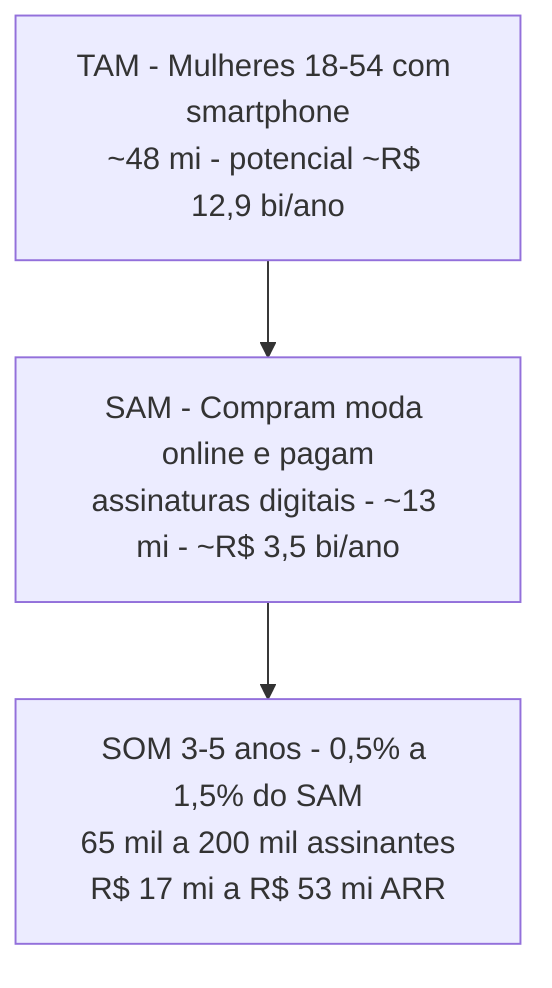

# Análise de Mercado — App Monta-Looks (Público Feminino, Brasil)

> [!important] Tese central
> O Brasil combina o **maior mercado de moda da América Latina** (têxtil-confecção acima de R$ 280 bi/ano, ~65% feminino), uma consumidora **hiperconectada** (5h12/dia no celular) e um hábito de assinatura já consolidado (69% têm ao menos uma assinatura digital). Um app de looks com fotos de indicações, curadoria de pecas do mercado e assinatura de R$ 19,90–24,90 entra num espaço onde os players globais (Whering, Acloset, Indyx) **não têm produto localizado em português nem integração com o varejo brasileiro**.

Documento irmão de [[01-visao-e-ideias]] e base para [[03-concorrentes]] e [[04-assinaturas-precos]]. Decisões de produto derivadas daqui alimentam [[05-frontend]] e [[07-backlog-github]].

---

## 1. Mercado de moda feminina no Brasil

| Indicador | Valor | Fonte |
|---|---|---|
| Mercado têxtil-confecção (2025) | > R$ 280 bilhões | [Central do Varejo](https://centraldovarejo.com.br/moda-lidera-o-e-commerce-brasileiro-em-2025-com-alta-de-35-nas-vendas/) |
| Participação do segmento feminino | ~65% do volume | [Central do Varejo](https://centraldovarejo.com.br/moda-lidera-o-e-commerce-brasileiro-em-2025-com-alta-de-35-nas-vendas/) |
| Participação feminina nas compras de moda online | 72% da categoria | [Babitonhela — Comportamento do Consumidor Online 2026](https://babitonhela.com/blog/comportamento-consumidor-online-brasil-2026/) |
| Lideranças femininas em lojas virtuais de moda | 66% | [E-Commerce Brasil](https://www.ecommercebrasil.com.br/noticias/setor-de-moda-cresce-35-no-e-commerce-brasileiro-em-2025) |

O recorte relevante para o app: **moda feminina é ~R$ 180 bi/ano em valor de mercadoria** (65% de R$ 280 bi — estimativa derivada). O app não captura esse valor diretamente, mas ele dimensiona o problema que resolvemos: decidir **o que vestir e o que comprar** dentro do maior segmento de consumo discricionário feminino do país.

## 2. E-commerce de moda no Brasil

- Moda é a **vertical líder do e-commerce nacional em volume**, com crescimento de **35% em 2025** e mais de 10 milhões de produtos vendidos (+28%) na base medida — [E-Commerce Brasil](https://www.ecommercebrasil.com.br/noticias/setor-de-moda-cresce-35-no-e-commerce-brasileiro-em-2025), [Veloce.Tech](https://veloce.tech/2026/03/04/crescimento-de-35-consolida-moda-como-destaque-do-e-commerce-em-2025/).
- Statista projeta **US$ 8,47 bi de receita para o e-commerce de moda brasileiro em 2025**, com CAGR de 11,56% até 2029 — via [Relatório Executivo E-commerce de Moda 2025](https://vitorpeyroton.com.br/relatorio-executivo-e-commerce-de-moda-em-2025/).
- O e-commerce brasileiro total deve ultrapassar **R$ 234 bi em 2025** (+15% a.a.) — [Central do Varejo](https://centraldovarejo.com.br/moda-lidera-o-e-commerce-brasileiro-em-2025-com-alta-de-35-nas-vendas/).
- Canais: **Instagram é usado organicamente por 97% das lojas de moda**; TikTok já é o 3º canal de vendas (26%) — [E-Commerce Brasil](https://www.ecommercebrasil.com.br/noticias/setor-de-moda-cresce-35-no-e-commerce-brasileiro-em-2025).

> [!tip] Implicação para o produto
> O pilar 3 (apresentar as melhores opções do mercado) tem tração dupla: além da assinatura, abre caminho futuro de **receita de afiliação/CPA com varejistas de moda** — o e-commerce de moda cresce 2–3x mais rápido que o e-commerce geral. Registrar no [[07-backlog-github]] como monetização fase 2.

## 3. Fashion-tech global e wardrobe apps

| Segmento | Tamanho atual | Projeção | CAGR | Fonte |
|---|---|---|---|---|
| Fashion technology (global) | US$ 239,6 bi (2024) | US$ 345,4 bi (2030) | 6,3% | [Grand View Research](https://www.grandviewresearch.com/industry-analysis/fashion-technology-market-report) |
| IA em moda (global) | US$ 1,81 bi (2025) | US$ 40,81 bi (2034) | 41,4% | [Fortune Business Insights](https://www.fortunebusinessinsights.com/ai-in-fashion-market-109328) |
| Apps de guarda-roupa (wardrobe apps) | US$ 224 mi (2024) | US$ 399 mi (2032) | 8,8% | [Intel Market Research](https://www.intelmarketresearch.com/wardrobe-app-2025-2032-667-1709) |
| Apps de styling | US$ 2,55 bi (2024) | US$ 6,05 bi (2033) | 10% | [Strategic Revenue Insights](https://www.strategicrevenueinsights.com/industry/styling-app-market) |
| Provador virtual (global) | US$ 5,77–7,56 bi (2024/25) | US$ 27,7–28 bi (2031/32) | 20–25% | [Business Market Insights](https://www.businessmarketinsights.com/reports/virtual-fitting-room-market), [OpenPR](https://www.openpr.com/news/4514833/ai-driven-virtual-fitting-room-market-forecast-2032-current) |
| IA no varejo de moda (Brasil) | US$ 544,9 mi (2025) | US$ 1,42 bi (2033) | ~13% | [uMode](https://www.umode.com.br/post/IA-no-Varejo-de-Moda-De-483-Milhoes-a-1-4-Bilhao-em-2033) |

Referências de produto no exterior (detalhar em [[03-concorrentes]]): **Whering** (free forte, guarda-roupa digital), **Acloset** (IA de sugestão + marketplace de usados, freemium com limite de 100 peças), **Indyx** (stylist humana paga, lookbooks a partir de US$ 60), Vesta e GetWardrobe — [Whering](https://whering.co.uk/best-styling-apps-2025), [Indyx](https://www.myindyx.com/blog/the-best-wardrobe-apps), [Vesta](https://vestatheapp.com/blog/vesta-vs-indyx-whering-acloset).

> [!warning] Leitura honesta do nicho
> O nicho puro de "wardrobe app" é pequeno globalmente (centenas de milhões de dólares, não bilhões). O valor do nosso app não está em ser um catálogo de armário: está na intersecção **IA generativa (CAGR 41%) + recomendação de compra (e-commerce de moda) + assinatura local barata**. Posicionar como "stylist de bolso que indica o que comprar", não como "organizador de armário".

## 4. TAM / SAM / SOM (Brasil, assinatura R$ 19,90–24,90)

Premissas (estimativas próprias, marcadas como tal — validar com dados IBGE/PNAD em revisão futura):

| Camada | Cálculo | Resultado |
|---|---|---|
| **TAM** | ~54 mi de mulheres de 18–54 anos no Brasil × ~90% com celular ([NegociosSC](https://www.negociossc.com.br/blog/o-uso-de-celular-no-brasil-e-a-intencao-de-compra-dos-brasileiros/)) × ticket médio R$ 22,40/mês × 12 | ~48 mi de mulheres; teto teórico **~R$ 12,9 bi/ano** |
| **SAM** | Mulheres que compram moda online (moda = 72% de participação feminina; classe C: 52% compram moda online — [Babitonhela](https://babitonhela.com/blog/comportamento-consumidor-online-brasil-2026/)) e já pagam ao menos uma assinatura digital (69% da base conectada — [TI Inside](https://tiinside.com.br/04/09/2025/a-economia-por-assinatura-da-tendencia-ao-habito-que-redefine-consumo-e-negocios-no-brasil/)). Estimativa: ~13 mi de mulheres endereçáveis | **~R$ 3,5 bi/ano** de potencial de assinatura |
| **SOM** | Captura realista de 0,5–1,5% do SAM em 3–5 anos, em linha com penetração de apps de nicho | **65–200 mil assinantes → R$ 17–53 mi ARR** |

> [!important] Sanidade do preço
> 56% dos brasileiros já gastam **R$ 51–200/mês em assinaturas** ([TI Inside](https://tiinside.com.br/19/08/2025/gastos-com-assinaturas-devem-crescer-ate-2030-revela-pesquisa-inedita/)) e 48% pretendem gastar mais. R$ 19,90 posiciona o Medium abaixo de qualquer streaming relevante — o app disputa a **última vaga do orçamento de assinaturas**, não a primeira. Detalhe de pricing em [[04-assinaturas-precos]].

## 5. Perfil e comportamento da consumidora brasileira

- **Faixa etária núcleo**: 25–34 anos = 32% dos compradores digitais; 35–44 = 28%; 45–59 é a que mais cresce (+18% em 2025) — [Babitonhela](https://babitonhela.com/blog/comportamento-consumidor-online-brasil-2026/). Persona primária: 25–44.
- **Classe C é o motor**: 52% compram moda online e respondem por 41% do volume de pedidos; 33% pesquisam produto em rede social (vs 29% nas classes A/B) — [Babitonhela](https://babitonhela.com/blog/comportamento-consumidor-online-brasil-2026/).
- **Preço decide**: preço + frete é fator decisivo para 71% — o app precisa indicar looks com opções em faixas de preço, não só peças aspiracionais.
- **PIX** é o meio de pagamento preferido das jovens e da classe C — oferecer assinatura via PIX (não só cartão) reduz atrito. Levar para [[04-assinaturas-precos]].
- **Hiperconexão**: brasileiros passam em média **5h12/dia no smartphone** ([Mobile Time/Opinion Box](https://www.mobiletime.com.br/pesquisas/uso-de-apps-no-brasil-abril-de-2025/)); no Instagram, **58,4% da audiência é feminina** ([mLabs](https://www.mlabs.com.br/blog/redes-sociais-mais-usadas)).
- **Descoberta social**: 73% dos brasileiros já compraram algo que descobriram no Instagram; **69% compraram por indicação de influenciadoras** — [Trajeto Comunicação](https://trajetocomunicacao.com.br/influencia-de-compras-nas-redes-sociais-instagram-tiktok/).

> [!tip] Tradução para produto
> A consumidora-alvo já usa Instagram/TikTok como vitrine de moda. O feed de **fotos de indicações** (pilar 1) precisa ter qualidade visual de rede social — imagens reais/geradas de alto padrão, salvamento de looks, compartilhamento. Requisitos visuais em [[05-frontend]].

## 6. Tendências 2025–2026

| Tendência | Evidência | Relevância para o app |
|---|---|---|
| **IA generativa em moda** | Mercado de IA em moda com CAGR 41,4% ([Fortune BI](https://www.fortunebusinessinsights.com/ai-in-fashion-market-109328)); fashiontechs BR como a Doris já operam provador com IA generativa ([uMode](https://www.umode.com.br/post/doris-provador-virtual-com-ia-generativa-que-est-redefinindo-o-varejo-de-moda)) | Núcleo do produto: geração de looks e imagens de indicação |
| **Social commerce** | TikTok Shop chegou ao BR em mai/2025 e cresceu **102x em GMV diário** no 1º ano; lives diárias cresceram 20x ([TikTok Newsroom](https://newsroom.tiktok.com/tiktok-shop-cresce-102-vezes-em-seu-primeiro-ano-no-brasil?lang=pt-BR)); Instagram Shopping chegou ao BR ampliando a disputa ([Exame](https://exame.com/tecnologia/instagram-shopping-chega-ao-brasil-e-amplia-disputa-com-tiktok-no-social-commerce/)) | Canal de aquisição e, depois, canal de conversão das indicações |
| **Revenda / brechó** | 118 mil brechós ativos, projeção de **R$ 24 bi** (Sebrae); moda circular crescendo 15–20% a.a. até 2030 (BCG); 56% dos brasileiros já transacionaram usados ([Exame](https://exame.com/esg/dia-mundial-do-second-hand-brasil-lidera-revolucao-com-118-mil-brechos-e-projecao-de-r-24-bi/)) | Indicação de peças second hand como diferencial de preço para classe C |
| **Provador virtual** | 79% dos consumidores veem provador virtual como a forma mais eficaz de melhorar a compra online ([Business Market Insights](https://www.businessmarketinsights.com/reports/virtual-fitting-room-market)) | Feature Premium natural (try-on com foto da usuária) — exige o rigor de segurança de [[06-seguranca]] |

## 7. Benchmarks de conversão freemium e churn

Fonte principal: [RevenueCat — State of Subscription Apps](https://www.revenuecat.com/state-of-subscription-apps-2025) e [benchmarks compilados](https://www.artisangrowthstrategies.com/blog/freemium-conversion-rate-benchmarks).

| Métrica | Benchmark | Nota |
|---|---|---|
| Conversão freemium → pago (D35) | **2,1%** mediana; faixa típica 2–5% | Nossa projeção usa 2/4/6% |
| Conversão com hard paywall + trial | 10,7% (D35) | ~5x a do freemium, mas afunila o topo |
| Retenção anual (assinantes) | ~28% após 1 ano | Freemium e hard paywall empatam aqui |
| Cancelamento no 1º mês | ~30% das assinaturas anuais; 1º mês concentra 35% dos cancelamentos do ano | Onboarding + primeiro look "uau" são críticos |
| Churn ano 1 | ~72% dos assinantes anuais cancelam no 1º ano | Planejar reativação e win-back desde o início |

> [!warning] O que isso significa
> Com churn mensal típico de 8–10% em apps lifestyle, a vida média da assinante é de **~10–12 meses**. LTV bruto ≈ R$ 21,90 × 10–12 = **R$ 219–263**; líquido de taxa de loja (15–30%), **R$ 155–225** (estimativa). Todo o plano de aquisição da seção 8 precisa fechar com CAC bem abaixo disso. Testes de retenção entram em [[08-plano-de-testes]].

## 8. Canais de aquisição e CAC

- **CPI Brasil**: média ~US$ 0,80 por instalação (faixa US$ 0,50–2,00 na América Latina) — [Mapendo](https://mapendo.co/blog/cost-per-install-by-country-2025), [Linkrunner](https://linkrunner.io/tools/cost-per-install-benchmark). Em reais: **~R$ 4–11/instalação** (estimativa, câmbio ~5,4).
- Apps de shopping em mercados desenvolvidos chegam a US$ 6,20 de CPI ([Business of Apps](https://www.businessofapps.com/ads/cpi/research/cost-per-install/)) — o Brasil é estruturalmente barato para adquirir, mas com LTV menor.
- **Influenciadoras**: CPM de campanhas no Brasil entre **R$ 15–35**; nano influenciadoras (1–10 mil seguidoras) têm engajamento de 5–10% vs 1–2% das macro, com custo por resultado menor — [Shopify Brasil](https://www.shopify.com/br/blog/quanto-custa-contratar-um-influenciador), [Veeras](https://veeras.com.br/blog/quanto-custa-contratar-influenciador-digital).

Estimativa de CAC por assinante pagante (estimativa própria, validar em campanha piloto):

| Canal | CPI estimado | Conversão install → paga | CAC por pagante |
|---|---|---|---|
| Meta Ads (Instagram) | R$ 5–9 | 2–4% | **R$ 125–450** |
| TikTok Ads | R$ 4–7 | 2–3% | **R$ 130–350** |
| Nano/micro influenciadoras (publi + cupom) | R$ 3–6 efetivo | 3–6% (tráfego mais quente) | **R$ 50–200** |
| Orgânico (conteúdo de looks, SEO, viral) | ~R$ 0 marginal | 1–3% | tende a zero, escala lenta |

> [!important] Conclusão de canal
> Com LTV líquido de R$ 155–225, **mídia paga pura não fecha a conta no início** (CAC > LTV nos cenários conservadores). A estratégia dominante é **nano influenciadoras + conteúdo orgânico de looks** (o próprio feed de indicações é o criativo), usando paid apenas para amplificar o que já performa. Meta de CAC blended: **< R$ 60**.

## 9. Projeção de receita — 3 cenários

Premissas: mix de pagantes 60% Medium (R$ 19,90) / 40% Premium (R$ 24,90) → **ARPU pagante = R$ 21,90/mês**. Valores brutos, antes de taxa de loja (15–30%) e impostos. Base = usuárias ativas cadastradas.

| Base de usuárias | Conversão | Assinantes | MRR | ARR |
|---:|---:|---:|---:|---:|
| 10.000 | 2% | 200 | R$ 4.380 | R$ 52.560 |
| 10.000 | 4% | 400 | R$ 8.760 | R$ 105.120 |
| 10.000 | 6% | 600 | R$ 13.140 | R$ 157.680 |
| 50.000 | 2% | 1.000 | R$ 21.900 | R$ 262.800 |
| 50.000 | 4% | 2.000 | R$ 43.800 | R$ 525.600 |
| 50.000 | 6% | 3.000 | R$ 65.700 | R$ 788.400 |
| 200.000 | 2% | 4.000 | R$ 87.600 | R$ 1.051.200 |
| 200.000 | 4% | 8.000 | R$ 175.200 | R$ 2.102.400 |
| 200.000 | 6% | 12.000 | R$ 262.800 | R$ 3.153.600 |

Leitura:

- **Cenário pessimista** (10k usuárias, 2%): R$ 52 mil/ano — não paga uma operação; serve apenas como fase de validação de retenção e conversão.
- **Cenário base** (50k usuárias, 4%): R$ 525 mil/ano — sustenta um time enxuto se o custo de IA generativa por usuária for controlado (cache de imagens, geração em lote).
- **Cenário otimista** (200k usuárias, 6%): R$ 3,15 mi/ano — exige os 6% de conversão, acima da mediana freemium (2,1%); só é plausível com paywall bem desenhado, trial e proposta Premium forte (provador virtual). Amarrar aos experimentos de [[08-plano-de-testes]].
- Custo de IA por usuária ativa é a variável oculta: geração de imagem por look pode consumir a margem no plano Grátis se não houver limite de gerações — definir cotas por tier em [[04-assinaturas-precos]].

## 10. Riscos e barreiras

> [!warning] Riscos principais
> 1. **CAC > LTV em mídia paga**: benchmark de conversão freemium (2,1%) contra CPI local torna paid puro deficitário; mitigação: influenciadoras nano + orgânico.
> 2. **Churn de 1º mês (~30–35% dos cancelamentos)**: se o primeiro look não encantar em minutos, a assinante sai; onboarding é o feature mais importante do app.
> 3. **Concorrência gratuita**: Whering é gratuito e forte; Pinterest, Shein e Amazon embutem recomendação de looks por IA de graça; a defesa é localização BR (preço em R$, varejo local, corpo e clima brasileiros) e curadoria.
> 4. **Privacidade de fotos pessoais (LGPD)**: fotos de corpo de usuárias são dado sensível na prática; vazamento é risco existencial para a marca — requisitos em [[06-seguranca]]: consentimento explícito, criptografia, retenção mínima, opção de processamento sem armazenamento.
> 5. **Custo de IA generativa**: geração de imagem por indicação escala linearmente com uso; cotas por tier e cache são obrigatórios.
> 6. **Taxa das lojas (15–30%)** comprime margem no ticket de R$ 19,90; avaliar assinatura via web/PIX para contornar (padrão pós-mudanças regulatórias em app stores).
> 7. **Poder de compra da classe C**: R$ 19,90 disputa com streaming e telefonia; o plano Grátis precisa ser genuinamente útil para manter a base engajada até a conversão.
> 8. **Dependência de plataformas de aquisição** (Meta/TikTok): mudanças de algoritmo ou CPM podem dobrar o CAC; diversificar com SEO de conteúdo de moda e comunidade própria.

---

## Fontes principais

- [E-Commerce Brasil — Setor de moda cresce 35% no e-commerce brasileiro em 2025](https://www.ecommercebrasil.com.br/noticias/setor-de-moda-cresce-35-no-e-commerce-brasileiro-em-2025)
- [Central do Varejo — Moda lidera o e-commerce brasileiro em 2025](https://centraldovarejo.com.br/moda-lidera-o-e-commerce-brasileiro-em-2025-com-alta-de-35-nas-vendas/)
- [Vitor Peyroton — Relatório Executivo: E-commerce de Moda em 2025 (Statista)](https://vitorpeyroton.com.br/relatorio-executivo-e-commerce-de-moda-em-2025/)
- [Grand View Research — Fashion Technology Market 2025–2030](https://www.grandviewresearch.com/industry-analysis/fashion-technology-market-report)
- [Fortune Business Insights — AI in Fashion Market](https://www.fortunebusinessinsights.com/ai-in-fashion-market-109328)
- [Intel Market Research — Wardrobe App Market 2025–2032](https://www.intelmarketresearch.com/wardrobe-app-2025-2032-667-1709)
- [Business Market Insights — Virtual Fitting Room Market](https://www.businessmarketinsights.com/reports/virtual-fitting-room-market)
- [uMode — IA no varejo de moda no Brasil](https://www.umode.com.br/post/IA-no-Varejo-de-Moda-De-483-Milhoes-a-1-4-Bilhao-em-2033)
- [Babitonhela — Comportamento do Consumidor Online no Brasil 2026](https://babitonhela.com/blog/comportamento-consumidor-online-brasil-2026/)
- [Mobile Time / Opinion Box — Uso de Apps no Brasil (abril 2025)](https://www.mobiletime.com.br/pesquisas/uso-de-apps-no-brasil-abril-de-2025/)
- [TI Inside — A economia por assinatura no Brasil](https://tiinside.com.br/04/09/2025/a-economia-por-assinatura-da-tendencia-ao-habito-que-redefine-consumo-e-negocios-no-brasil/)
- [TikTok Newsroom — TikTok Shop cresce 102x no 1º ano no Brasil](https://newsroom.tiktok.com/tiktok-shop-cresce-102-vezes-em-seu-primeiro-ano-no-brasil?lang=pt-BR)
- [Trajeto Comunicação — Influência de compras nas redes sociais](https://trajetocomunicacao.com.br/influencia-de-compras-nas-redes-sociais-instagram-tiktok/)
- [Exame — Brasil lidera second hand: 118 mil brechós e R$ 24 bi](https://exame.com/esg/dia-mundial-do-second-hand-brasil-lidera-revolucao-com-118-mil-brechos-e-projecao-de-r-24-bi/)
- [RevenueCat — State of Subscription Apps 2025](https://www.revenuecat.com/state-of-subscription-apps-2025)
- [Artisan Strategies — Freemium Conversion Benchmarks (2–5%)](https://www.artisangrowthstrategies.com/blog/freemium-conversion-rate-benchmarks)
- [Mapendo — Cost per Install by Country 2025](https://mapendo.co/blog/cost-per-install-by-country-2025)
- [Business of Apps — CPI Rates 2025](https://www.businessofapps.com/ads/cpi/research/cost-per-install/)
- [Shopify Brasil — Quanto custa contratar um influenciador em 2025](https://www.shopify.com/br/blog/quanto-custa-contratar-um-influenciador)
- [Whering — Best Styling Apps 2025](https://whering.co.uk/best-styling-apps-2025) / [Indyx — Best Wardrobe Apps](https://www.myindyx.com/blog/the-best-wardrobe-apps)

Relacionados: [[00-INDEX]] | [[01-visao-e-ideias]] | [[03-concorrentes]] | [[04-assinaturas-precos]] | [[05-frontend]] | [[06-seguranca]] | [[07-backlog-github]] | [[08-plano-de-testes]] | [[CLAUDE]]
