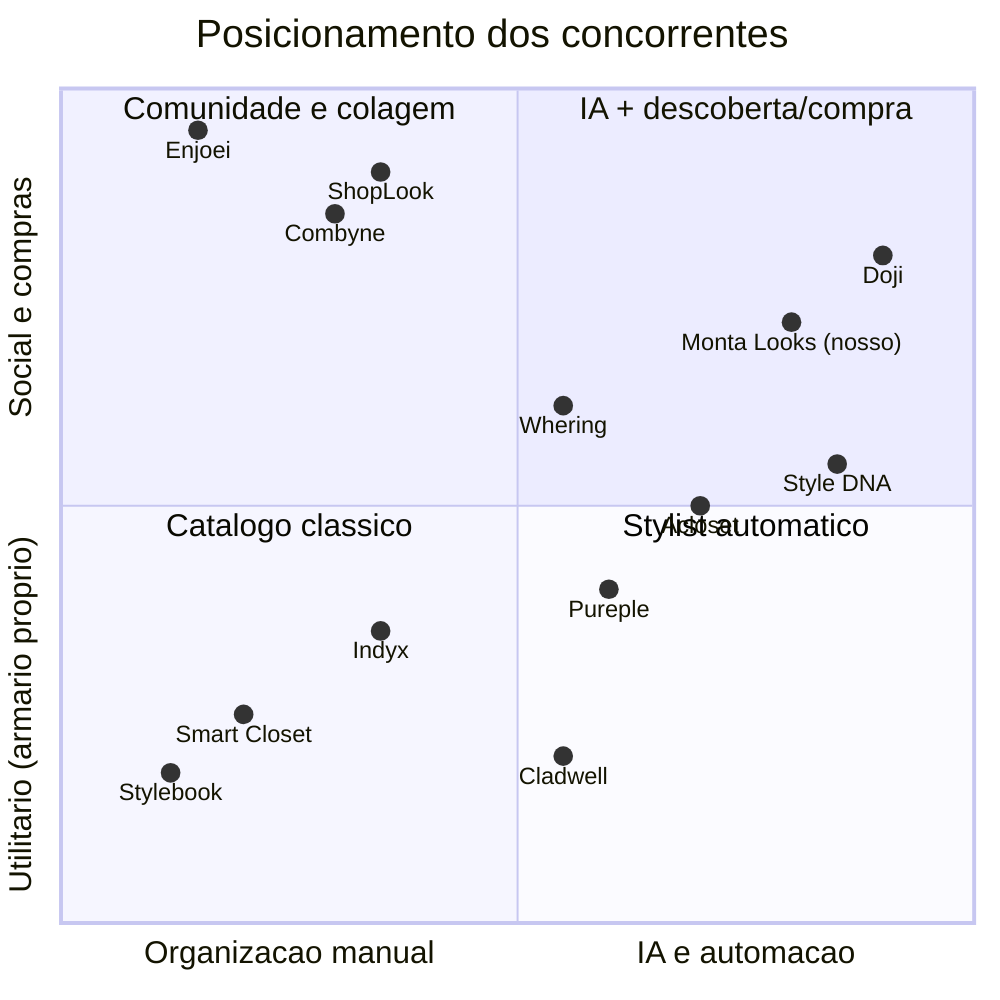

# Análise de Concorrentes — Apps de Montar Looks, Armário Virtual e Stylist com IA

Documento de trabalho do projeto Monta Looks. Analisa os principais concorrentes globais e brasileiros no espaço de **armário virtual / outfit planner / stylist com IA**, com foco em: proposta de valor, features, preço, notas nas lojas, público, forças e fraquezas. Fecha com lacunas de mercado e oportunidades de diferenciação para o nosso app (público feminino, indicações com fotos, segurança/privacidade).

Notas irmãs: [[00-INDEX]] | [[01-visao-e-ideias]] | [[02-analise-de-mercado]] | [[04-assinaturas-precos]] | [[05-frontend]] | [[06-seguranca]] | [[07-backlog-github]] | [[08-plano-de-testes]] | [[AGENTS]]

> [!note] Metodologia e conversão de moeda
> Dados coletados via pesquisa web em 11/08/2026 (fontes ao final). Preços internacionais convertidos a **câmbio estimado de US$ 1 = R$ 5,40** — valor aproximado, marcar como *estimativa* em qualquer material público. Notas nas lojas variam por país e por dia; valores marcados com "(est.)" são estimativas a partir de fontes secundárias ou conhecimento próprio, não leitura direta da loja na data.

---

## 1. Mapa do território competitivo

O mercado se divide em quatro clusters que se sobrepõem:

1. **Armário virtual / organização** — digitalizar o guarda-roupa e planejar looks com o que a usuária já tem (Stylebook, Indyx, GetWardrobe, Smart Closet, Acloset).
2. **Stylist com IA / recomendação** — sugestões automáticas de looks, análise de coloração, chat de estilo (Style DNA, Acloset, Pureple, Cladwell, Resolva).
3. **Social / colagem / inspiração** — montar looks com peças de lojas e compartilhar (Combyne, ShopLook, Whering na camada social).
4. **Try-on / provador virtual e compras** — avatar com IA vestindo peças reais (Doji, Alta) e ecossistema de compra/revenda (Enjoei, Repassa).

Nosso app nasce na interseção 2 + 4: **indicações com FOTOS (looks reais/gerados) + curadoria das melhores opções do mercado**, com privacidade como pilar — ver [[06-seguranca]].

---

## 2. Concorrentes internacionais

### 2.1 Whering (Reino Unido)

- **Proposta de valor**: "guarda-roupa digital + rede social de estilo", com discurso forte de sustentabilidade ("re-wear what you own"). Comunidade declarada de 4M+ usuárias e 10M+ downloads.
- **Features principais**: digitalização por foto com remoção de fundo, importação de peças de varejistas, sugestão diária de looks ("Dress Me"), feed social de looks de outras usuárias, métricas de sustentabilidade (custo por uso, pegada de carbono), wishlist com busca de peças similares.
- **Preço**: **gratuito** (sem tier pago relevante) — monetiza por afiliados/parcerias com varejistas. Em R$: R$ 0.
- **Notas nas lojas**: ~4,6–4,7 na App Store (fonte comparativa cita 4,66); Google Play um pouco abaixo (est. ~4,3).
- **Público**: mulheres 18–35, Gen Z/millennial, pauta de sustentabilidade; tem versão pt-BR na App Store ("Whering: Guarda-Roupa Virtual").
- **Fortes**: grátis de verdade (grande motor de aquisição); marca forte; camada social; UX moderna.
- **Fracos**: IA de sugestão considerada rasa (combinações aleatórias); catálogo de compras com foco em varejo europeu; sem serviço de stylist humano; monetização frágil (dependência de afiliados).

### 2.2 Acloset (Coreia do Sul)

- **Proposta de valor**: "assistente de moda com IA" — armário digital com detecção automática de categoria/cor e sugestões diárias baseadas em clima.
- **Features principais**: remoção automática de fundo, auto-tagging por IA, sugestões diárias por clima, calendário de looks, estatísticas de uso, chat de IA, marketplace social de segunda mão dentro do app.
- **Preço**: freemium — grátis até ~100 peças (com anúncios); planos pagos "Basic"/"Expert" a partir de ~US$ 3,99/mês (≈ **R$ 22/mês**), com tiers que chegam a ~US$ 30/mês (≈ R$ 160) em pacotes com mais recursos de IA.
- **Notas nas lojas**: est. ~4,6 App Store / ~4,1 Google Play; reviews recentes reclamam de paywall e anúncios impostos a usuárias antigas.
- **Público**: global, jovem, mobile-first; tem listagem pt-BR ("Acloset - Looks, Estilo, Moda").
- **Fortes**: melhor automação de cadastro do segmento (menos fricção); pacote de features amplo; marketplace interno.
- **Fracos**: crise de confiança ao mover features grátis para paywall; crashes e lentidão reportados; IA de look ainda genérica; suporte fraco.

> [!warning] Lição do Acloset
> Mudar a régua do plano grátis depois que a base já existe gera revolta e derruba nota na loja. Definir desde o dia 1 o que é grátis para sempre (ver [[04-assinaturas-precos]]) e nunca rebaixar retroativamente.

### 2.3 Indyx (EUA)

- **Proposta de valor**: catalogação premium do armário + **marketplace de stylists humanas** que montam lookbooks com o guarda-roupa real da cliente.
- **Features principais**: itens e looks ilimitados no grátis, remoção de fundo por IA, calendário de uso, listas de mala de viagem, compartilhamento de armário, styling social (opinião de amigas/comunidade), analytics de armário no plano pago, serviços de stylist (lookbooks a partir de ~US$ 50; styling mensal a partir de ~US$ 25/mês; 1:1 a partir de ~US$ 60).
- **Preço**: grátis generoso; assinatura "Insider" US$ 12,99/mês ou US$ 74,99/ano (≈ **R$ 70/mês** ou **R$ 405/ano**); fontes citam promoções a ~US$ 9/mês. Serviços de stylist avulsos de US$ 25 a US$ 295 (≈ R$ 135 a R$ 1.600).
- **Notas nas lojas**: est. ~4,8 App Store (base menor, público engajado); iOS-first.
- **Público**: mulheres 28–45, renda média/alta, dispostas a pagar por serviço humano.
- **Fortes**: modelo híbrido IA + humano único; qualidade de catalogação; conteúdo editorial forte (blog domina SEO de "best wardrobe apps").
- **Fracos**: preço alto em R$; serviço humano não escala para preço popular; sem Android consolidado; sem foco em compra de peças novas.

### 2.4 Stylebook (EUA)

- **Proposta de valor**: o veterano (desde 2009) de organização meticulosa do armário no iOS — controle manual total.
- **Features principais**: 90+ funções: categorias customizadas, custo por uso, estatísticas profundas, calendário, packing lists, colagens de look manuais.
- **Preço**: **compra única** de US$ 4,99–5,99 (≈ **R$ 27–32**), sem assinatura.
- **Notas nas lojas**: est. ~4,3–4,5 App Store; fanbase fiel.
- **Público**: organizadoras detalhistas, planejadoras, usuárias iOS.
- **Fortes**: sem mensalidade; profundidade analítica imbatível; confiança de mais de uma década.
- **Fracos**: setup 100% manual (6–8h para 100 peças); visual datado; **sem IA, sem Android, sem web, sem social**; nenhuma camada de recomendação/compra.

### 2.5 Cladwell (EUA)

- **Proposta de valor**: especialista em **cápsula de guarda-roupa** — menos peças, mais looks; recomendações diárias por clima e estilo de vida.
- **Features principais**: geração de plano de cápsula, sugestões diárias ("Outfits Today"), organização por capsulas/estações/viagens, opção de stylist humano no tier alto.
- **Preço**: histórico confuso — já foi ~US$ 4/mês, teve fase "Free for Life", hoje ~US$ 9,99/mês ou US$ 59,99/ano (≈ **R$ 54/mês / R$ 324/ano**), com tier com stylist a ~US$ 49/mês (≈ R$ 265).
- **Notas nas lojas**: est. ~4,2 App Store.
- **Público**: minimalistas, público de "capsule wardrobe", 25–45.
- **Fortes**: nicho claro e metodologia proprietária; recomendação diária útil.
- **Fracos**: mudanças bruscas de modelo de preço corroeram confiança; base de usuárias pequena; pouca inovação recente; sem camada social.

### 2.6 Combyne (Alemanha)

- **Proposta de valor**: rede social de **colagem de looks** com peças de 1.000+ marcas e 50+ lojas parceiras — moda como jogo criativo.
- **Features principais**: "Combyner" (canvas de montagem), feed social com feedback instantâneo, desafios de estilo, compra direta das peças nas lojas parceiras.
- **Preço**: grátis com assinatura premium opcional (remoção de anúncios/recursos extras, est. ~US$ 3–8/mês ≈ R$ 16–43).
- **Notas nas lojas**: ~4,4 (média citada 4,42).
- **Público**: adolescentes e jovens (13–25), forte componente lúdico.
- **Fracos**: não trabalha com o armário real da usuária (peças de catálogo, não suas roupas); recomendação de IA fraca; monetização por afiliados; público muito jovem monetiza mal.
- **Fortes**: engajamento altíssimo (mecânica de jogo/comunidade); acervo enorme de peças compráveis.

### 2.7 Pureple (EUA)

- **Proposta de valor**: outfit planner com IA + comunidade que estiliza o armário umas das outras.
- **Features principais**: cadastro sem limite de itens no grátis, sugestões de look por IA e por clima, virtual try-on em modelo gerado por IA, calendário e packing lists, comunidade de styling.
- **Preço**: grátis com muitos anúncios; Premium US$ 6,99/semana, US$ 14,99/mês ou US$ 89,99/ano (≈ **R$ 38/sem, R$ 81/mês, R$ 486/ano**) — precificação semanal agressiva.
- **Notas nas lojas**: **~3,9** — a pior do grupo; reclamações de anúncios incessantes e UX antiga.
- **Público**: mulheres 25–45, EUA/Índia/Sudeste Asiático.
- **Fortes**: grátis sem limite de itens; try-on chamativo; comunidade ativa.
- **Fracos**: experiência degradada por anúncios; visual datado; confiança baixa; preço premium caro para o valor entregue.

### 2.8 Smart Closet

- **Proposta de valor**: organizador de armário simples e multiplataforma (iOS/Android), estilo "canivete básico".
- **Features principais**: catálogo por categorias, montagem de looks em colagem, calendário, packing list, estatísticas simples (est.).
- **Preço**: grátis com anúncios + premium de baixo custo (est. ~US$ 2–5/mês ≈ R$ 11–27 ou compra única).
- **Notas nas lojas**: est. ~4,4 Google Play.
- **Público**: usuárias Android de entrada, mercados emergentes.
- **Fortes**: leve, simples, Android forte (lacuna dos rivais iOS-first).
- **Fracos**: sem IA relevante, sem social, sem compras, design utilitário; nenhuma diferenciação defensável.

### 2.9 ShopLook (EUA)

- **Proposta de valor**: canvas criativo de outfits e moodboards com biblioteca de **70M+ imagens**; sucessora espiritual do Polyvore.
- **Features principais**: editor de colagem avançado, comunidade de 1M+ criadoras, desafios, publicação de looks, link de compra das peças.
- **Preço**: grátis; ShopLook Pro US$ 3,99/mês (≈ **R$ 22/mês**) para ferramentas avançadas de edição.
- **Notas nas lojas**: est. ~4,6–4,8 App Store.
- **Público**: criadoras de conteúdo de moda, adolescentes/jovens, usuárias de Pinterest.
- **Fortes**: acervo gigante; comunidade criativa fiel; preço premium acessível.
- **Fracos**: não é armário virtual (não trabalha com roupas próprias); sem IA de recomendação pessoal; migração de features grátis para pago gerou atrito.

### 2.10 Style DNA (EUA/Europa do Leste)

- **Proposta de valor**: stylist de IA "tudo-em-um": análise de coloração por selfie, tipo de corpo, armário digital, chat de estilo e personal shopper com links para ASOS/Farfetch/Bloomingdale's.
- **Features principais**: análise de coloração por IA, chat conversacional de estilo, sugestões de compra personalizadas, cápsula por perfil, armário digital.
- **Preço**: freemium com paywall agressivo; planos de ~US$ 4,99 a US$ 19,99/mês (≈ **R$ 27 a R$ 108/mês**).
- **Notas nas lojas**: est. ~4,4–4,6 App Store, mas com cauda pesada de reviews negativas (cobranças, bugs, privacidade).
- **Público**: mulheres 25–45 interessadas em análise de coloração/consultoria de imagem — público muito parecido com o nosso.
- **Fortes**: pacote de consultoria de imagem completo; onboarding por selfie impressiona; recomendação de compra integrada.
- **Fracos**: **reclamações de privacidade e cobrança** (selfies + billing = área sensível); paywall agressivo; IA erra com frequência; suporte ruim.

> [!important] Style DNA é o alerta de privacidade do segmento
> O concorrente mais próximo do nosso conceito (IA + selfie + recomendação de compra) é justamente o mais criticado em privacidade e cobrança. Fazer o oposto — transparência LGPD, fotos processadas com consentimento explícito, cancelamento fácil — é diferencial competitivo direto. Detalhar em [[06-seguranca]].

---

## 3. Players brasileiros e ecossistema local

### 3.1 Enjoei (e ecossistema de moda circular)

- **O que é**: maior plataforma de moda circular do país — 4M+ usuários, 84,6M produtos anunciados, 1M+ compradores e 2M vendedores ativos; em expansão para lojas físicas (meta de 300 lojas até 2027, primeira loja no RJ em jun/2025).
- **Relação com nosso app**: não é concorrente direto em "montar looks", mas domina o comportamento de compra/venda de moda no Brasil e é candidato natural a **parceria de catálogo** (indicar peças de segunda mão nas recomendações). O mercado de segunda mão no Brasil pode chegar a **R$ 78 bilhões** em três anos (estudo BCG citado pela imprensa).
- **Fortes**: marca consolidada, liquidez de catálogo, apelo de sustentabilidade.
- **Fracos (como concorrente)**: zero styling/IA; experiência de descoberta caótica; não trabalha o armário da usuária.

### 3.2 Doji (try-on com IA — cobertura forte no Brasil)

- **O que é**: app de provador virtual que cria avatar realista a partir de 6 selfies + 2 fotos de corpo; seed de US$ 14M liderado pela Thrive Capital (mai/2025); iOS, acesso por convite; grande cobertura na imprensa tech brasileira.
- **Relação com nosso app**: valida a tese de que **ver o look em uma foto realista** é o "momento uau" da categoria. É referência de experiência, não de modelo de negócio (ainda sem monetização clara).
- **Fracos**: por convite, iOS-only, sem armário próprio, catálogo de grife distante da consumidora média brasileira.

### 3.3 Me Combina (Brasil)

- **O que é**: organizador de guarda-roupa brasileiro que sugere looks com as peças da usuária, com ajuda de IA; **gratuito, sem custos ocultos**.
- **Fortes**: em português, grátis, proposta simpática.
- **Fracos**: produto pequeno, sem escala visível, IA simples, sem camada de compras nem comunidade; risco de descontinuidade.

### 3.4 Resolva (Brasil)

- **O que é**: guarda-roupa virtual brasileiro com IA de consultoria ("Sofia"); maioria dos recursos no plano premium, assinatura a partir de **~R$ 11/mês**.
- **Fortes**: preço localizado em R$; consultoria de imagem em português.
- **Fracos**: base pequena, pouca prova social, dependência de um único diferencial (a IA "Sofia").

### 3.5 Outros nomes do ecossistema

- **Threadiary** — armário virtual minimalista iOS, grátis, sem cadastro; nicho.
- **Pronti AI** — stylist com IA citado em listas locais; presença pequena no Brasil.
- **Sizebay** — brasileiro, mas B2B (provador virtual/recomendação de tamanho para e-commerces); possível fornecedor/parceiro, não rival.
- **Repassa / brechós digitais** — reforçam o boom de moda circular; mesmos papéis do Enjoei (catálogo/parceria).

> [!tip] Leitura do cenário brasileiro
> Não existe hoje **nenhum player brasileiro forte** combinando armário virtual + IA + recomendação de compra com foco feminino. Os locais (Me Combina, Resolva) são pequenos e sub-capitalizados; os globais fortes (Whering, Acloset) têm tradução, mas catálogo, clima, calendário de moda e meios de pagamento não são localizados. A janela está aberta.

---

## 4. Tabela comparativa geral

| App | Origem | Modelo | Preço (R$ est.) | Nota lojas | Público-alvo | Armário próprio | IA de look | Social | Compra de peças | Ponto forte | Ponto fraco |
|---|---|---|---|---|---|---|---|---|---|---|---|
| Whering | UK | Grátis (afiliados) | R$ 0 | ~4,6 | F 18–35 | Sim | Média | Sim | Afiliados | Grátis + marca | IA rasa |
| Acloset | KR | Freemium | R$ 22–160/mês | ~4,1–4,6 | Unissex jovem | Sim | Boa | Marketplace | 2ª mão | Automação de cadastro | Paywall retroativo |
| Indyx | US | Freemium + serviços | R$ 70/mês; serviços R$ 135–1.600 | ~4,8 (est.) | F 28–45 renda alta | Sim | Média | Leve | Não | Stylist humana | Caro, iOS-first |
| Stylebook | US | Compra única | R$ 27–32 única | ~4,4 (est.) | Organizadoras iOS | Sim | Não | Não | Não | Profundidade/sem mensalidade | Manual, datado |
| Cladwell | US | Assinatura | R$ 54/mês | ~4,2 (est.) | Minimalistas | Sim | Média | Não | Não | Método cápsula | Confiança/preço instável |
| Combyne | DE | Grátis + premium | R$ 16–43/mês (est.) | ~4,4 | F 13–25 | Não | Fraca | Forte | Sim | Engajamento lúdico | Não usa roupas reais |
| Pureple | US | Freemium | R$ 38/sem–486/ano | ~3,9 | F 25–45 | Sim | Média | Sim | Não | Try-on IA, sem limite grátis | Anúncios, UX antiga |
| Smart Closet | — | Freemium barato | R$ 11–27/mês (est.) | ~4,4 (est.) | Android entrada | Sim | Não | Não | Não | Simplicidade Android | Sem diferencial |
| ShopLook | US | Grátis + Pro | R$ 22/mês | ~4,7 (est.) | Criadoras 13–30 | Não | Não | Forte | Links | Acervo 70M imagens | Não é armário |
| Style DNA | US/EU | Freemium | R$ 27–108/mês | ~4,5 (est.) | F 25–45 | Sim | Boa | Não | Sim | Coloração + IA + shopping | Privacidade/billing |
| Doji | US | Convite (sem preço) | — | — | Early adopters | Não | Try-on | Sim | Sim | Avatar realista | Acesso restrito |
| Enjoei | BR | Marketplace | Comissão | ~4,5 (est.) | Brasil amplo | Não | Não | Sim | Núcleo | Escala BR + circular | Zero styling |
| Me Combina | BR | Grátis | R$ 0 | — | F BR | Sim | Simples | Não | Não | Português, grátis | Sem escala |
| Resolva | BR | Freemium | ~R$ 11/mês | — | F BR | Sim | Média | Não | Não | Preço local + IA em pt | Base pequena |
| **Monta Looks (nosso)** | **BR** | **Grátis / R$ 19,90 / R$ 24,90** | **R$ 0–24,90/mês** | — | **F BR** | **Sim** | **Foco: indicações com fotos** | **Planejado** | **Curadoria de mercado** | **Privacidade + fotos + preço BR** | — |

Referência cruzada de preços e tiers do nosso app: [[04-assinaturas-precos]].

---

## 5. Análise de lacunas e oportunidades de diferenciação

### 5.1 Lacunas identificadas no mercado

1. **Ninguém entrega "indicação com foto" como produto central.** Os apps ou mostram colagens frias (Stylebook, Smart Closet), ou sugerem combinações sem visual convincente (Whering, Acloset), ou fazem try-on sem recomendação editorial (Doji, Pureple). A experiência "receba looks prontos, bonitos, em foto, prontos para copiar" não é o coração de nenhum concorrente.
2. **Privacidade é o ponto cego da categoria.** Apps que pedem selfie/foto de corpo (Style DNA, Pureple, Doji) acumulam críticas ou silêncio sobre tratamento de dados. Nenhum comunica conformidade LGPD — porque nenhum é brasileiro com escala. Fotos pessoais + medidas corporais são **dados sensíveis** na prática; tratar isso como feature de marketing (selo "suas fotos nunca treinam IA de terceiros", armazenamento cifrado, exclusão em 1 toque) é diferencial inédito. Ver [[06-seguranca]].
3. **Preço internacional não conversa com o Brasil.** Premium dos gringos sai de R$ 54 a R$ 108/mês em câmbio direto — acima até de streaming. Nossos R$ 19,90/Medium e R$ 24,90/Premium ficam abaixo de tudo que entrega IA de verdade, e acima apenas de apps fracos. Posição de preço confortável — detalhes em [[04-assinaturas-precos]].
4. **Curadoria de compra local inexiste.** Whering/Style DNA indicam ASOS e Farfetch; nada de Renner, C&A, Shein Brasil, Amaro, brechós Enjoei/Repassa, nem parcelamento/Pix. "As melhores opções do mercado" com preço em R$ e frete real é lacuna aberta.
5. **Clima e calendário brasileiros ignorados.** Sugestão por clima existe (Acloset, Cladwell), mas sem entender verão de Recife vs. inverno de Curitiba, Carnaval, festa junina, réveillon branco. Regionalização é barata de construir e difícil de copiar de fora.
6. **Foco feminino declarado não existe.** Todos os apps são "unissex por default com público feminino de fato". Um produto desenhado abertamente para mulheres (corpo, ocasião, ciclo de vida do guarda-roupa, segurança) comunica melhor e converte melhor.
7. **Fricção de cadastro mata retenção.** A maior reclamação transversal (Stylebook 6–8h de setup; Indyx idem no grátis). Quem resolver o cold start — via IA de reconhecimento (caminho Acloset) ou via **indicações que funcionam sem digitalizar o armário inteiro** — vence o primeiro dia de uso.

### 5.2 Ameaças a monitorar

- **Whering entrar forte no Brasil** (já tem listagem pt-BR) — mitigação: velocidade + catálogo local + privacidade.
- **Acloset baixar preço regional** via preços por país nas lojas.
- **Doji abrir acesso e catálogo popular** — o avatar deles é superior; mitigação: nosso valor está na **curadoria + recomendação**, não só no render.
- **Enjoei lançar camada de styling** sobre a base de 4M usuários — mitigação: propor parceria antes.

### 5.3 Posicionamento recomendado

> [!tip] Frase de posicionamento (rascunho)
> "O app brasileiro que monta looks para você — com fotos de verdade, peças que existem nas lojas que você conhece, e as suas fotos protegidas como devem ser."

Três pilares de diferenciação sustentável, em ordem de prioridade:

| Pilar | Contra quem ganha | Prova no produto |
|---|---|---|
| Indicações com FOTOS (looks prontos, visual realista) | Whering, Acloset, Stylebook | Feed diário de looks em foto; try-on da usuária no Premium |
| Segurança/privacidade LGPD como feature visível | Style DNA, Pureple, Doji | Selo de privacidade no onboarding; exclusão total em 1 toque; fotos nunca usadas para treinar modelos de terceiros |
| Curadoria do mercado BR + preço em R$ | Todos os internacionais | Peças de varejo BR com preço/parcelamento/Pix; tiers R$ 0 / 19,90 / 24,90 |

### 5.4 Decisões que esta análise puxa para o backlog

- Plano grátis deve incluir indicações com foto (limitadas), nunca só "organizador" — o grátis do concorrente já faz organização de graça. Ver [[07-backlog-github]].
- Onboarding sem obrigar digitalização do armário: quiz de estilo + 1 selfie opcional → primeira indicação em < 3 minutos.
- Não copiar precificação semanal (Pureple) nem paywall retroativo (Acloset) — ambos destroem nota na loja.
- Testes de usabilidade devem medir tempo-até-primeiro-look e percepção de segurança das fotos — critérios em [[08-plano-de-testes]].
- Explorar parceria de catálogo com Enjoei/Repassa para indicações de moda circular (diferencial de preço e sustentabilidade).

---

## 6. Fontes

- [Whering — site oficial](https://whering.co.uk/) | [Whering na App Store BR](https://apps.apple.com/br/app/whering-guarda-roupa-virtual/id1519461680) | [Whering — Best Wardrobe Apps 2025](https://whering.co.uk/best-wardrobe-apps-2025)
- [Indyx — The Best Wardrobe Apps (comparativo)](https://www.myindyx.com/blog/the-best-wardrobe-apps) | [Indyx — How it works (preços)](https://www.myindyx.com/how-it-works) | [Review independente do Indyx](https://theeliseedit.com/blog/my-honest-review-of-the-indyx-app)
- [GetWardrobe — comparativo de 10 apps (preços e notas)](https://getwardrobe.com/compare/)
- [Acloset no Google Play](https://play.google.com/store/apps/details?id=com.looko.acloset) | [Kimola — análise de feedback do Acloset](https://kimola.com/reports/acloset-app-feedback-analysis-insights-for-growth-google-play-en-141015)
- [Stylebook — site oficial](https://www.stylebookapp.com/) | [Review Stylebook 2025](https://www.cottoncashmerecathair.com/blog/2020/4/10/how-i-catalog-my-closet-and-track-what-i-wear-with-the-stylebook-app-review)
- [Cladwell — pricing](https://cladwell.com/pricing) | [Review Cladwell](https://thelaurieloo.com/blog/cladwell-review)
- [Pureple — site oficial](https://pureple.com/) | [Pureple na App Store](https://apps.apple.com/us/app/pureple-ai-outfit-planner/id628106373)
- [Combyne no Google Play](https://play.google.com/store/apps/details?id=com.combyne.app)
- [ShopLook na App Store](https://apps.apple.com/us/app/shoplook-outfit-maker/id1408832096) | [ShopLook — reviews e preços](https://justuseapp.com/en/app/1408832096/shoplook-outfit-maker)
- [Style DNA na App Store](https://apps.apple.com/us/app/style-dna-ai-stylist-closet/id1358319821) | [Comparativo AI styling apps 2025](https://blog.looksmaxxreport.com/best-ai-styling-app-2025/)
- [TechCrunch — Doji levanta US$ 14M](https://techcrunch.com/2025/05/15/doji-raises-14m-to-make-virtual-try-ons-fun-through-ai-avatars) | [TechTudo — Doji e 6 apps de provador virtual](https://www.techtudo.com.br/listas/2026/05/doji-e-6-outros-apps-de-provador-virtual-para-ideias-e-organizacao-edapps.ghtml)
- [Me Combina — site oficial](https://www.mecombina.com.br/)
- [InfoMoney — planos do Enjoei (300 lojas até 2027)](https://www.infomoney.com.br/business/300-lojas-ate-2027-os-planos-do-enjoei-para-levar-moda-circular-ao-mundo-fisico/) | [Mercado&Consumo — Enjoei inaugura loja física no RJ](https://mercadoeconsumo.com.br/10/06/2025/franquias/enjoei-inaugura-primeira-loja-fisica-no-rio-e-acelera-expansao-via-franquias/)
- [Sizebay — 10 melhores apps para montar looks](https://sizebay.com/en/blog/outfit-styling-app/)
- [Vesta — comparativo Vesta vs Indyx vs Whering vs Acloset](https://vestatheapp.com/blog/vesta-vs-indyx-whering-acloset)

> [!note] Confiabilidade
> Valores de assinatura mudam com frequência e variam por região da loja. Antes de usar qualquer número em material público ou pitch, revalidar direto na App Store/Google Play BR. Itens marcados "(est.)" são estimativas.
