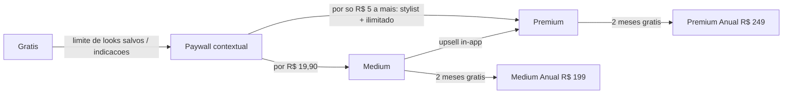
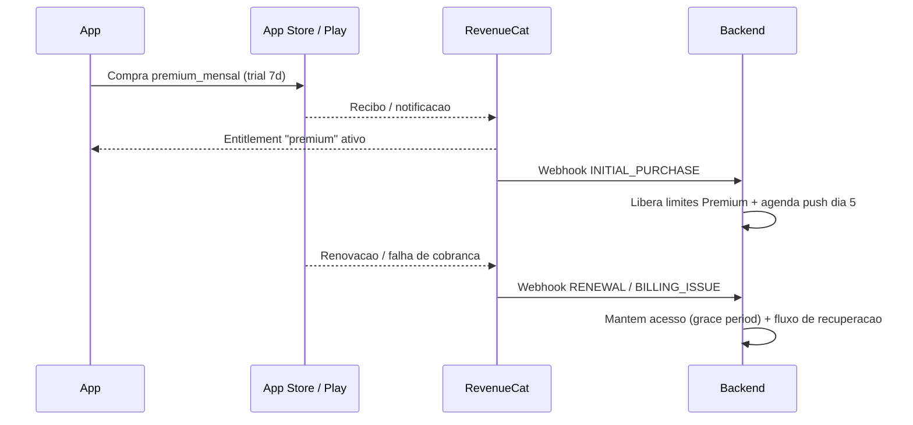

# Assinaturas e Preços

Estratégia de monetização do app com os 3 níveis fixos definidos pelo fundador: **Grátis**, **Medium R$ 19,90/mês** e **Premium R$ 24,90/mês**. Este documento detalha a divisão de features, o racional de cada limite, a análise do gap de preço entre os planos pagos, a estratégia de conversão e as metas de métricas. Coerente com os pilares descritos em [[01-visao-e-ideias]] e com o comparativo de mercado em [[02-analise-de-mercado]] e [[03-concorrentes]].

> [!important] Premissa inegociável
> Os preços são **fixos por decisão do fundador**: Grátis / R$ 19,90 / R$ 24,90. Este documento analisa e otimiza dentro dessa restrição — não propõe alteração dos valores mensais. A única adição sugerida é o **plano anual com desconto**, que não altera o preço mensal de tabela.

---

## 1. Tabela de features por tier

Divisão pensada a partir dos 4 pilares do produto ([[01-visao-e-ideias]]): fotos de indicações (looks recomendados com imagem real/gerada), segurança máxima das fotos pessoais, melhores opções do mercado e os 3 níveis de assinatura.

| Feature | Grátis | Medium (R$ 19,90/mês) | Premium (R$ 24,90/mês) |
|---|---|---|---|
| **Indicações de looks com foto (IA)** | 3 por semana | 20 por semana | Ilimitadas (fair use) |
| **Qualidade das imagens de indicação** | Padrão | Alta resolução | Alta resolução + 3 variações por look |
| **Provador virtual (try-on com foto da usuária)** | — | 5 gerações/mês | 30 gerações/mês |
| **Looks salvos (favoritos)** | 10 | 100 | Ilimitados |
| **Peças no armário virtual (fotos)** | 20 peças | 200 peças | Ilimitadas |
| **Perfis de estilo** (trabalho, festa, casual...) | 1 | 3 | Ilimitados |
| **Planejador semanal de looks (calendário)** | — | Sim | Sim + sugestão automática da semana |
| **Melhores opções do mercado (links de compra)** | Vê as peças sugeridas | Vê + comparação de preço entre lojas | Tudo + alertas de queda de preço |
| **Alertas de promoção de peças desejadas** | — | 10 peças monitoradas | Ilimitadas + acesso antecipado a ofertas de parceiros |
| **Acesso a stylist** | — | — | 1 revisão de look/mês por stylist humana (assíncrona) + fila prioritária da IA |
| **Estatísticas do armário** (custo por uso, peças esquecidas) | — | Básicas | Completas |
| **Compartilhar look (imagem)** | Com marca d'água do app | Sem marca d'água | Sem marca d'água + formatos para stories |
| **Anúncios** | Sim (leves, nunca sobre as fotos pessoais) | Sem anúncios | Sem anúncios |
| **Suporte** | FAQ + e-mail | E-mail prioritário | Prioritário + canal direto |
| **Histórico de indicações** | Últimos 7 dias | 90 dias | Completo |

> [!warning] Segurança nunca é feature paga
> Criptografia das fotos pessoais, controles de privacidade, exclusão definitiva de dados e direitos LGPD valem **para todos os tiers, inclusive o Grátis**. Cobrar por segurança destruiria a confiança — que é o pilar 2 do produto. Detalhes técnicos em [[06-seguranca]].

> [!warning] Custo variável da stylist humana
> A revisão mensal por stylist humana no Premium é o item de maior risco de margem (custo estimado R$ 5–10 por revisão se terceirizada em escala). Validar unit economics no piloto; se não fechar, substituir por "stylist IA avançada + fila prioritária" e mover a stylist humana para um add-on avulso. Registrar decisão no [[07-backlog-github]].

---

## 2. Racional de cada limite

Princípio geral: o Grátis precisa entregar o **momento "uau"** (receber uma indicação de look com foto que parece feita para ela) sem restrição de qualidade — a restrição é de **quantidade e recorrência**. O upgrade deve parecer "quero mais disso", nunca "o grátis é inútil".

| Limite | Racional |
|---|---|
| **3 indicações/semana no Grátis** | Suficiente para formar hábito semanal (ex.: look de segunda, look de sexta, look de evento). Escassez natural: a usuária engajada quer indicação diária → Medium. Também controla custo de inferência de imagem, o maior custo variável do produto. |
| **10 looks salvos no Grátis** | Dá para montar uma "coleção inicial". Quem curadoria ativamente estoura em 2–4 semanas — o paywall aparece num momento de investimento emocional (ela *quer* guardar aquele look), o gatilho de conversão mais quente. |
| **20 peças no armário Grátis** | Permite testar o armário virtual de verdade (uma cápsula básica tem ~20 peças). Quem fotografa o guarda-roupa inteiro já demonstrou intenção altíssima; o limite converte sem impedir a experiência inicial. |
| **Provador virtual só nos pagos** | Try-on com a foto da própria usuária é o feature de maior custo (GPU) e maior valor percebido. Mantê-lo 100% pago protege margem e cria o principal "motivo de assinar". No Grátis, mostrar preview borrado/parcial como demonstração. |
| **Try-on: 5/mês vs 30/mês** | Diferença de 6x é grande o suficiente para justificar o Premium para usuárias intensas, e 30/mês (~1/dia) cobre uso real sem abrir custo ilimitado de GPU. |
| **Indicações ilimitadas só no Premium** | "Ilimitado" é o argumento de venda mais simples de comunicar. Fair use interno (ex.: 20/dia) protege contra abuso e scraping. |
| **Alertas de preço 0 / 10 / ilimitado** | Conecta o pilar "melhores opções do mercado" à monetização e a futuras receitas de afiliados: quanto mais alertas, mais cliques de compra, mais comissão — o tier pago se paga duas vezes. |
| **Anúncios só no Grátis** | Receita sobre a base que não converte + incômodo leve que empurra upgrade. Nunca anúncios sobre fotos pessoais ou no fluxo do provador (conflito com o pilar de privacidade e experiência). |
| **Marca d'água no compartilhamento Grátis** | Transforma cada compartilhamento em aquisição orgânica (o app se divulga) e dá às assinantes um motivo estético de upgrade. |
| **Histórico 7 dias no Grátis** | Perder acesso a indicações antigas dói na usuária engajada — mais um empurrão suave, sem quebrar o uso presente. |

> [!tip] Regra de ouro anti-frustração
> Nenhum limite pode bloquear o **primeiro uso completo** (onboarding → primeira indicação com foto → salvar → compartilhar). Limites só podem morder a partir da **segunda semana** de uso típico. Se analytics mostrar frustração antes disso (churn de D7 alto no Grátis), afrouxar o limite, não o preço.

---

## 3. Análise honesta do gap R$ 19,90 vs R$ 24,90

O gap entre os pagos é de **R$ 5,00 (~25%)**. Isso tem efeitos bons e ruins que precisam ser administrados conscientemente.

### Efeito ancoragem (a favor)

- Com o Medium a R$ 19,90 na tela, o Premium custa "só R$ 5 a mais" — menos que um café. A comparação mental é Medium→Premium, não R$ 0→R$ 24,90.
- É o clássico *good–better–best* com o do meio funcionando como **isca (decoy)**: se o Premium for visivelmente muito superior, a maioria racionaliza "por R$ 5, levo o completo".
- Consequência estratégica: **o Medium existe para vender o Premium.** O plano de destaque ("mais popular" / pré-selecionado) na tela de paywall deve ser o Premium.

### Riscos (contra)

| Risco | Descrição | Mitigação |
|---|---|---|
| **Canibalização do Medium** | Se o Premium é óbvio por +R$ 5, o Medium vira tier morto (<10% dos pagos) e vira só custo de manutenção de mais um SKU. | Aceitável e até desejável no início. Se Medium < 10% dos pagos após 6 meses, avaliar simplificar para 2 tiers (decisão futura, não agora). |
| **Medium "bom demais"** | Se o Medium cobre 90% das necessidades, ninguém paga os R$ 5 extras e o ARPU trava em R$ 19,90. | Manter os 3 diferenciais exclusivos e emocionais no Premium: **stylist**, **try-on 30/mês**, **ilimitados**. Nunca vazar esses três para o Medium. |
| **Percepção de "preço confuso"** | Dois preços tão próximos podem parecer arbitrários e gerar paralisia de escolha. | Comunicação por identidade, não por tabela: Medium = "para organizar seus looks", Premium = "para ter uma stylist no bolso". |
| **Teto de ARPU baixo** | O gap pequeno impede capturar disposição a pagar maior (há usuárias que pagariam R$ 39,90). | Capturar via **add-ons futuros** (sessão extra de stylist, pacote de try-on) e afiliados — sem mexer nos preços de tabela. |

### Recomendação

1. **Manter os preços** (decisão do fundador) e **diferenciar fortemente o Premium**: stylist, try-on 6x maior e "tudo ilimitado" são exclusivos e inegociáveis.
2. Tratar o Medium como **âncora/decoy consciente**: aparece sempre ao lado do Premium, nunca sozinho. Meta interna: **≥ 60% das novas assinaturas no Premium**.
3. Lançar **plano anual com ~2 meses grátis**:
	- **Medium anual: R$ 199,00/ano** (equivale a R$ 16,58/mês — economiza R$ 39,80)
	- **Premium anual: R$ 249,00/ano** (equivale a R$ 20,75/mês — economiza R$ 49,80)
	- Efeitos: caixa antecipado, churn mensal deixa de existir para essa coorte, e o Premium anual custa por mês **menos** que o Medium mensal — mais um empurrão de ancoragem.
4. Revisar a distribuição Medium/Premium no comitê de métricas do mês 6 antes de qualquer mudança estrutural.

---

## 4. Estratégia de conversão

### 4.1 Trial de 7 dias do Premium

- **Formato:** trial gratuito de 7 dias **do Premium** (nunca do Medium — quem prova o melhor não quer voltar), com cartão cadastrado via loja (auto-renova em assinatura paga).
- **Momento da oferta:** ao final do onboarding, **depois** da primeira indicação de look com foto — a usuária precisa ver o valor antes de ver o preço.
- **Boas práticas:** notificação no dia 5 avisando que o trial termina (exigência de confiança + reduz chargebacks e reviews negativas); durante o trial, garantir que ela use os features exclusivos (provocar 1 try-on e 1 contato com stylist via mensagens in-app).
- **Downgrade elegante:** quem cancela o trial recebe oferta do Medium na tela de cancelamento.

### 4.2 Paywalls contextuais — em que momento mostrar

O paywall certo aparece no **momento de desejo**, nunca de forma aleatória. Mapeamento com [[05-frontend]]:

| Gatilho | Momento | Mensagem do paywall |
|---|---|---|
| 11º look salvo | Ela tenta salvar e não pode | "Seus looks favoritos merecem espaço. Medium: 100 looks salvos." |
| 4ª indicação da semana | Acabaram as indicações grátis | "Suas próximas indicações chegam em X dias — ou agora, com o Premium." |
| Toque no provador virtual | Feature bloqueado com preview | "Veja o look em você. Experimente 7 dias grátis do Premium." |
| 21ª peça no armário | Upload bloqueado | "Seu guarda-roupa completo no app, a partir de R$ 19,90/mês." |
| Compartilhar look | Marca d'água visível no preview | "Compartilhe sem marca d'água" (CTA secundário, não bloqueante) |
| Alerta de preço | Ela favorita uma peça do mercado | "Quer saber quando essa peça baixar de preço?" |
| Fim do trial (dia 5) | Notificação push + in-app | Resumo do que ela usou no trial ("você gerou 6 looks, 2 try-ons...") + preço |

> [!tip] Higiene de paywall
> Máximo de **1 paywall intrusivo por sessão**. Os demais gatilhos aparecem como banners/CTAs discretos. Paywall repetido em sequência é a receita para desinstalação — medir "paywall fatigue" (fechamentos consecutivos sem conversão) e suprimir por 72h após 3 fechamentos.

### 4.3 Win-back e retenção

- **Fluxo de cancelamento** (nunca esconder o botão — LGPD/CDC e confiança): pesquisa de motivo em 1 toque → contraoferta segmentada:
	- "Está caro" → oferta de downgrade para Medium ou 50% off por 2 meses.
	- "Não uso o suficiente" → oferta de **pausa de 1–2 meses** (mantém dados e armário).
	- "Problema técnico" → canal direto de suporte antes de sair.
- **Pós-cancelamento:** a conta volta ao Grátis **sem apagar nada** (armário e looks ficam guardados, apenas acima do limite ficam somente-leitura). O acervo dela é o maior ativo de win-back.
- **Campanhas de retorno:** push/e-mail em D+7 ("seu armário sente sua falta" + 1 indicação grátis extra), D+30 (oferta de 30% off no 1º mês de volta) e sazonais (verão, festas de fim de ano, volta às aulas — momentos de renovação de guarda-roupa no Brasil).
- **Churn involuntário:** retry de cobrança + grace period das lojas (ver seção 7) — tipicamente recupera 20–40% das falhas de pagamento.

---

## 5. Benchmarks de preço de concorrentes

> [!warning] Valores aproximados
> Preços de referência compilados na data desta nota (2026-08-11), sujeitos a variação cambial e reajuste. Conferir e manter atualizados em [[03-concorrentes]]. Câmbio de referência: US$ 1 ≈ R$ 5,50.

| App / Serviço | Categoria | Preço aproximado | Equivalente mensal em R$ |
|---|---|---|---|
| Acloset (AI) | Armário virtual + IA | ~US$ 6,99/mês | ~R$ 38 |
| Whering | Armário virtual | Grátis (premium em rollout) | R$ 0 |
| Cladwell | Sugestão diária de looks | ~US$ 7,99/mês ou US$ 59,99/ano | ~R$ 44 (mensal) |
| Stylebook | Armário virtual (compra única) | ~US$ 4,99 única | — |
| Pureple | Armário + outfits | Grátis com premium ~US$ 4,99/mês | ~R$ 27 |
| Indyx | Armário + stylist humana | App grátis; consultoria a partir de ~US$ 30 | — (avulso) |
| Combyne | Montagem de looks social | Grátis com compras in-app | — |
| **Âncoras nacionais de assinatura** | | | |
| Spotify Premium BR | Streaming | ~R$ 21,90–23,90/mês | referência de "assinatura normal" |
| Netflix (com anúncios) | Streaming | ~R$ 20,90/mês | idem |
| iFood Clube | Benefícios | ~R$ 9,90–14,90/mês | piso psicológico |

**Leituras:**

- R$ 19,90 e R$ 24,90 caem **exatamente na faixa Spotify/Netflix** — o consumidor brasileiro já validou esse patamar como "preço de assinatura mensal razoável". Boa escolha de posicionamento.
- Os concorrentes gringos com IA cobram o equivalente a R$ 35–45/mês: o Premium a R$ 24,90 fica **30–45% mais barato** que o benchmark internacional, com vantagem de localização (moda brasileira, lojas brasileiras, corpo/clima brasileiros). Usar isso na comunicação.
- Nenhum concorrente relevante combina **indicações com foto + provador virtual + melhores ofertas do mercado + preço em reais**. O gap competitivo detalhado está em [[03-concorrentes]].

---

## 6. Metas de métricas

Metas para os primeiros 12 meses pós-lançamento (revisão trimestral). Instrumentação e eventos em [[08-plano-de-testes]] e [[07-backlog-github]].

| Métrica | Definição | Meta mês 3 | Meta mês 6 | Meta mês 12 |
|---|---|---|---|---|
| Conversão Grátis → pago | % de MAU grátis que assina | 1,5% | 3% | 5% |
| Conversão trial → pago | % de trials que viram assinatura | 30% | 40% | 45% |
| Mix Premium | % das novas assinaturas no Premium | 50% | 60% | 65% |
| Mix anual | % da base paga em plano anual | — | 15% | 30% |
| Churn mensal (pagos) | Cancelamentos / base paga | < 10% | < 7% | < 5% |
| Churn involuntário recuperado | % de falhas de cobrança recuperadas | 20% | 30% | 40% |
| ARPU (pagos) | Receita / assinante pago | ≥ R$ 21 | ≥ R$ 21,50 | ≥ R$ 22 |
| LTV (pago) | ARPU líquido × vida média | ~R$ 180 | ~R$ 250 | ~R$ 330 |
| LTV/CAC | LTV ÷ custo de aquisição | ≥ 1,5 | ≥ 2,5 | ≥ 3 |
| Retenção D30 (Grátis) | % que volta em 30 dias | 25% | 30% | 35% |

**Contas de referência do LTV (mês 12):** ARPU R$ 22 − 15% de taxa de loja (Small Business Program) ≈ R$ 18,70 líquido/mês; churn 5% → vida média ~20 meses → LTV ~R$ 370 bruto de custos variáveis; meta conservadora R$ 330. Com LTV/CAC ≥ 3, o **CAC máximo saudável é ~R$ 110** — teto para as campanhas de aquisição.

> [!important] Métrica de guarda
> Acompanhar **NPS/reviews sobre paywall e privacidade** como métrica de guarda: conversão que sobe com confiança caindo é vitória de Pirro. Qualquer experimento de monetização que degrade a percepção de segurança das fotos é revertido — pilar 2 acima de receita no curto prazo.

---

## 7. Implementação técnica (resumo)

Detalhamento vira issues em [[07-backlog-github]]; requisitos de privacidade em [[06-seguranca]].

### RevenueCat vs lojas nativas

| Critério | RevenueCat | Nativo (StoreKit 2 + Play Billing) |
|---|---|---|
| Tempo de implementação | Dias (SDK único iOS/Android) | Semanas (2 integrações + backend de validação) |
| Validação de recibo | Feita por eles, server-side | Precisamos construir e manter |
| Webhooks/eventos | Prontos (compra, renovação, cancelamento, billing issue) | Construir sobre App Store Server Notifications v2 + RTDN do Google |
| Paywall remoto / A-B de oferta | Nativo na plataforma (Offerings + Experiments) | Construir do zero |
| Custo | Grátis até ~US$ 2,5 mil/mês de receita; depois ~1% | "Grátis" (custo em engenharia) |
| Lock-in | Médio (dados exportáveis) | Nenhum |

**Recomendação: RevenueCat.** No estágio atual, 1% de fee custa muito menos que semanas de backend de billing, e os experimentos de paywall (seção 4) saem quase de graça. Migração para nativo só se/quando a receita justificar.

### Decisões técnicas

- **Produtos:** `medium_mensal`, `premium_mensal`, `medium_anual`, `premium_anual` nas duas lojas, preços em BRL fixos (R$ 19,90 / R$ 24,90 / R$ 199 / R$ 249). Trial de 7 dias configurado como oferta introdutória **apenas nos SKUs Premium**.
- **Entitlements (RevenueCat):** dois entitlements — `medium` e `premium` — mapeando os limites da tabela da seção 1. O app consulta entitlement, nunca o SKU (permite mudar embalagem sem release).
- **Enforcement server-side:** limites de indicações de IA, try-on e alertas são validados **no backend** (custo real de GPU), não só no cliente. Limites de UI (looks salvos, peças) podem ser client-side com verificação eventual.
- **Webhooks → backend:** eventos `INITIAL_PURCHASE`, `RENEWAL`, `CANCELLATION`, `BILLING_ISSUE`, `EXPIRATION` alimentam: (1) provisionamento de limites, (2) fluxos de win-back (seção 4.3), (3) analytics de métricas (seção 6).
- **Churn involuntário:** habilitar **grace period** (16 dias iOS / configurável Android) — usuária mantém acesso enquanto a loja tenta cobrar de novo.
- **Small Business Program / Play tier de 15%:** inscrever a empresa nos dois programas (receita < US$ 1 mi/ano) — taxa cai de 30% para 15%, diferença direta no LTV.
- **Restaurar compras** obrigatório e visível (exigência das lojas + troca de aparelho).
- **LGPD:** eventos de billing não carregam dados sensíveis; ID de assinante pseudonimizado (app user ID ≠ CPF/e-mail em claro). Ver [[06-seguranca]].

---

## Decisões em aberto

- [ ] Validar unit economics da stylist humana no Premium antes do lançamento (piloto com 50 usuárias).
- [ ] Definir fair use exato do "ilimitado" Premium (proposta: 20 indicações/dia).
- [ ] Configurar os 4 SKUs + trial nas duas lojas e no RevenueCat.
- [ ] Instrumentar eventos de paywall (exibição, fechamento, conversão por gatilho) — ver [[08-plano-de-testes]].
- [ ] Revisão mês 6: distribuição Medium/Premium e decisão sobre manter 3 tiers.

Relacionados: [[00-INDEX]] · [[01-visao-e-ideias]] · [[02-analise-de-mercado]] · [[03-concorrentes]] · [[05-frontend]] · [[06-seguranca]] · [[07-backlog-github]] · [[08-plano-de-testes]] · [[CLAUDE]]
