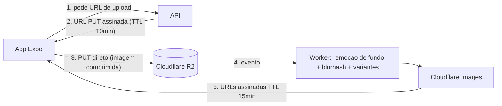

# Front-end: opcoes, comparativo e recomendacao

Documento de decisao tecnica do app **Monta Looks** (app brasileiro que monta looks para mulheres). Avalia as quatro rotas de front-end mobile viaveis e fecha uma recomendacao para o MVP, com stack completa, design tokens, estrutura de projeto e wireframes textuais das telas.

Relacionado: [[00-INDEX]] | [[01-visao-e-ideias]] | [[04-assinaturas-precos]] | [[06-seguranca]] | [[07-backlog-github]] | [[08-plano-de-testes]]

---

## 1. O que o front-end precisa entregar (requisitos que pesam na escolha)

Derivado dos pilares do produto:

1. **Feed pesado de imagens** — a tela principal e um feed de fotos de indicacoes (looks reais/gerados). Scroll a 60fps com centenas de imagens, cache agressivo, placeholders (blurhash), prefetch.
2. **Camera e galeria de primeira classe** — a usuaria fotografa pecas do proprio closet e a si mesma. Upload confiavel, compressao local, corte/edicao basica.
3. **Provador virtual** — no MVP, o "provador" sera **try-on por IA no servidor** (a usuaria envia foto, o backend gera a imagem dela com o look). AR em tempo real (tipo espelho magico) fica para fase 2+. Isso **reduz muito** a dependencia de ARKit/ARCore no framework escolhido.
4. **Assinaturas in-app** — 3 planos (Gratis, Medium R$19,90/mes, Premium R$24,90/mes) via App Store / Google Play. Ver [[04-assinaturas-precos]].
5. **Privacidade critica** — fotos pessoais de usuarias = dado sensivel. Armazenamento seguro de tokens, URLs assinadas com expiracao, bloqueio de screenshot em telas sensiveis. Detalhes em [[06-seguranca]].
6. **Velocidade de iteracao** — produto de moda vive de tendencia; precisamos publicar ajustes de UI e conteudo sem esperar review de loja (OTA updates).

> [!important] Decisao de escopo que muda a comparacao
> Como o provador virtual do MVP e **geracao de imagem server-side** (nao AR no device), o criterio "AR" pesa menos na escolha do framework agora — mas nao pode inviabilizar AR no futuro.

---

## 2. Comparativo das opcoes

Notas de 1 (fraco) a 5 (excelente), no contexto **deste** produto.

| Criterio | React Native + Expo | Flutter | Nativo (Swift/Kotlin) | PWA |
|---|---|---|---|---|
| Performance com muitas imagens | **4** — `expo-image` (Glide/SDWebImage por baixo), FlashList; New Architecture fechou o gap | **5** — rendering proprio (Impeller), listas de imagem muito fluidas | **5** — controle total (SDWebImage/Coil) | **2** — cache limitado, scroll pesado, sem controle fino de memoria |
| Camera / galeria | **4** — `expo-camera`, `expo-image-picker`, VisionCamera se precisar de frame processor | **4** — plugins maduros (`camera`, `image_picker`) | **5** — APIs nativas diretas | **2** — `getUserMedia` limitado no iOS Safari, sem galeria rica |
| AR / provador virtual (futuro) | **3** — ViroReact/bridges nativos; possivel, com esforco | **3** — plugins ARCore/ARKit imaturos | **5** — ARKit/ARCore de primeira classe | **1** — WebXR praticamente inexistente no iOS |
| Custo e velocidade de MVP | **5** — 1 codebase, EAS Build/Submit, ecossistema JS, dev loop rapido | **4** — 1 codebase, mas ecossistema menor p/ integracao BR | **1** — 2 times, 2 codebases, 2x custo e prazo | **5** — mais barato, porem entrega produto errado (ver abaixo) |
| Contratacao no Brasil | **5** — maior oferta (JS/TS/React), salarios acessiveis, freelas abundantes | **4** — comunidade forte e crescente, oferta menor que RN | **2** — devs iOS/Android seniores escassos e caros | **4** — qualquer dev web, mas perfil errado p/ mobile |
| OTA updates | **5** — EAS Update nativo do ecossistema | **3** — Shorebird (terceiro, pago, so Dart) | **1** — inexistente; toda mudanca passa por review | **5** — deploy instantaneo (e web) |
| Libs de pagamento/assinatura | **5** — RevenueCat (`react-native-purchases`) maduro; Stripe RN p/ web checkout | **4** — RevenueCat p/ Flutter tambem maduro | **5** — StoreKit 2 / Play Billing direto | **1** — sem IAP; Pix/cartao via web foge das lojas e mata distribuicao |
| **Total (ponderado p/ este produto)** | **31** | **27** | **24** | **20** |

> [!warning] Por que PWA esta descartada para o produto principal
> Publico feminino mobile-first no Brasil vive dentro de app stores; PWA nao tem IAP (quebra o modelo de assinatura das lojas), camera/galeria sao fracas no iOS, push notification no iOS ainda e limitado e a percepcao de "app de verdade" importa para um produto premium de moda. PWA sobrevive apenas como **web complementar** (secao 6).

> [!tip] Por que nao Flutter, se a nota de performance e maior
> A diferenca real de performance para um feed de imagens bem implementado e imperceptivel ao usuario final. O que decide e: contratacao no Brasil (RN >> Flutter), OTA de primeira classe (EAS Update), ecossistema de integracao local (Pix, RevenueCat, analytics, libs de social login) e reuso de conhecimento com a web (Next.js compartilha TS, tipos e ate componentes de logica).

---

## 3. Recomendacao

> [!important] RECOMENDACAO: **Expo + React Native (TypeScript)** para o app; **Next.js** para landing + painel admin.
> - **Menor custo/prazo de MVP** com um unico time TypeScript cobrindo app iOS + Android + web.
> - **Contratacao facil no Brasil** — o maior pool de devs mobile do pais e React Native.
> - **EAS Update (OTA)** permite corrigir UI, textos e curadoria de looks sem review de loja — vital para um produto de tendencia.
> - **RevenueCat maduro** resolve assinaturas nas duas lojas com uma API so, incluindo trial, upgrade Medium -> Premium e webhooks para o backend.
> - **Try-on por IA e server-side**, entao a fraqueza relativa em AR nao afeta o MVP; se o provador AR em tempo real virar prioridade, isolamos como modulo nativo (Expo Modules API) sem trocar de stack.
> - Risco residual: performance de listas — mitigado com FlashList + `expo-image` + thumbnails via CDN (secao 4.5).

---

## 4. Stack completa do app (Expo + React Native)

### 4.1 Fundacao

| Camada | Escolha | Observacoes |
|---|---|---|
| Linguagem | **TypeScript** (strict) | Tipos compartilhados com backend/web via pacote `@monta-looks/types` |
| Runtime | **Expo SDK (mais recente estavel)** + New Architecture | Dev builds via `expo-dev-client`; nunca depender do Expo Go em producao |
| Navegacao | **expo-router** (file-based) | Deep links prontos (`montalooks://look/123`), rotas tipadas, grupos `(auth)`/`(tabs)` |
| Estado de servidor | **TanStack Query v5** | Cache do feed, invalidacao pos-upload, `prefetchQuery` do detalhe do look no scroll |
| Estado de cliente | **Zustand** | Sessao, quiz de estilo em andamento, flags de UI; persistencia via MMKV |
| Storage local | **react-native-mmkv** | Rapido e sincronico; nunca guardar token aqui — token vai no SecureStore ([[06-seguranca]]) |
| Formularios | **react-hook-form + zod** | Validacao compartilhada com o backend (schemas zod no pacote de tipos) |

### 4.2 UI e design system

| Camada | Escolha | Observacoes |
|---|---|---|
| Estilizacao | **NativeWind v4 (Tailwind) + design system proprio** | Tamagui e otimo, mas seu visual "de fabrica" briga com estetica editorial de moda; NativeWind da velocidade sem impor cara. Tokens em `tailwind.config` = fonte unica |
| Componentes base | Proprios: `Button`, `Card`, `LookCard`, `Chip`, `Sheet`, `Paywall` | Sem UI kit visual de terceiros; primitivos de acessibilidade podem vir de `react-native-primitives` |
| Listas | **@shopify/flash-list** | Obrigatorio no feed; `estimatedItemSize` calibrado, imagens com aspect ratio fixo |
| Animacoes | **react-native-reanimated + react-native-gesture-handler** | Shared element do card do look -> detalhe; micro-interacoes de like/salvar; `Moti` opcional p/ atalhos |
| Icones | **lucide-react-native** | Traco fino combina com a estetica; customizar stroke-width 1.5 |
| Haptics | **expo-haptics** | Feedback sutil em like, salvar look e confirmacao de assinatura |

### 4.3 Imagem (coracao do produto)

| Funcao | Escolha | Observacoes |
|---|---|---|
| Exibicao | **expo-image** | `cachePolicy="memory-disk"`, `placeholder={blurhash}`, `recyclingKey` no FlashList, `transition` de 200ms |
| Captura | **expo-camera** + **expo-image-picker** | Fluxo "fotografar peca" e "escolher da galeria"; pedir permissao com tela explicativa propria (LGPD, ver [[06-seguranca]]) |
| Compressao/corte local | **expo-image-manipulator** | Redimensionar p/ max 2048px e JPEG q=0.8 **antes** do upload — economiza dados moveis da usuaria |
| Remocao de fundo | **API server-side** (PhotoRoom API ou rembg/BiRefNet self-hosted) | Nunca no device (bateria/tempo); app envia foto da peca -> backend devolve PNG recortado p/ o closet virtual. Comecar com PhotoRoom (rapido de integrar), migrar p/ self-hosted quando o volume justificar custo |
| Blurhash | Gerado no backend no momento do upload | Vem junto no payload do feed |

### 4.4 Upload e CDN

**Escolha: Cloudflare R2 + Cloudflare Images** (alternativa: S3 + CloudFront + Lambda@Edge).

- R2 sem custo de egress (feed de imagens = muito egress; no S3 isso vira a maior conta).
- Cloudflare Images gera variantes (`thumb 200px`, `feed 600px`, `full 1200px`) — o app **nunca** baixa a imagem original.
- **URLs assinadas com TTL curto** (15 min) para fotos pessoais de usuarias; fotos de catalogo/indicacoes podem ser publicas com cache longo.
- Upload **direto do app para o R2** via URL pre-assinada (o binario nao passa pela API — menos latencia e menos superficie de ataque).



### 4.5 Pagamentos e assinatura

- **RevenueCat** (`react-native-purchases`): entitlements `medium` e `premium`, paywall nativo, trial, restauracao de compra, webhooks -> backend.
- Precos das lojas espelhando [[04-assinaturas-precos]]: Medium R$19,90/mes, Premium R$24,90/mes.
- Paywall proprio (nao o template do RevenueCat) para manter a estetica — RevenueCat so como motor.

### 4.6 Servicos transversais

| Funcao | Escolha |
|---|---|
| Auth | Backend proprio ou Supabase Auth; social login com `expo-apple-authentication` (obrigatorio na App Store se houver social login) + Google |
| Analytics | PostHog (self-hosted ou cloud) — funil: onboarding -> quiz -> primeiro look salvo -> paywall -> assinatura |
| Crash/erro | Sentry (`sentry-expo`) |
| Push | `expo-notifications` — "seu look do dia chegou" |
| OTA | **EAS Update** — canal `production` e `preview`; changelog interno em [[07-backlog-github]] |
| CI/CD | EAS Build + Submit via GitHub Actions; testes em [[08-plano-de-testes]] |

---

## 5. Design tokens — duas direcoes esteticas

Publico: mulheres brasileiras, produto aspiracional mas acessivel (R$19,90–24,90). Ambas as direcoes fogem do rosa-choque cliche; escolher **uma** em teste com usuarias (ver [[08-plano-de-testes]]).

### Direcao A — "Editorial Areia" (minimal de revista, quente e sofisticado)

| Token | Hex | Uso |
|---|---|---|
| `bg` | `#FAF7F2` | Fundo geral (off-white quente) |
| `surface` | `#FFFFFF` | Cards de look |
| `ink` | `#1C1A17` | Texto principal (preto quente, nunca #000) |
| `ink-soft` | `#6E675E` | Texto secundario, legendas |
| `primary` | `#A65A3F` | Terracota — CTAs, like, destaque de plano |
| `primary-soft` | `#EAD9CF` | Fundo de chips e tags |
| `accent` | `#3E4A3D` | Verde-oliva profundo — detalhes, icones ativos |
| `gold` | `#B8975A` | Selo Premium, estrelas |
| `danger` | `#B3442E` | Erros |

- **Tipografia**: display **Fraunces** (serifa com personalidade, pesos 500–600 para titulos "Seu look de hoje"); corpo **Figtree** (400/500/600). Numeros de preco em Fraunces.
- Sensacao: editorial, linho, luz natural — Pinterest sofisticado.

### Direcao B — "Vinho Moderno" (luxo urbano, contraste alto)

| Token | Hex | Uso |
|---|---|---|
| `bg` | `#F7F1EE` | Fundo geral (rosa-areia palido) |
| `surface` | `#FFFFFF` | Cards |
| `ink` | `#2A161D` | Texto principal (vinho quase preto) |
| `ink-soft` | `#7A6067` | Secundario |
| `primary` | `#7A1E3C` | Burgundy — CTAs, navegacao ativa |
| `primary-soft` | `#F0D8DE` | Chips, fundos de destaque |
| `accent` | `#D98E73` | Coral queimado — badges "novo", promocoes |
| `gold` | `#C6A15B` | Selo Premium |
| `danger` | `#C03A2B` | Erros |

- **Tipografia**: display **Playfair Display** (600); corpo **Inter** (400/500/600).
- Sensacao: vitrine noturna, batom, salto — mais "moda festa/urbana".

> [!tip] Regras comuns as duas direcoes
> Raio de borda 16px em cards e 999px em chips; espacamento em escala de 4 (4/8/12/16/24/32); fotos sempre em proporcao 3:4 (retrato de moda); modo escuro fica para pos-MVP (fotos de look rendem melhor em fundo claro).

---

## 6. Web complementar — Next.js

| Peca | Stack | Conteudo |
|---|---|---|
| Landing page | **Next.js (App Router) + Tailwind**, deploy Vercel | Proposta de valor, prints do app, precos dos planos, FAQ LGPD, links das lojas; SEO p/ "looks para..." (ver [[02-analise-de-mercado]]) |
| Painel admin | Next.js + shadcn/ui, atras de auth | Curadoria de indicacoes (aprovar/editar looks gerados), gestao de catalogo de pecas/marcas parceiras, moderacao de fotos, metricas de assinatura (webhooks RevenueCat) |

Reuso: pacote `@monta-looks/types` (zod + TS) compartilhado entre app, API e web — um schema, tres consumidores.

---

## 7. Estrutura de pastas do projeto Expo

```
monta-looks/
├── app/                          # rotas (expo-router)
│   ├── _layout.tsx               # providers: Query, tema, auth gate
│   ├── (auth)/
│   │   ├── boas-vindas.tsx
│   │   ├── login.tsx
│   │   └── quiz-estilo/          # onboarding de estilo (multi-step)
│   │       ├── _layout.tsx
│   │       └── [etapa].tsx
│   ├── (tabs)/
│   │   ├── _layout.tsx           # tab bar customizada
│   │   ├── index.tsx             # Home: feed de indicacoes
│   │   ├── explorar.tsx          # busca por ocasiao/estilo/marca
│   │   ├── closet.tsx            # meu closet + provador
│   │   └── perfil.tsx
│   ├── look/[id].tsx             # detalhe do look
│   ├── provador/resultado.tsx    # resultado do try-on IA
│   └── paywall.tsx               # modal de assinatura
├── src/
│   ├── components/
│   │   ├── ui/                   # design system (Button, Chip, Sheet...)
│   │   └── look/                 # LookCard, LookGrid, PecaTag
│   ├── features/
│   │   ├── feed/                 # hooks + api do feed
│   │   ├── closet/               # upload, remocao de fundo, pecas
│   │   ├── provador/             # try-on
│   │   ├── assinatura/           # RevenueCat, entitlements
│   │   └── quiz-estilo/
│   ├── lib/                      # apiClient, queryClient, analytics, storage
│   ├── stores/                   # Zustand (sessao, ui)
│   ├── theme/                    # tokens.ts (fonte p/ tailwind.config)
│   └── types/                    # re-export de @monta-looks/types
├── assets/                       # fontes, splash, icones
├── tailwind.config.js
├── app.config.ts                 # config por ambiente (dev/preview/prod)
└── eas.json                      # perfis de build/update
```

---

## 8. Telas do MVP com wireframe textual

### 8.1 Onboarding — Quiz de estilo (`(auth)/quiz-estilo`)
```
[progresso ▓▓▓░░ 3/5]
Titulo: "O que voce mais usa no dia a dia?"
[grid 2x2 de fotos selecionaveis: casual | office | festa | boho]
[continuar →]  (desabilitado ate escolher)
```
Objetivo: alimentar o motor de indicacoes antes do primeiro feed. Maximo 5 etapas, pulavel a partir da 3a.

### 8.2 Home — Feed de indicacoes (`(tabs)/index`)
```
[saudacao: "Bom dia, Ana"]  [icone busca]
[chips horizontais: Para hoje | Trabalho | Festa | Frio]
┌──────────────┐ ┌──────────────┐
│ foto look 3:4│ │ foto look 3:4│   <- FlashList 2 colunas
│ ♥ salvar     │ │ ♥ salvar     │
│ "Office chic"│ │ "Sexta casual"│
└──────────────┘ └──────────────┘
[card destacado 1x: "Seu look do dia" — gerado p/ o clima da cidade]
```
Gratis: N looks/dia com blur nos excedentes -> toque abre `paywall`.

### 8.3 Detalhe do look (`look/[id]`)
```
[foto grande 3:4, shared element da Home]
[titulo + tags: ocasiao, estilo, clima]
Pecas do look:
  [thumb] Blazer alfaiataria — Renner  R$189  [ver na loja ↗]
  [thumb] Calca wide leg — Zara        R$259  [ver na loja ↗]
[♥ salvar] [provar em mim →]  (provador = feature Medium+)
[looks parecidos: carrossel horizontal]
```
"Ver na loja" abre browser in-app com link afiliado (pilar 3: melhores opcoes do mercado).

### 8.4 Meu Closet + Provador (`(tabs)/closet`)
```
[tabs internas: Minhas pecas | Meus looks salvos]
[+ fotografar peca]  [+ da galeria]
[grid de pecas com fundo removido, agrupadas por categoria]
Provador: [minha foto base + escolher look] -> [gerar imagem]
[estado: gerando... ~20s, com skeleton]
```
Foto base da usuaria: tela com aviso de privacidade e link "como protegemos suas fotos" -> conteudo de [[06-seguranca]].

### 8.5 Explorar (`(tabs)/explorar`)
```
[campo busca: "vestido para casamento de dia"]
[filtros: ocasiao | estilo | faixa de preco | marca]
[resultado em grid 2 colunas, mesmo LookCard da Home]
```

### 8.6 Paywall (`paywall`, modal)
```
[foto de fundo: look aspiracional com overlay]
"Desbloqueie looks ilimitados"
( ) Medium  R$19,90/mes — looks ilimitados + provador
(•) Premium R$24,90/mes — tudo do Medium + prioridade em novidades + sem anuncios
[assinar agora]   [restaurar compra]   [termos]
```
Copy e hierarquia dos planos: ver [[04-assinaturas-precos]].

### 8.7 Perfil (`(tabs)/perfil`)
```
[avatar + nome + selo do plano]
Meu estilo (refazer quiz) ›
Assinatura ›   Notificacoes ›
Privacidade e meus dados (LGPD) ›   <- exportar/excluir dados
Sair
```

---

## 9. Seguranca mobile (resumo — detalhes em [[06-seguranca]])

> [!warning] Itens obrigatorios no front-end desde o MVP
> - Tokens **somente** em `expo-secure-store` (Keychain/Keystore) — nunca em MMKV/AsyncStorage.
> - **URLs assinadas com TTL curto** para toda foto pessoal; nada de bucket publico para conteudo de usuaria.
> - `expo-screen-capture` bloqueando screenshot/gravacao nas telas de foto pessoal (closet, provador, resultado do try-on).
> - Biometria opcional (`expo-local-authentication`) para abrir o closet.
> - Upload sempre por HTTPS com certificate pinning (via `expo-build-properties` / config plugin).
> - Tela de consentimento LGPD especifica para fotos pessoais (finalidade: gerar provador), com revogacao e exclusao em "Privacidade e meus dados".
> - EAS Update assinado (code signing) para impedir OTA malicioso.

---

## 10. Riscos e proximos passos

| Risco | Mitigacao |
|---|---|
| Feed engasgar com imagens | FlashList + variantes de CDN + blurhash; teste de performance com 500 itens em device Android de entrada (ver [[08-plano-de-testes]]) |
| Custo de API de remocao de fundo escalar | Comecar PhotoRoom, planejar migracao p/ rembg self-hosted em Worker/GPU spot |
| Review da Apple no paywall | Seguir guidelines de IAP a risca (nada de link p/ pagamento externo no app) |
| AR real virar exigencia de mercado | Isolar como Expo Module nativo; decisao registrada em [[03-concorrentes]] quando algum player lancar |

**Proximos passos** (detalhar em [[07-backlog-github]]):
1. Validar as duas direcoes esteticas com 5–8 usuarias-alvo (teste de preferencia com mockups).
2. Bootstrap do monorepo (app Expo + Next.js + pacote de tipos).
3. Spike de 3 dias: feed com FlashList + expo-image + R2 assinado, medindo fps em Android de entrada.
4. Conta RevenueCat + produtos das lojas configurados com os precos de [[04-assinaturas-precos]].
