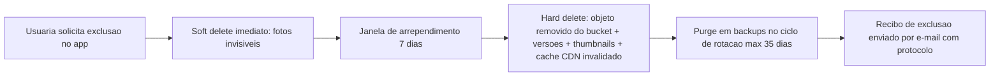

# Seguranca Maxima — Especificacao Tecnica

> [!important] Por que este documento e o mais critico do projeto
> O app armazena **fotos pessoais de mulheres** (corpo, rosto, ambiente domestico) para montar looks. Um vazamento nao seria apenas um incidente tecnico: seria dano real a integridade e privacidade das usuarias, morte reputacional do produto e violacao grave da LGPD. Seguranca aqui **nao e feature — e o diferencial central** anunciado ao mercado (ver [[01-visao-e-ideias]] e [[02-analise-de-mercado]]).

Documentos irmãos: [[00-INDEX]] · [[05-frontend]] · [[07-backlog-github]] · [[08-plano-de-testes]]

---

## 1. Threat Model resumido (STRIDE)

### 1.1 Ativos protegidos

| Ativo | Sensibilidade | Observacao |
|---|---|---|
| Fotos pessoais das usuarias (armario, provas de look, selfies) | **Critica** | Nunca publicas por padrao; nucleo do threat model |
| Fotos de indicacoes/looks gerados | Alta | Podem conter rosto/corpo da usuaria |
| Dados cadastrais (nome, e-mail, telefone) | Alta | Dado pessoal LGPD |
| Medidas corporais e preferencias de estilo | Alta | Dado sensivel por inferencia (corpo, saude, religiao via vestuario) |
| Dados de pagamento (assinaturas Medium/Premium) | Alta | Tokenizado no gateway; nunca no nosso banco |
| Tokens de sessao e credenciais | Critica | Alvo de account takeover |
| Modelos/prompts de geracao de imagem | Media | Propriedade intelectual |

### 1.2 Atacantes considerados

- **Stalker / ex-parceiro abusivo**: tenta localizar, identificar ou acessar fotos de uma usuaria especifica. Cenario prioritario por se tratar de publico feminino.
- **Vazamento em massa**: invasor externo ou insider exfiltra o bucket de fotos ou o banco.
- **Scraping**: bots coletam fotos e perfis para treinar modelos ou montar bases de reconhecimento facial.
- **Conta invadida (account takeover)**: credential stuffing, phishing, SIM swap.
- **Insider malicioso**: funcionario/prestador com acesso indevido a fotos.

### 1.3 Matriz STRIDE

| Ameaca | Cenario no app | Controles principais |
|---|---|---|
| **S**poofing | Login com credenciais vazadas; phishing | Passkeys, MFA TOTP, deteccao de login suspeito (secao 4) |
| **T**ampering | Alteracao de payloads da API; app repackaged | TLS 1.3 + pinning, validacao server-side, assinatura de builds (secoes 5, 7, 9) |
| **R**epudiation | Disputa sobre exclusao de fotos/consentimento | Logs de auditoria imutaveis com trilha de consentimento e purge (secoes 3, 10) |
| **I**nformation disclosure | URL de foto vazada, bucket publico, EXIF com GPS | Bucket privado + URLs assinadas curtas, strip de EXIF, E2EE opcional (secao 5) |
| **D**enial of service | Flood na API de geracao de looks (custosa) | Rate limiting por conta/IP, WAF, quotas por plano (secao 7) |
| **E**levation of privilege | IDOR: usuaria A acessa foto da usuaria B | Autorizacao por objeto em TODA rota, testes automatizados de IDOR ([[08-plano-de-testes]]) |

> [!warning] Regra de ouro anti-IDOR
> Toda query de foto/dado passa por verificacao `owner_id == session.user_id` no backend. IDs de recursos sao UUIDv4 (nao sequenciais). Teste de regressao obrigatorio por endpoint.

---

## 2. OWASP MASVS — controles por categoria

Alvo: **MASVS-L2 + R** (protecao de dados sensiveis + resiliencia) para o app mobile.

| Categoria MASVS | Controles concretos no monta-looks |
|---|---|
| **MASVS-STORAGE** | Nenhuma foto persistida em claro no device fora do sandbox; cache de imagens criptografado e com TTL; tokens apenas em Keychain (iOS) / Keystore+EncryptedSharedPreferences (Android); proibido logar dado pessoal; backup do app (iTunes/ADB) exclui diretorio de fotos e tokens (`android:allowBackup=false` seletivo) |
| **MASVS-CRYPTO** | Somente algoritmos padrao de plataforma (AES-256-GCM, SHA-256, Argon2id no servidor); zero crypto caseira; chaves geradas no Secure Enclave/StrongBox quando disponivel |
| **MASVS-AUTH** | Passkeys preferencial, MFA TOTP, sessao curta com refresh rotativo, logout server-side real (revogacao), re-autenticacao biometrica para acoes sensiveis (exportar/excluir armario) |
| **MASVS-NETWORK** | TLS 1.3 obrigatorio, certificate pinning com plano de rotacao, sem trafego HTTP nem excecoes de ATS/cleartext |
| **MASVS-PLATFORM** | Permissoes minimas (camera/galeria sob demanda, nunca localizacao); WebViews com JS restrito e sem acesso a arquivos; deep links validados (App Links/Universal Links verificados) contra hijacking |
| **MASVS-CODE** | Builds release com ofuscacao (R8/ProGuard), simbolos removidos, dependencias auditadas (secao 9), atualizacao forcada de versoes com CVE critico |
| **MASVS-RESILIENCE** | Deteccao de root/jailbreak, deteccao de debugger/hooking (Frida) em telas sensiveis, Play Integrity API + App Attest para atestar o cliente antes de emitir tokens |
| **MASVS-PRIVACY** | Minimizacao (secao 3), strip de EXIF no client E no server, telas sensiveis fora do app switcher, sem SDKs de tracking de terceiros no fluxo de fotos |

---

## 3. LGPD — conformidade completa

### 3.1 Bases legais por tratamento

| Tratamento | Base legal (LGPD art. 7/11) | Nota |
|---|---|---|
| Cadastro e login | Execucao de contrato | Necessario para prestar o servico |
| Fotos do armario e provas de look | **Consentimento especifico** | Revogavel a qualquer momento no app |
| Medidas corporais / preferencias | Consentimento especifico | Tratado como sensivel por precaucao |
| Recomendacoes personalizadas (IA) | Consentimento + legitimo interesse documentado | Opt-out sem perder o uso basico |
| Cobranca de assinatura ([[04-assinaturas-precos]]) | Execucao de contrato / obrigacao legal | Dados fiscais retidos pelo prazo legal |
| Marketing (push/e-mail) | Consentimento | Opt-in separado, nunca pre-marcado |

### 3.2 Consentimento granular

- Toggles independentes no onboarding e em Configuracoes > Privacidade: (a) armazenar fotos, (b) usar fotos para gerar looks com IA, (c) recomendacoes personalizadas, (d) comunicacoes de marketing.
- Registro de consentimento com versao do texto, timestamp, IP e device — trilha auditavel.
- Mudanca de finalidade => novo consentimento. **Fotos jamais usadas para treinar modelos** sem opt-in explicito e separado.

### 3.3 Minimizacao e retencao

- Coletar apenas o necessario: sem CPF no cadastro gratuito, sem localizacao, sem contatos.
- Retencao definida: fotos e perfil mantidos enquanto a conta existir; conta inativa por 24 meses => aviso e anonimizacao/exclusao.
- Logs de acesso: 6 meses (art. 15 Marco Civil aplicado a registros de aplicacao) e depois descartados.

### 3.4 Direito ao esquecimento — purge real de fotos

- Exclusao cobre: original, derivados (thumbnails, crops, imagens geradas a partir da foto), embeddings/vetores, cache de CDN e replicas.
- Backups criptografados expiram em ate 35 dias; documento registra que a exclusao definitiva em backup ocorre por expiracao — informado com transparencia a usuaria.
- Job de verificacao pos-purge confirma ausencia do objeto e grava evidencia no log de auditoria.

### 3.5 Governanca

- **DPO/Encarregado** nomeado antes do lancamento, com canal publico (privacidade@dominio) e SLA de resposta de 15 dias a titulares.
- **RIPD** (Relatorio de Impacto a Protecao de Dados) elaborado antes do MVP e revisado a cada feature que toque fotos/IA.
- **Hospedagem no Brasil: AWS sa-east-1 (Sao Paulo)** para dados pessoais e fotos — reduz latencia, simplifica jurisdicao e elimina discussao de transferencia internacional. Subprocessadores listados na politica de privacidade.
- Contratos de operador (DPA) com todo fornecedor que tocar dado pessoal (gateway de pagamento, provedor de IA, ferramenta de analytics).
- Comunicacao de incidente a ANPD e as titulares conforme Resolucao CD/ANPD n. 15/2024 (prazo de 3 dias uteis).

---

## 4. Autenticacao e contas

- **Passkeys/WebAuthn como metodo preferencial** (sem senha para roubar/phishar); fallback: OAuth **Sign in with Apple** e **Google**; e-mail+senha apenas como ultimo recurso, com Argon2id e checagem contra senhas vazadas (k-anonimato estilo HIBP).
- **MFA TOTP** opcional para todas e incentivada; obrigatoria para acoes de alto risco quando o login for por senha.
- **Sessao**: access token JWT de 15 min; refresh token opaco, rotativo, single-use, com deteccao de reuso (reuso => revoga a familia inteira de tokens).
- **Deteccao de login suspeito**: novo device/pais/impossivel-viagem => e-mail de alerta + step-up (TOTP ou re-auth passkey); lista de sessoes ativas no app com botao "desconectar tudo".
- Recuperacao de conta sem perguntas secretas: link magico com expiracao curta + esfriamento de 24h antes de permitir troca de e-mail; alteracoes criticas notificadas no e-mail antigo.
- Protecao a credential stuffing: rate limit por conta e por IP, device fingerprint leve, escalada para atestacao (App Attest / Play Integrity).

---

## 5. Criptografia e protecao das fotos

> [!important] Fotos: postura padrao
> **Toda foto de usuaria vive em bucket S3 privado (sa-east-1), sem nenhum objeto publico, servida exclusivamente por URLs assinadas com expiracao de 60–300 segundos**, emitidas apenas apos autorizacao por objeto.

- **Em transito**: TLS 1.3 exclusivo; **certificate pinning** no app (pin do SPKI, com pin reserva e janela de rotacao para nao brickar clientes).
- **Em repouso**: AES-256 (SSE-KMS com chaves gerenciadas e rotacionadas; CMK dedicada ao bucket de fotos com politica restritiva e logging de uso de chave).
- **Pipeline de upload**:
  1. Client remove **EXIF/metadata (GPS, serial, data)** antes do envio;
  2. Server re-processa e faz strip novamente (defesa em profundidade) + re-encode da imagem (mata payloads escondidos);
  3. Antivirus/scan de conteudo; validacao de tipo real (magic bytes), limite de tamanho;
  4. Objeto gravado com UUID nao adivinhavel, sem nome original do arquivo.
- **E2EE opcional — "Armario Privado" (Premium)**: fotos cifradas no device (libsignal/AES-256-GCM com chave derivada no Secure Enclave/Keystore); servidor armazena apenas blobs; recomendacoes nesse modo rodam on-device. Trade-off documentado: sem recuperacao se a usuaria perder a chave — fluxo de recovery code claro.
- Sem fotos em CDN publica; CDN somente com signed cookies/URLs e cache privado.
- Chaves e segredos de backend em AWS Secrets Manager; nunca em codigo, nunca em variaveis de build do app.

---

## 6. Seguranca no device

- Tokens e chaves: **Keychain (iOS, `kSecAttrAccessibleWhenUnlockedThisDeviceOnly`) / Android Keystore + EncryptedSharedPreferences**.
- **Biometria para abrir o app (opcional, incentivada)**: Face ID/Touch ID/BiometricPrompt; obrigatoria para entrar no Armario Privado E2EE.
- **Bloqueio de screenshot/gravacao em telas sensiveis**: `FLAG_SECURE` no Android; no iOS, ocultacao de conteudo no app switcher e deteccao de captura com aviso (iOS nao permite bloqueio total — limite documentado).
- **Root/jailbreak detection** (Play Integrity + App Attest + checagens locais): device comprometido => bloqueia Armario Privado e alerta a usuaria; nao bloqueia o app inteiro (evitar falso positivo punitivo).
- Sem dados sensiveis em logs do device, clipboard monitorado (aviso ao copiar link de foto), teclados de terceiros desabilitados em campos sensiveis quando possivel.
- Cache de imagens com criptografia e limpeza no logout.

---

## 7. Seguranca de API

- **Rate limiting** em camadas: por IP (WAF), por conta, por endpoint (geracao de look tem quota por plano — ver [[04-assinaturas-precos]]); resposta 429 com backoff.
- **WAF (AWS WAF)** na borda: OWASP Core Rule Set, bloqueio de bots conhecidos, regras anti-scraping (padrao de acesso sequencial a perfis => bloqueio + alerta).
- **Validacao e autorizacao**: schema validation (zod/JSON Schema) em toda entrada; autorizacao por objeto centralizada em middleware (nunca ad-hoc por rota); paginacao com cursores opacos.
- **Tokens**: access de 15 min, refresh rotativo (secao 4); tokens vinculados a device (DPoP ou claim de device) para reduzir replay.
- Headers de seguranca, CORS restrito ao dominio do app web (se houver), erros sem stack trace, IDs internos jamais expostos.
- Logs de API com trilha de auditoria para acesso a fotos (quem, quando, qual objeto) — insumo direto para resposta a incidentes.

---

## 8. Anti-abuso e seguranca da comunidade

- **Perfis privados por padrao**; compartilhamento de look e opt-in, por item, com preview do que ficara visivel.
- **Nenhuma localizacao publica, nunca**: app nao pede permissao de localizacao; cidade/regiao nao aparece em perfil.
- **Moderacao de imagens em duas camadas**: IA (nudez nao consentida, menores, violencia — ex.: Rekognition/Hive) na entrada de qualquer conteudo compartilhavel + fila de revisao humana treinada, com SLA de 24h.
- **Denuncia e bloqueio**: botao de denuncia em todo conteudo/perfil publico; bloqueio impede qualquer interacao e descoberta; usuaria denunciada nao e notificada de quem denunciou.
- Protecao anti-stalker: busca de perfil somente por handle exato (sem busca por nome real/telefone/foto); sem "visto por ultimo"; sem confirmacao de leitura.
- Anti-scraping: fotos publicas (quando a usuaria optar) servidas com rate limit agressivo, sem URLs estaveis, `noindex`, e watermarking invisivel para rastrear vazamentos.
- Verificacao de idade no cadastro (13+ com tratamento reforcado para menores conforme art. 14 LGPD; alvo de produto: 18+).

---

## 9. Supply chain e ciclo de desenvolvimento

- **Dependabot/Renovate** com auto-PR semanal; CVE critico => patch em 48h.
- **SCA** (Software Composition Analysis) no CI bloqueando dependencia com vulnerabilidade alta sem excecao aprovada; geracao de SBOM por release.
- **Secret scanning** (GitHub Advanced Security + gitleaks no pre-commit); segredo vazado => rotacao imediata documentada.
- **SAST**: CodeQL + Semgrep com regras customizadas (ex.: proibir upload sem strip de EXIF, proibir bucket policy publica) rodando em todo PR.
- **Assinatura de builds**: Play App Signing + fastlane match com certificados protegidos; provenance de build (SLSA) no pipeline; ambiente de CI com OIDC, sem chaves AWS de longa duracao.
- Revisao de codigo obrigatoria (2 aprovacoes em codigo que toca fotos/auth); branch protection; infraestrutura como codigo (Terraform) revisada com policy-as-code (tfsec/Checkov — ex.: negar bucket publico por politica).
- Itens correspondentes ja mapeados no [[07-backlog-github]].

---

## 10. Processo e operacao

- **Pentest anual** por terceiro independente (escopo: app mobile, API, cloud) + pentest pontual antes de lancamentos maiores (ex.: Armario Privado E2EE).
- **Bug bounty / VDP**: comecar com programa de divulgacao coordenada (security.txt + pagina de politica) e evoluir para bounty pago (BugHunt/HackerOne) apos o produto estabilizar.
- **Resposta a incidentes**: runbook escrito (deteccao, contencao, erradicacao, comunicacao ANPD em 3 dias uteis, comunicacao as usuarias, post-mortem); simulacao (tabletop) semestral; on-call definido.
- **Backups criptografados e TESTADOS**: snapshot diario do banco + versionamento de bucket; restore testado mensalmente com evidencia; RPO 24h, RTO 4h; backups respeitam o purge (secao 3.4).
- Monitoramento: CloudTrail + GuardDuty + alertas de acesso anomalo ao bucket de fotos; painel de metricas de seguranca revisado quinzenalmente.
- Treinamento anual de privacidade/seguranca para todo o time; acesso de produção sob least privilege com MFA e sessao gravada para operacoes em dados de usuarias.

---

## 11. Checklist final acionavel

Prioridade: **P0** = bloqueia lancamento · **P1** = ate 90 dias pos-lancamento · **P2** = evolucao continua.

| # | Item | Prioridade | Secao | Status |
|---|---|---|---|---|
| 1 | Bucket privado + URLs assinadas curtas + SSE-KMS | P0 | 5 | pendente |
| 2 | Strip de EXIF/GPS no client e no server + re-encode | P0 | 5 | pendente |
| 3 | Autorizacao por objeto (anti-IDOR) + testes automatizados | P0 | 1, 7 | pendente |
| 4 | TLS 1.3 + certificate pinning com rotacao | P0 | 5 | pendente |
| 5 | Passkeys + OAuth Apple/Google + refresh rotativo | P0 | 4 | pendente |
| 6 | Consentimento granular + trilha de auditoria | P0 | 3 | pendente |
| 7 | Fluxo de exclusao com purge real (fotos, derivados, backups) | P0 | 3.4 | pendente |
| 8 | Hospedagem sa-east-1 + DPA com fornecedores | P0 | 3.5 | pendente |
| 9 | Keychain/Keystore + FLAG_SECURE em telas sensiveis | P0 | 6 | pendente |
| 10 | Rate limiting + WAF + validacao de schema | P0 | 7 | pendente |
| 11 | Moderacao IA + humana, denuncia e bloqueio | P0 | 8 | pendente |
| 12 | Perfis privados por padrao, sem localizacao | P0 | 8 | pendente |
| 13 | Secret scanning + SAST (CodeQL/Semgrep) no CI | P0 | 9 | pendente |
| 14 | RIPD elaborado + DPO nomeado | P0 | 3.5 | pendente |
| 15 | MFA TOTP + deteccao de login suspeito | P1 | 4 | pendente |
| 16 | Biometria para abrir o app + root/jailbreak detection | P1 | 6 | pendente |
| 17 | Backups criptografados com restore testado mensal | P1 | 10 | pendente |
| 18 | Runbook de incidentes + tabletop | P1 | 10 | pendente |
| 19 | Dependabot/SCA + SBOM + assinatura de builds | P1 | 9 | pendente |
| 20 | Pentest independente | P1 | 10 | pendente |
| 21 | E2EE Armario Privado (Premium) | P2 | 5 | pendente |
| 22 | Bug bounty pago | P2 | 10 | pendente |
| 23 | Watermarking invisivel anti-scraping | P2 | 8 | pendente |
| 24 | Atestacao de cliente (App Attest / Play Integrity) para emitir tokens | P2 | 4, 6 | pendente |

> [!tip] Integracao com o backlog
> Cada linha desta tabela vira issue no [[07-backlog-github]] com label `security` e a prioridade correspondente (`P0`/`P1`/`P2`). Os itens P0 formam o "security gate" de lancamento: nenhum release publico sem os 14 primeiros concluidos e verificados no [[08-plano-de-testes]].
