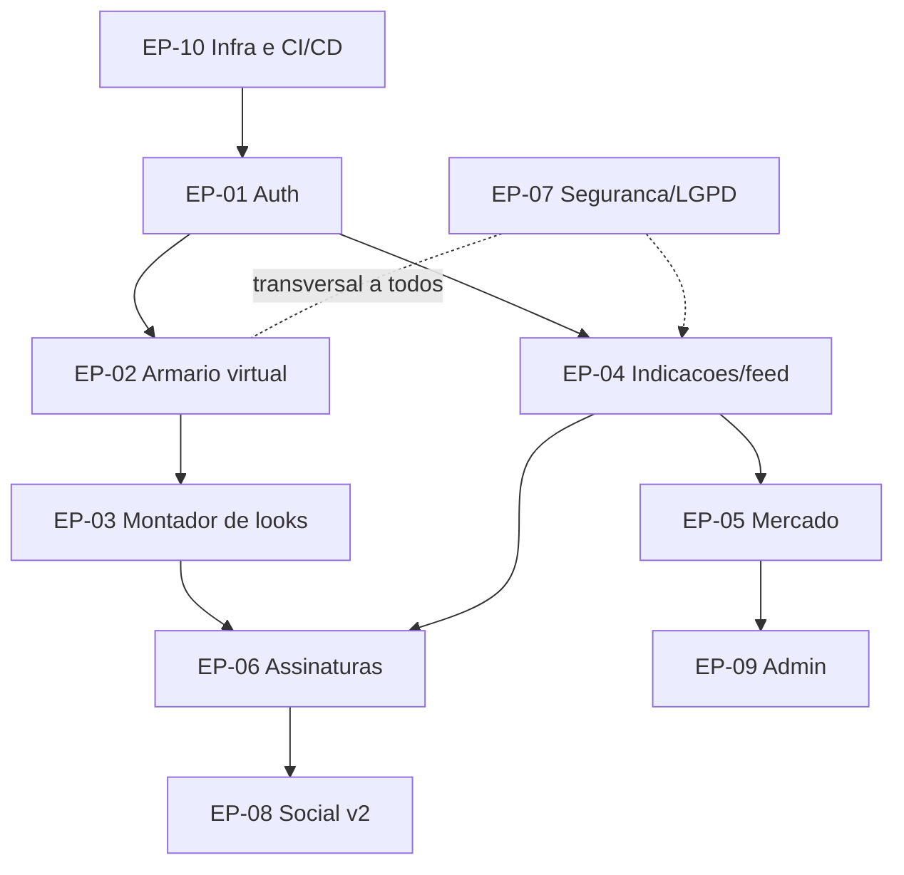
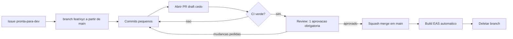

# Backlog GitHub e Fluxo de PR/Issues

Documento de trabalho do repositorio do app monta-looks: estrutura de epicos, issues iniciais prontas para colar no GitHub, templates de issue/PR, fluxo de branches e pull requests, CI/CD com gates de seguranca e Definition of Done.

Relacionado: [[00-INDEX]] · [[01-visao-e-ideias]] · [[04-assinaturas-precos]] · [[05-frontend]] · [[06-seguranca]] · [[08-plano-de-testes]] · [[CLAUDE]]

> [!important] Regra de ouro do repositorio
> Nada entra na branch `main` sem pull request revisado e com todos os status checks verdes — incluindo os gates de seguranca. Fotos de usuarias sao dado sensivel: qualquer issue que toque em upload, armazenamento ou exibicao de foto recebe obrigatoriamente a label `seguranca` e revisao extra (ver [[06-seguranca]]).

---

## 1. Estrutura de epicos

Cada epico vira uma issue "guarda-chuva" no GitHub (com tasklist apontando para as issues filhas) e uma label `epico:*`.

| Epico | Label | Descricao | Milestone principal |
|---|---|---|---|
| EP-01 Autenticacao e contas | `epico:auth` | Cadastro, login, recuperacao, onboarding de estilo, exclusao de conta | MVP |
| EP-02 Armario virtual | `epico:armario` | Upload e organizacao das pecas da usuaria (fotos pessoais) | MVP |
| EP-03 Montador de looks | `epico:looks` | Combinacao de pecas, sugestao automatica, favoritos | MVP |
| EP-04 Indicacoes e feed de fotos | `epico:indicacoes` | Feed com FOTOS DE INDICACOES (imagens reais/geradas) e refinamento por feedback | MVP |
| EP-05 Melhores opcoes do mercado | `epico:mercado` | Catalogo de pecas/marcas parceiras, links de compra, precos | MVP |
| EP-06 Assinaturas e pagamentos | `epico:assinaturas` | Planos Gratis / Medium R$19,90 / Premium R$24,90, paywall, gating | MVP |
| EP-07 Seguranca e privacidade (LGPD) | `epico:seguranca` | Criptografia, consentimento, URLs assinadas, direitos da titular | MVP |
| EP-08 Social e compartilhamento | `epico:social` | Compartilhar looks, perfil publico opcional, moderacao | v2 |
| EP-09 Admin e backoffice | `epico:admin` | Curadoria de indicacoes, gestao de catalogo, metricas | MVP |
| EP-10 Infra, CI/CD e qualidade | `epico:infra` | Pipeline, observabilidade, crash reporting, ambiente | MVP |



> [!tip] Como criar os epicos no GitHub
> Crie uma issue por epico com titulo `[EPICO] EP-XX — Nome`, label `epico:*` + `epico-guarda-chuva`, e use tasklist (`- [ ] #numero`) para vincular as issues filhas. Milestone fica nas filhas, nao no epico.

---

## 2. Milestones sugeridos

| Milestone | Objetivo | Criterio de fechamento |
|---|---|---|
| `MVP` | Beta fechado para publico feminino: armario + montador + feed de indicacoes + assinaturas funcionando com seguranca de fotos | Todas as issues `MVP` fechadas, checklist de seguranca de [[06-seguranca]] aprovado, plano de testes de [[08-plano-de-testes]] executado |
| `v2` | Pos-lancamento: social, clima, comparador de precos, portabilidade LGPD completa | Issues `v2` fechadas + metricas de retencao do MVP avaliadas |

---

## 3. Labels sugeridas

| Grupo | Labels | Uso |
|---|---|---|
| Tipo | `feature`, `bug`, `melhoria`, `docs`, `debito-tecnico`, `teste` | Toda issue tem exatamente 1 |
| Prioridade | `p0-critica`, `p1-alta`, `p2-media`, `p3-baixa` | `p0` = bloqueia release ou incidente de seguranca |
| Epico | `epico:auth`, `epico:armario`, `epico:looks`, `epico:indicacoes`, `epico:mercado`, `epico:assinaturas`, `epico:seguranca`, `epico:social`, `epico:admin`, `epico:infra` | Espelha a tabela de epicos |
| Transversal | `seguranca`, `lgpd`, `ux`, `performance`, `pagamentos` | Pode acumular com as demais |
| Fluxo | `pronta-para-dev`, `bloqueada`, `em-validacao`, `boa-primeira-issue`, `precisa-design` | Estado no quadro (Projects) |

> [!warning] Label `seguranca` e obrigatoria
> Issues que envolvem foto de usuaria, dados pessoais, pagamento ou autenticacao DEVEM carregar `seguranca` (e `lgpd` quando aplicavel). O CODEOWNERS forca revisor de seguranca nesses caminhos (secao 6).

---

## 4. Issues iniciais (~44, prontas para colar)

Formato de cada bloco: titulo, descricao curta (colar no corpo), criterios de aceite, labels, epico, milestone.

### EP-01 Autenticacao e contas

#### I-01 · Cadastro com e-mail e senha
Como usuaria, quero criar conta com e-mail e senha para acessar o app.
- [ ] Cadastro com e-mail, senha (min. 8 chars, medidor de forca) e confirmacao por e-mail
- [ ] Senha armazenada com hash forte (bcrypt/argon2), nunca em texto puro
- [ ] Erros de validacao em portugues claro, sem vazar se o e-mail ja existe
- [ ] Teste E2E do fluxo feliz registrado conforme [[08-plano-de-testes]]

Labels: `feature`, `epico:auth`, `seguranca`, `p1-alta` · Epico: EP-01 · Milestone: MVP

#### I-02 · Login social (Google e Apple)
Login com Google e Sign in with Apple (obrigatorio na App Store quando ha login social).
- [ ] Login Google e Apple funcionando em Android e iOS
- [ ] Merge de conta quando o e-mail ja existe (com confirmacao)
- [ ] Tokens armazenados em SecureStore/Keychain, nunca em AsyncStorage
- [ ] Revogacao de sessao no logout

Labels: `feature`, `epico:auth`, `seguranca`, `p1-alta` · Epico: EP-01 · Milestone: MVP

#### I-03 · Recuperacao de senha
Fluxo "esqueci minha senha" por e-mail com token de uso unico.
- [ ] Token expira em 30 min e e invalidado apos uso
- [ ] Nao revelar se o e-mail existe na base (resposta generica)
- [ ] Rate limit de 3 tentativas por hora por e-mail/IP

Labels: `feature`, `epico:auth`, `seguranca`, `p2-media` · Epico: EP-01 · Milestone: MVP

#### I-04 · Onboarding: quiz de perfil de estilo
Quiz inicial (estilo, cores, ocasioes, tamanhos) que alimenta o motor de indicacoes.
- [ ] Maximo 6 telas, com opcao "pular" (perfil pode ser completado depois)
- [ ] Respostas persistidas no perfil e usadas pelo feed de indicacoes
- [ ] Copy revisada em pt-BR com tom acolhedor (ver [[05-frontend]])
- [ ] Evento de analytics por etapa (funil de onboarding)

Labels: `feature`, `epico:auth`, `ux`, `p1-alta` · Epico: EP-01 · Milestone: MVP

#### I-05 · Exclusao de conta e dados (LGPD)
Usuaria exclui a conta pelo app; todos os dados pessoais e fotos sao removidos.
- [ ] Botao de exclusao acessivel em Configuracoes (exigencia das lojas)
- [ ] Exclusao definitiva de fotos no storage e registros no banco em ate 30 dias, com soft-delete imediato
- [ ] E-mail de confirmacao e prazo de arrependimento de 7 dias
- [ ] Log de auditoria da exclusao (sem reter dado pessoal)

Labels: `feature`, `epico:auth`, `lgpd`, `seguranca`, `p1-alta` · Epico: EP-01 · Milestone: MVP

### EP-02 Armario virtual

#### I-06 · Upload de foto de peca com recorte automatico
Usuaria fotografa/importa uma peca; o app remove o fundo e recorta.
- [ ] Upload por camera e galeria com compressao antes do envio
- [ ] Remocao de fundo automatica com fallback de recorte manual
- [ ] Upload direto para bucket privado via URL assinada (nunca bucket publico)
- [ ] EXIF (incl. geolocalizacao) removido no cliente antes do upload

Labels: `feature`, `epico:armario`, `seguranca`, `p0-critica` · Epico: EP-02 · Milestone: MVP

#### I-07 · Categorizacao de pecas
Classificar peca por tipo (blusa, calca, vestido...), cor, estacao e ocasiao.
- [ ] Sugestao automatica de categoria/cor com confirmacao da usuaria
- [ ] Taxonomia inicial definida e versionada em `docs/taxonomia.md`
- [ ] Edicao de categoria a qualquer momento

Labels: `feature`, `epico:armario`, `p1-alta` · Epico: EP-02 · Milestone: MVP

#### I-08 · Editar e excluir pecas
CRUD completo da peca no armario.
- [ ] Edicao de foto, nome e categorias
- [ ] Exclusao remove a imagem do storage (nao apenas a referencia)
- [ ] Look salvo que usa a peca excluida exibe placeholder e aviso

Labels: `feature`, `epico:armario`, `p2-media` · Epico: EP-02 · Milestone: MVP

#### I-09 · Busca e filtros no armario
Buscar por nome e filtrar por tipo/cor/estacao/ocasiao.
- [ ] Filtros combinaveis com resposta < 300 ms para 500 pecas
- [ ] Estado vazio com orientacao ("adicione sua primeira peca")

Labels: `feature`, `epico:armario`, `ux`, `p3-baixa` · Epico: EP-02 · Milestone: v2

#### I-10 · Limite de pecas por plano
Gating do armario: Gratis ate N pecas, Medium ampliado, Premium ilimitado (numeros em [[04-assinaturas-precos]]).
- [ ] Limites lidos de configuracao remota (sem hardcode no app)
- [ ] Ao atingir o limite, exibir paywall contextual (nao bloquear visualizacao)
- [ ] Testes cobrindo transicao de plano (upgrade/downgrade)

Labels: `feature`, `epico:armario`, `epico:assinaturas`, `pagamentos`, `p1-alta` · Epico: EP-02 · Milestone: MVP

### EP-03 Montador de looks

#### I-11 · Tela de montagem (canvas de combinacao)
Combinar pecas do armario em um look (topo, parte de baixo, calcado, acessorios).
- [ ] Slots por categoria com troca por swipe/toque
- [ ] Preview do look composto renderizado em < 1 s
- [ ] Funciona offline com pecas ja sincronizadas

Labels: `feature`, `epico:looks`, `ux`, `p0-critica` · Epico: EP-03 · Milestone: MVP

#### I-12 · Sugestao automatica de look por ocasiao
Botao "montar para mim": o app sugere um look para uma ocasiao escolhida.
- [ ] Ocasioes minimas: trabalho, casual, festa, encontro
- [ ] Usa perfil de estilo (I-04) + pecas do armario; regra documentada
- [ ] Botao "outra sugestao" gera alternativa sem repetir a anterior imediata

Labels: `feature`, `epico:looks`, `p1-alta` · Epico: EP-03 · Milestone: MVP

#### I-13 · Salvar e favoritar looks
Persistir looks montados e marcar favoritos.
- [ ] Salvar com nome opcional e ocasiao
- [ ] Lista "Meus looks" com favoritos no topo
- [ ] Limite de looks salvos por plano (ver [[04-assinaturas-precos]])

Labels: `feature`, `epico:looks`, `p1-alta` · Epico: EP-03 · Milestone: MVP

#### I-14 · Historico e calendario de looks
Registrar "usei este look no dia X" e visualizar em calendario.
- [ ] Marcar look como usado em uma data
- [ ] Visao mensal com miniaturas
- [ ] Alerta de repeticao ("voce usou este look ha 5 dias")

Labels: `feature`, `epico:looks`, `p3-baixa` · Epico: EP-03 · Milestone: v2

#### I-15 · Look do dia com base no clima
Sugestao diaria considerando previsao do tempo da cidade da usuaria.
- [ ] Permissao de localizacao opcional (funciona com cidade manual)
- [ ] Cache da previsao (1 chamada/dia por usuaria)
- [ ] Notificacao push opcional de manha (opt-in explicito)

Labels: `feature`, `epico:looks`, `p2-media` · Epico: EP-03 · Milestone: v2

### EP-04 Indicacoes e feed de fotos

#### I-16 · Feed de fotos de indicacoes
Pilar do produto: feed rolavel com FOTOS de looks recomendados (imagens reais/geradas).
- [ ] Scroll infinito com paginacao e placeholders de carregamento
- [ ] Cada card: foto, descricao curta, pecas identificadas, CTA "ver opcoes"
- [ ] Imagens servidas via CDN com URL assinada e cache
- [ ] Acessibilidade: alt text gerado para cada foto

Labels: `feature`, `epico:indicacoes`, `p0-critica` · Epico: EP-04 · Milestone: MVP

#### I-17 · Pipeline de geracao de imagens de looks
Backoffice/job que produz as imagens de indicacao (fotos reais licenciadas ou geradas por IA).
- [ ] Job gera imagem + metadados (pecas, estilo, ocasiao) e envia para fila de curadoria
- [ ] Marcacao visivel "imagem gerada por IA" quando aplicavel
- [ ] Nenhuma foto pessoal de usuaria e usada para treinar/gerar sem consentimento explicito (ver [[06-seguranca]])
- [ ] Custo por imagem monitorado (metrica no dashboard)

Labels: `feature`, `epico:indicacoes`, `seguranca`, `lgpd`, `p0-critica` · Epico: EP-04 · Milestone: MVP

#### I-18 · Filtros de indicacoes
Filtrar feed por estilo, ocasiao, faixa de preco e tipo de corpo.
- [ ] Filtros persistem entre sessoes
- [ ] Linguagem de tipo de corpo revisada (positiva, sem termos depreciativos)
- [ ] Filtro de faixa de preco em R$

Labels: `feature`, `epico:indicacoes`, `ux`, `p1-alta` · Epico: EP-04 · Milestone: MVP

#### I-19 · Feedback de indicacao (gostei / nao e para mim)
Refinar recomendacoes com feedback explicito.
- [ ] Botoes de feedback em cada card com resposta visual imediata
- [ ] Feedback alimenta o ranking do feed na proxima sessao
- [ ] Evento de analytics com motivo opcional

Labels: `feature`, `epico:indicacoes`, `p1-alta` · Epico: EP-04 · Milestone: MVP

#### I-20 · Push de novas indicacoes
Notificar quando ha novas indicacoes relevantes.
- [ ] Opt-in explicito, frequencia maxima 3x/semana, horario silencioso
- [ ] Deep link direto para o card da indicacao
- [ ] Opt-out em 1 toque nas configuracoes

Labels: `feature`, `epico:indicacoes`, `p2-media` · Epico: EP-04 · Milestone: v2

### EP-05 Melhores opcoes do mercado

#### I-21 · Catalogo de pecas de parceiros
Base de pecas/marcas com foto, preco em R$ e loja.
- [ ] Modelo de dados de produto com variacoes (tamanho, cor) e disponibilidade
- [ ] Importacao inicial via planilha/API de afiliados
- [ ] Preco exibido com data de atualizacao ("preco em 11/08")

Labels: `feature`, `epico:mercado`, `p1-alta` · Epico: EP-05 · Milestone: MVP

#### I-22 · Link de compra (afiliado) e tracking
CTA "comprar" abre a loja parceira com link de afiliado rastreado.
- [ ] Links de afiliado com UTM/ID proprio por indicacao
- [ ] Aviso de transparencia: "podemos receber comissao"
- [ ] Evento de conversao registrado (clique e, quando possivel, postback)

Labels: `feature`, `epico:mercado`, `p1-alta` · Epico: EP-05 · Milestone: MVP

#### I-23 · Comparador de precos entre lojas
Mesma peca (ou similar) em varias lojas, ordenado por preco.
- [ ] Agrupamento de produtos similares com score de similaridade
- [ ] Atualizacao de preco no maximo a cada 24 h

Labels: `feature`, `epico:mercado`, `p3-baixa` · Epico: EP-05 · Milestone: v2

#### I-24 · Alerta de promocao de pecas desejadas
Usuaria marca "quero" e recebe alerta quando o preco cai.
- [ ] Lista de desejos por usuaria
- [ ] Push/e-mail quando preco cai X% (configuravel)
- [ ] Recurso exclusivo Medium/Premium (gating)

Labels: `feature`, `epico:mercado`, `pagamentos`, `p2-media` · Epico: EP-05 · Milestone: v2

### EP-06 Assinaturas e pagamentos

#### I-25 · Integracao de compras in-app (RevenueCat)
Infra de assinatura via App Store/Play Billing com RevenueCat (ou equivalente).
- [ ] Produtos configurados: `medium_mensal` R$19,90 e `premium_mensal` R$24,90
- [ ] Estado da assinatura sincronizado no backend (webhook)
- [ ] Restaurar compras funcionando nas duas plataformas
- [ ] Sandbox testado e registrado conforme [[08-plano-de-testes]]

Labels: `feature`, `epico:assinaturas`, `pagamentos`, `p0-critica` · Epico: EP-06 · Milestone: MVP

#### I-26 · Paywall e tela de planos
Tela comparando Gratis / Medium R$19,90 / Premium R$24,90 (beneficios em [[04-assinaturas-precos]]).
- [ ] Tabela comparativa clara, preco total mensal sem letras miudas
- [ ] Paywall contextual disparado nos limites (armario, looks salvos, indicacoes)
- [ ] Conformidade com regras de assinatura da Apple/Google (cancelamento visivel)
- [ ] Evento de analytics por variante (preparado para teste A/B)

Labels: `feature`, `epico:assinaturas`, `pagamentos`, `ux`, `p0-critica` · Epico: EP-06 · Milestone: MVP

#### I-27 · Gating de funcionalidades por plano
Mapa unico de entitlements plano -> recurso, aplicado no cliente e validado no backend.
- [ ] Matriz de entitlements versionada (fonte unica, sem duplicacao)
- [ ] Validacao server-side (cliente nunca e a unica barreira)
- [ ] Downgrade preserva dados alem do limite em modo somente leitura

Labels: `feature`, `epico:assinaturas`, `seguranca`, `p1-alta` · Epico: EP-06 · Milestone: MVP

#### I-28 · Cancelamento e downgrade
Fluxo transparente de cancelar/downgrade sem dark patterns.
- [ ] Link direto para gerenciamento de assinatura da loja
- [ ] Pesquisa de motivo opcional (1 tela, pulavel)
- [ ] Estado pos-cancelamento correto ate o fim do periodo pago

Labels: `feature`, `epico:assinaturas`, `pagamentos`, `p1-alta` · Epico: EP-06 · Milestone: MVP

#### I-29 · Trial de 7 dias no Premium
Periodo de teste gratuito para reduzir friccao de entrada.
- [ ] Trial configurado nas lojas, 1 por conta (anti-abuso)
- [ ] Lembrete no dia 5 antes da cobranca (exigencia de boa pratica/lojas)
- [ ] Metricas de conversao trial -> pago no dashboard

Labels: `feature`, `epico:assinaturas`, `pagamentos`, `p2-media` · Epico: EP-06 · Milestone: v2

### EP-07 Seguranca e privacidade (LGPD)

#### I-30 · Criptografia de fotos em transito e em repouso
Base de seguranca do pilar de privacidade (detalhes em [[06-seguranca]]).
- [ ] TLS 1.2+ obrigatorio; certificate pinning avaliado
- [ ] Buckets com criptografia em repouso habilitada e acesso privado
- [ ] Chaves gerenciadas por KMS; nenhuma chave no codigo
- [ ] Checklist de seguranca de storage revisado por segundo dev

Labels: `feature`, `epico:seguranca`, `seguranca`, `p0-critica` · Epico: EP-07 · Milestone: MVP

#### I-31 · Consentimento LGPD e politica de privacidade
Fluxo de consentimento no onboarding + documento legal acessivel.
- [ ] Aceite explicito e granular (fotos, analytics, comunicacao) com registro de data/versao
- [ ] Politica de privacidade em pt-BR acessivel sem login
- [ ] Base legal documentada por categoria de dado
- [ ] Revogacao de consentimento nas configuracoes

Labels: `feature`, `epico:seguranca`, `lgpd`, `p0-critica` · Epico: EP-07 · Milestone: MVP

#### I-32 · URLs assinadas com expiracao para fotos
Nenhuma foto pessoal acessivel por URL publica permanente.
- [ ] URLs assinadas com expiracao <= 15 min para fotos de usuarias
- [ ] Autorizacao verificada no backend a cada emissao (dona do recurso)
- [ ] Teste automatizado: URL expirada retorna 403

Labels: `feature`, `epico:seguranca`, `seguranca`, `p0-critica` · Epico: EP-07 · Milestone: MVP

#### I-33 · Exportacao de dados (portabilidade LGPD)
Usuaria baixa um pacote com seus dados e fotos.
- [ ] Export assincrono com link seguro por e-mail (expira em 48 h)
- [ ] Formato legivel (JSON + imagens) documentado
- [ ] Prazo maximo de atendimento: 15 dias

Labels: `feature`, `epico:seguranca`, `lgpd`, `p2-media` · Epico: EP-07 · Milestone: v2

#### I-34 · Rate limiting e protecao de API
Protecao contra abuso, enumeracao e scraping do feed.
- [ ] Rate limit por IP e por conta nos endpoints sensiveis (auth, upload, feed)
- [ ] Bloqueio progressivo e alertas de anomalia
- [ ] Headers de seguranca e validacao de payload (tamanho maximo de upload)

Labels: `feature`, `epico:seguranca`, `seguranca`, `p1-alta` · Epico: EP-07 · Milestone: MVP

#### I-35 · Auditoria de acesso a dados sensiveis
Log de quem (sistema/admin) acessou fotos e dados pessoais.
- [ ] Log imutavel com ator, recurso, motivo e timestamp
- [ ] Acesso de admin a foto de usuaria sempre justificado e logado
- [ ] Retencao de logs definida (12 meses) e revisao trimestral

Labels: `feature`, `epico:seguranca`, `seguranca`, `lgpd`, `p2-media` · Epico: EP-07 · Milestone: v2

### EP-08 Social e compartilhamento

#### I-36 · Compartilhar look como imagem
Exportar look como imagem bonita para stories/WhatsApp.
- [ ] Template de imagem com marca do app discreta
- [ ] Compartilhamento nativo (share sheet) sem sair do app
- [ ] Nunca incluir dados pessoais na imagem exportada

Labels: `feature`, `epico:social`, `p2-media` · Epico: EP-08 · Milestone: v2

#### I-37 · Perfil publico opcional
Usuaria escolhe tornar publico um recorte do perfil (looks selecionados).
- [ ] Privado por padrao; publicacao e opt-in por look
- [ ] Nenhuma foto do armario pessoal exposta sem acao explicita
- [ ] Despublicar remove acesso imediatamente (invalidar cache/CDN)

Labels: `feature`, `epico:social`, `seguranca`, `p2-media` · Epico: EP-08 · Milestone: v2

#### I-38 · Seguir amigas e feed social
Feed com looks publicados por perfis seguidos.
- [ ] Buscar e seguir perfis publicos
- [ ] Feed social separado do feed de indicacoes
- [ ] Bloquear usuaria remove interacao nos dois sentidos

Labels: `feature`, `epico:social`, `p3-baixa` · Epico: EP-08 · Milestone: v2

#### I-39 · Denuncia e moderacao de conteudo
Ferramentas de denuncia e fila de moderacao (pre-requisito para social).
- [ ] Botao de denuncia em todo conteudo publico (motivos padronizados)
- [ ] Fila de moderacao no admin com SLA de 24 h
- [ ] Remocao automatica preventiva apos N denuncias

Labels: `feature`, `epico:social`, `epico:admin`, `seguranca`, `p1-alta` · Epico: EP-08 · Milestone: v2

### EP-09 Admin e backoffice

#### I-40 · Painel de curadoria de indicacoes
Aprovar/reprovar imagens do pipeline (I-17) antes de irem ao feed.
- [ ] Fila com preview, metadados e acoes aprovar/reprovar/editar
- [ ] Acesso restrito por papel (RBAC) com 2FA obrigatorio
- [ ] Historico de decisoes por curador

Labels: `feature`, `epico:admin`, `seguranca`, `p0-critica` · Epico: EP-09 · Milestone: MVP

#### I-41 · Gestao de catalogo de parceiros
CRUD de marcas, produtos e links de afiliado no admin.
- [ ] Cadastro/edicao de parceiro com validacao de link de afiliado
- [ ] Importacao em lote (CSV) com relatorio de erros
- [ ] Desativar parceiro remove produtos do feed sem quebrar cards antigos

Labels: `feature`, `epico:admin`, `p1-alta` · Epico: EP-09 · Milestone: MVP

#### I-42 · Dashboard de metricas
Assinaturas, churn, engajamento do feed e funil de onboarding.
- [ ] MRR, assinantes por plano, churn mensal, conversao trial
- [ ] Engajamento: DAU/WAU, feedback de indicacoes, looks montados
- [ ] Sem dado pessoal identificavel no dashboard (agregado)

Labels: `feature`, `epico:admin`, `p2-media` · Epico: EP-09 · Milestone: v2

### EP-10 Infra, CI/CD e qualidade

#### I-43 · Setup do repositorio e pipeline de CI
Repo com Expo/React Native (ver [[05-frontend]]), lint, typecheck, testes e gates de seguranca.
- [ ] Workflow `ci.yml` da secao 7 rodando verde em PR
- [ ] Branch protection da secao 6 aplicada em `main`
- [ ] Templates de issue/PR da secao 5 commitados em `.github/`
- [ ] CODEOWNERS ativo

Labels: `feature`, `epico:infra`, `p0-critica` · Epico: EP-10 · Milestone: MVP

#### I-44 · Observabilidade e crash reporting
Sentry (ou equivalente) + logs estruturados no backend.
- [ ] Crash reporting no app com sourcemaps enviados no build EAS
- [ ] Scrubbing de dados pessoais nos eventos (sem foto, sem e-mail)
- [ ] Alerta para taxa de crash > 1% em release

Labels: `feature`, `epico:infra`, `seguranca`, `p1-alta` · Epico: EP-10 · Milestone: MVP

---

## 5. Templates (colar em `.github/`)

Estrutura de arquivos:

```
.github/
├── ISSUE_TEMPLATE/
│   ├── bug.yml
│   ├── feature.yml
│   └── config.yml
├── PULL_REQUEST_TEMPLATE.md
├── CODEOWNERS
└── workflows/
    └── ci.yml
```

### 5.1 Template de bug — `.github/ISSUE_TEMPLATE/bug.yml`

```yaml
name: Reportar bug
description: Algo nao funciona como esperado no app
title: "[BUG] "
labels: ["bug"]
body:
  - type: textarea
    id: descricao
    attributes:
      label: Descricao do bug
      description: O que aconteceu? O que voce esperava que acontecesse?
    validations:
      required: true
  - type: textarea
    id: passos
    attributes:
      label: Passos para reproduzir
      placeholder: |
        1. Abrir a tela ...
        2. Tocar em ...
        3. Observar o erro ...
    validations:
      required: true
  - type: dropdown
    id: plataforma
    attributes:
      label: Plataforma
      options: [Android, iOS, Ambas, Backend/Admin]
    validations:
      required: true
  - type: input
    id: versao
    attributes:
      label: Versao do app / build
      placeholder: "ex: 1.2.0 (build 45)"
  - type: dropdown
    id: severidade
    attributes:
      label: Severidade
      options:
        - p0-critica (crash, perda de dados, falha de seguranca)
        - p1-alta (funcionalidade principal quebrada)
        - p2-media (com workaround)
        - p3-baixa (cosmetico)
    validations:
      required: true
  - type: checkboxes
    id: seguranca
    attributes:
      label: Impacto de seguranca/privacidade
      options:
        - label: Este bug pode expor foto ou dado pessoal de usuaria (adicionar label `seguranca` e tratar como p0)
  - type: textarea
    id: evidencias
    attributes:
      label: Screenshots / logs
      description: NUNCA anexar foto real de usuaria ou dado pessoal — use conta de teste.
```

### 5.2 Template de feature — `.github/ISSUE_TEMPLATE/feature.yml`

```yaml
name: Nova funcionalidade
description: Proposta de feature ou melhoria
title: "[FEAT] "
labels: ["feature"]
body:
  - type: textarea
    id: historia
    attributes:
      label: Historia de usuaria
      placeholder: "Como usuaria, quero ... para ..."
    validations:
      required: true
  - type: textarea
    id: criterios
    attributes:
      label: Criterios de aceite
      placeholder: |
        - [ ] criterio 1
        - [ ] criterio 2
    validations:
      required: true
  - type: dropdown
    id: epico
    attributes:
      label: Epico
      options:
        - EP-01 Auth
        - EP-02 Armario virtual
        - EP-03 Montador de looks
        - EP-04 Indicacoes/feed
        - EP-05 Mercado
        - EP-06 Assinaturas
        - EP-07 Seguranca/LGPD
        - EP-08 Social
        - EP-09 Admin
        - EP-10 Infra
    validations:
      required: true
  - type: dropdown
    id: milestone
    attributes:
      label: Milestone sugerido
      options: [MVP, v2]
  - type: checkboxes
    id: privacidade
    attributes:
      label: Checagem de privacidade
      options:
        - label: Esta feature toca em foto ou dado pessoal de usuaria (labels `seguranca`/`lgpd` obrigatorias; ver docs/06-seguranca)
```

### 5.3 `.github/ISSUE_TEMPLATE/config.yml`

```yaml
blank_issues_enabled: false
contact_links:
  - name: Duvida rapida
    url: https://github.com/ORG/monta-looks/discussions
    about: Use Discussions para duvidas que nao sao bug nem feature.
```

### 5.4 Template de pull request — `.github/PULL_REQUEST_TEMPLATE.md`

```markdown
## O que este PR faz

<!-- Resumo em 1-3 frases. -->

Closes #<numero-da-issue>

## Tipo de mudanca

- [ ] feat (nova funcionalidade)
- [ ] fix (correcao de bug)
- [ ] refactor / chore / docs / test / ci

## Como testar

<!-- Passos objetivos para o revisor validar. -->

## Checklist (Definition of Done)

- [ ] Criterios de aceite da issue atendidos
- [ ] Lint, typecheck e testes passando localmente
- [ ] Testes novos/atualizados para o comportamento alterado
- [ ] Sem segredo, token ou chave no diff
- [ ] Revisao de seguranca: nenhuma foto/dado pessoal exposto, endpoints com autorizacao verificada (docs/06-seguranca)
- [ ] Registro de teste manual criado/atualizado em docs/testes/ (docs/08-plano-de-testes)
- [ ] Strings novas em pt-BR revisadas
- [ ] Screenshots/video anexados (mudancas de UI)

## Notas para o revisor

<!-- Decisoes de design, trade-offs, pontos de atencao. -->
```

---

## 6. Fluxo de pull request e branches

### 6.1 Trunk-based com branches curtas

- Uma unica branch permanente: `main` (sempre deployavel/buildavel).
- Branches de trabalho curtas (< 2 dias de vida, < ~400 linhas de diff): `tipo/escopo-curto`, ex.: `feat/paywall-planos`, `fix/upload-exif`, `chore/ci-semgrep`.
- Feature grande? Quebrar em PRs menores atras de feature flag — nunca branch longa.
- Merge por **squash** (historico linear, 1 commit por PR com mensagem Conventional Commit).



### 6.2 Branch protection em `main`

| Regra | Valor |
|---|---|
| Require pull request before merging | Ativo — 1 aprovacao minima |
| Dismiss stale approvals | Ativo (novo push invalida aprovacao) |
| Require review from Code Owners | Ativo |
| Required status checks | `qualidade`, `seguranca-sast`, `codeql`, `dependency-review` |
| Require branches up to date | Ativo |
| Require conversation resolution | Ativo |
| Require linear history | Ativo (squash only) |
| Force push / deletion | Bloqueados |
| Restrict who can push | Ninguem direto em `main` (nem admin, "Do not allow bypassing") |

### 6.3 Conventional Commits

Formato: `tipo(escopo): descricao no imperativo` — em minusculas, sem ponto final.

| Tipo | Uso | Exemplo |
|---|---|---|
| `feat` | Nova funcionalidade | `feat(armario): recorte automatico de fundo no upload` |
| `fix` | Correcao de bug | `fix(auth): invalidar token de recuperacao apos uso` |
| `refactor` | Mudanca sem alterar comportamento | `refactor(feed): extrair hook usePaginacao` |
| `test` | Testes | `test(assinaturas): cobrir downgrade medium->gratis` |
| `docs` | Documentacao | `docs: adicionar taxonomia de pecas` |
| `chore` | Manutencao/config | `chore: atualizar expo sdk` |
| `ci` | Pipeline | `ci: adicionar semgrep ao workflow` |
| `perf` | Performance | `perf(feed): memoizar cards de indicacao` |

Breaking change: `feat(api)!: ...` + rodape `BREAKING CHANGE:`. Validar com commitlint no CI (job `qualidade`).

### 6.4 CODEOWNERS — `.github/CODEOWNERS`

```
# Padrao: fundador revisa tudo
*                               @fundador

# Caminhos sensiveis exigem revisao de seguranca
/src/services/auth/             @fundador @revisor-seguranca
/src/services/storage/          @fundador @revisor-seguranca
/src/services/pagamentos/       @fundador @revisor-seguranca
/backend/                       @fundador @revisor-seguranca
/.github/                       @fundador
```

> [!tip] Time de uma pessoa?
> Enquanto so o fundador desenvolve, mantenha a exigencia de PR e CI (protege contra erro e cria historico), e troque "1 aprovacao" por auto-merge apos checks verdes. Reative a aprovacao obrigatoria no primeiro dev contratado.

---

## 7. CI/CD com gates de seguranca

Gates no PR: lint + typecheck + testes (`qualidade`), secret scanning e SAST (`seguranca-sast`), `codeql`, `dependency-review`. Build EAS roda apos merge em `main`.

### 7.1 Workflow — `.github/workflows/ci.yml`

```yaml
name: ci

on:
  pull_request:
    branches: [main]
  push:
    branches: [main]

permissions:
  contents: read

concurrency:
  group: ci-${{ github.ref }}
  cancel-in-progress: true

jobs:
  qualidade:
    name: qualidade
    runs-on: ubuntu-latest
    steps:
      - uses: actions/checkout@v4
      - uses: actions/setup-node@v4
        with:
          node-version: 20
          cache: npm
      - run: npm ci
      - name: Lint
        run: npm run lint
      - name: Typecheck
        run: npm run typecheck
      - name: Commitlint (Conventional Commits)
        if: github.event_name == 'pull_request'
        run: npx commitlint --from ${{ github.event.pull_request.base.sha }} --to HEAD
      - name: Testes com cobertura
        run: npm test -- --coverage
      - name: Guardar cobertura
        uses: actions/upload-artifact@v4
        with:
          name: coverage
          path: coverage/

  seguranca-sast:
    name: seguranca-sast
    runs-on: ubuntu-latest
    steps:
      - uses: actions/checkout@v4
        with:
          fetch-depth: 0
      - name: Secret scanning (gitleaks)
        uses: gitleaks/gitleaks-action@v2
        env:
          GITHUB_TOKEN: ${{ secrets.GITHUB_TOKEN }}
      - name: SAST (semgrep)
        run: |
          pip install semgrep
          semgrep ci --config p/default --config p/react --config p/owasp-top-ten
        env:
          SEMGREP_RULES: ""

  codeql:
    name: codeql
    runs-on: ubuntu-latest
    permissions:
      security-events: write
      contents: read
    steps:
      - uses: actions/checkout@v4
      - uses: github/codeql-action/init@v3
        with:
          languages: javascript-typescript
      - uses: github/codeql-action/analyze@v3

  dependency-review:
    name: dependency-review
    if: github.event_name == 'pull_request'
    runs-on: ubuntu-latest
    steps:
      - uses: actions/checkout@v4
      - uses: actions/dependency-review-action@v4
        with:
          fail-on-severity: high

  build-eas:
    name: build-eas
    if: github.event_name == 'push' && github.ref == 'refs/heads/main'
    needs: [qualidade, seguranca-sast, codeql]
    runs-on: ubuntu-latest
    steps:
      - uses: actions/checkout@v4
      - uses: actions/setup-node@v4
        with:
          node-version: 20
          cache: npm
      - run: npm ci
      - uses: expo/expo-github-action@v8
        with:
          eas-version: latest
          token: ${{ secrets.EXPO_TOKEN }}
      - name: Build preview (Android + iOS)
        run: eas build --profile preview --platform all --non-interactive --no-wait
```

### 7.2 Configuracoes no GitHub (fora do yaml)

- **Settings > Code security**: ativar Secret scanning **com push protection**, Dependabot alerts e Dependabot security updates.
- **Dependabot version updates** (`.github/dependabot.yml`): npm semanal, github-actions mensal.
- Segredos apenas em **Actions secrets** (`EXPO_TOKEN` etc.) — nunca em `.env` commitado; `.env*` no `.gitignore` desde o primeiro commit.

> [!warning] Gate e gate
> Se `seguranca-sast` ou `codeql` falhar, o PR nao entra — sem excecao "so dessa vez". Falso positivo se resolve com supressao justificada no codigo (comentario + link para issue), revisada como qualquer mudanca.

---

## 8. Definition of Done

Uma issue so fecha quando TODOS os itens valem:

- [ ] Criterios de aceite da issue atendidos e demonstrados no PR (video/screenshot para UI)
- [ ] Codigo mergeado em `main` via PR com aprovacao e checks verdes
- [ ] Testes automatizados cobrindo o caminho feliz e ao menos 1 caso de erro
- [ ] **Seguranca**: checklist de privacidade avaliado — nenhum dado pessoal/foto exposto, autorizacao server-side nos endpoints novos, sem segredo no codigo (ver [[06-seguranca]])
- [ ] **Registro de teste**: execucao de teste manual documentada em `docs/testes/YYYY-MM-DD-nome-da-feature.md` conforme [[08-plano-de-testes]]
- [ ] Strings em pt-BR revisadas; valores monetarios em R$ formatados (`R$ 19,90`)
- [ ] Analytics/eventos definidos na issue implementados
- [ ] Documentacao afetada atualizada (este vault e/ou README)
- [ ] Sem regressao conhecida: smoke test do fluxo principal executado no build de preview

> [!important] DoD de seguranca nao e opcional
> O item de seguranca e o de registro de teste sao os dois que sustentam os pilares do produto (privacidade das fotos e qualidade das indicacoes). PR sem eles = PR reprovado.

---

## 9. Quadro (GitHub Projects) e rotina

- **Projects (board)**: colunas `Backlog` -> `Pronta para dev` -> `Em andamento` -> `Em review` -> `Em validacao` -> `Concluida`.
- Entrada na coluna `Pronta para dev` exige: criterios de aceite escritos, labels e milestone definidos, design anexado quando `precisa-design`.
- Rotina semanal: triagem de novas issues (30 min), revisao de prioridades do milestone `MVP`, poda de issues `bloqueada`.
- Issues de bug `p0-critica` furam a fila e podem interromper trabalho em andamento.

> [!tip] Ordem de ataque sugerida do MVP
> I-43 (repo+CI) -> I-01/I-02 (auth) -> I-30/I-32 (seguranca de fotos) -> I-06/I-07 (armario) -> I-11/I-12/I-13 (montador) -> I-16/I-17/I-40 (indicacoes+curadoria) -> I-21/I-22 (mercado) -> I-25/I-26/I-27 (assinaturas) -> I-31 (LGPD) -> beta fechado.
