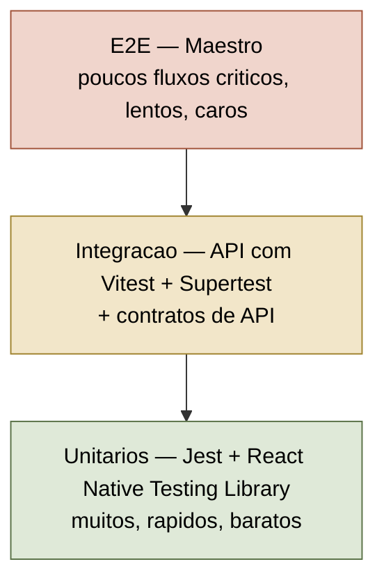
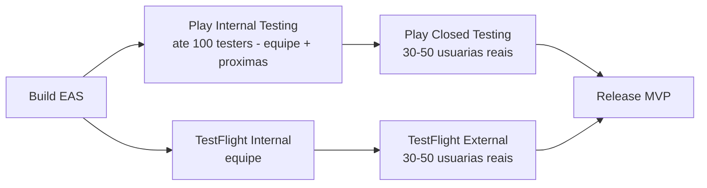
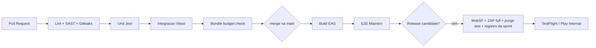

# Plano de Testes — Monta-Looks

Documento de trabalho que define **o que testar, como testar e como registrar** cada teste do app de montagem de looks para mulheres. Cobre o stack Expo/React Native no cliente e a API no backend, com foco especial em segurança de fotos pessoais (LGPD) — ver [[06-seguranca]] — e nos fluxos de assinatura (Grátis, Medium R$19,90/mês, Premium R$24,90/mês) — ver [[04-assinaturas-precos]].

> [!important] Regra do fundador
> **Todo teste executado deve ficar registrado em arquivo `.md`.** Sem registro, o teste não aconteceu. O registro vive no repositório, em `docs/testes/`, um arquivo `REGISTRO-TESTES-sprint-XX.md` por sprint, com evidências versionadas. Nenhuma release sai sem o registro da sprint fechado e revisado. O template obrigatório está na seção [[#7. Sistema de registro de testes]].

Notas relacionadas: [[00-INDEX]] · [[05-frontend]] · [[07-backlog-github]] · [[08-plano-de-testes]] (esta nota).

---

## 1. Pirâmide de testes (stack Expo/React Native)



Proporção-alvo: **~70% unit / ~20% integração / ~10% E2E** (em quantidade de casos). Regra prática: se um bug escapou para E2E ou produção, escrever primeiro o teste unitário ou de integração que o teria pegado.

### 1.1 Testes unitários — Jest + React Native Testing Library

| Item | Definição |
|---|---|
| Ferramentas | `jest` com preset `jest-expo`, `@testing-library/react-native`, `@testing-library/jest-native` (matchers) |
| Onde rodam | Node, sem emulador — em todo commit (pre-push) e em todo PR no CI |
| Alvo de cobertura | 80% em `src/lib` e `src/services` (lógica pura); 60% global. Cobertura é piso, não meta |
| Convenção | `*.test.ts(x)` ao lado do arquivo testado ou em `__tests__/` |

O que **deve** ter teste unitário no MVP:

- Lógica de montagem de look: combinação de peças, filtros por ocasião/clima/estilo, ordenação das indicações.
- Regras de plano: o que Grátis pode ver vs Medium vs Premium (limites de indicações/dia, acesso a fotos geradas, etc.). Cada regra de gating de plano é uma função pura testável.
- Formatação e validação: preços em R$, datas pt-BR, validação de cadastro (e-mail, senha), máscara de telefone.
- Reducers/stores (Zustand/Redux): estados de upload de foto (idle → enviando → sucesso/erro), estado da fila de indicações.
- Componentes de UI críticos com RNTL: paywall (renderiza o plano certo com o preço certo), card de indicação (imagem + CTA), tela de consentimento de foto.
- Utilitários de imagem: cálculo de resize/compressão antes do upload, geração de nome de arquivo sem dados pessoais.

> [!tip] RNTL: testar comportamento, não implementação
> Consultar por `getByRole` / `getByText` / `getByLabelText` (o que a usuária vê), nunca por `testID` como primeira opção. Isso deixa os testes unitários também vigiarem acessibilidade básica (labels ausentes quebram o teste).

### 1.2 Testes de integração — API com Vitest + Supertest

| Item | Definição |
|---|---|
| Ferramentas | `vitest` como runner + `supertest` contra a app HTTP; banco de teste efêmero (Docker/Testcontainers ou SQLite/pg em memória) |
| Escopo | Rotas da API com banco real de teste, auth real (tokens de teste), storage mockado ou bucket de teste isolado |
| Quando rodam | Em todo PR no CI; suíte completa antes de release |

Casos obrigatórios do MVP:

- `POST /auth/registro` e `POST /auth/login`: fluxo feliz, e-mail duplicado, senha fraca, rate limit (5 tentativas → 429).
- `POST /fotos/upload-url`: só usuária autenticada; URL assinada retornada com TTL correto; escopo restrito ao prefixo da própria usuária.
- `GET /indicacoes`: respeita limite do plano (Grátis recebe N/dia, Medium/Premium sem corte); usuária nunca recebe indicação montada com foto de outra usuária.
- `POST /assinatura/webhook`: eventos da loja (compra, renovação, cancelamento, refund) atualizam o plano; evento duplicado é idempotente; assinatura inválida do webhook é rejeitada.
- `DELETE /conta`: dispara o pipeline de purge (ver seção 2.5) e invalida todos os tokens.

### 1.3 E2E — Maestro (recomendado) vs Detox

| Critério | **Maestro (recomendado)** | Detox |
|---|---|---|
| Linguagem dos testes | YAML declarativo, legível por não-dev | JavaScript/TypeScript |
| Setup com Expo | Muito simples: roda contra dev build/EAS build sem código nativo extra | Exige `expo prebuild`/dev client, config nativa por plataforma, manutenção maior |
| Flakiness | Baixa: espera/retry embutidos por padrão | Sincronização fina com a app, mas frágil com animações e timers |
| iOS + Android | Sim, mesmo flow YAML | Sim, com configs separadas |
| CI | Roda em emulador no CI ou Maestro Cloud (builds EAS direto) | Precisa de infra própria de emuladores, builds mais lentos |
| Curva de aprendizado | Horas | Dias/semanas |
| Poder de expressão | Suficiente para fluxos de app (taps, inputs, asserts, deep links) | Maior controle programático (mocks nativos, condições complexas) |
| Comunidade/ritmo | Mantido pela mobile.dev, adoção crescente no ecossistema Expo | Mantido pela Wix, maduro porém setup pesado |

> [!important] Decisão
> **Maestro** para o MVP: time pequeno, stack Expo com EAS, e o custo de manutenção do Detox não se paga nesta fase. Reavaliar Detox somente se surgirem cenários que exijam mock nativo profundo (ex.: simular câmera com imagem específica em CI).

Fluxos E2E obrigatórios (pasta `e2e/` com um `.yaml` por fluxo):

1. `e2e/01-onboarding-cadastro.yaml` — abrir app → cadastro → consentimento de fotos → home.
2. `e2e/02-upload-primeira-foto.yaml` — permissão de galeria → escolher foto → upload → confirmação.
3. `e2e/03-receber-indicacao.yaml` — pedir look para "trabalho" → ver fotos de indicações → abrir detalhe da peça.
4. `e2e/04-favoritar-e-rever.yaml` — favoritar look → fechar app → reabrir → favorito persiste.
5. `e2e/05-paywall-upgrade.yaml` — usuária Grátis atinge limite → paywall com R$19,90 e R$24,90 → fluxo de compra sandbox.
6. `e2e/06-excluir-conta.yaml` — configurações → excluir conta → dupla confirmação → logout forçado.

### 1.4 Contratos de API

- **Fonte de verdade:** especificação OpenAPI 3.1 versionada em `docs/api/openapi.yaml`.
- **Lado cliente:** schemas `zod` gerados/derivados do OpenAPI; toda resposta da API é parseada com zod em runtime de dev e nos testes — divergência quebra o teste, não a usuária.
- **Lado servidor:** validação automática de conformidade com **Schemathesis** (fuzzing baseado no OpenAPI) rodando no CI noturno contra staging.
- **Regra de quebra:** mudança de contrato exige PR que altera `openapi.yaml` + testes + nota de versão. Campo removido/renomeado = major interno, exige janela de compatibilidade porque apps móveis atualizam devagar.

---

## 2. Testes de segurança

> [!warning] Contexto crítico
> O ativo mais sensível do produto são **fotos pessoais de usuárias**. Falha aqui não é bug, é incidente LGPD com dano real a pessoas. Todos os controles abaixo têm detalhamento técnico em [[06-seguranca]]; esta seção define **como verificá-los**.

### 2.1 SAST (análise estática)

| Ferramenta | Escopo | Quando |
|---|---|---|
| Semgrep (regras `p/typescript`, `p/react`, `p/owasp-top-ten`) | Código app + API | Todo PR (bloqueante em findings High/Critical) |
| `eslint-plugin-security` + `eslint-plugin-react-native` | Código app | Todo PR |
| Gitleaks | Segredos em commits | Pre-commit + todo PR (bloqueante) |
| `npm audit` / OSV-Scanner | Dependências | Todo PR + semanal agendado |

### 2.2 DAST — OWASP ZAP

- **Baseline scan** (passivo) contra a API de **staging**: semanal, automatizado no CI, relatório versionado em `docs/testes/seguranca/`.
- **Full scan** (ativo, autenticado com conta de teste): a cada release candidate, executado manualmente e registrado no `REGISTRO-TESTES` da sprint.
- Alvos prioritários: endpoints de upload, endpoints de indicações (IDOR entre usuárias), webhooks de assinatura, headers de segurança.
- Critério de saída: zero findings High/Critical não triados; Medium com issue aberta e prazo.

### 2.3 MobSF no binário

A cada release candidate, rodar **MobSF** (Docker local) sobre o `.apk`/`.aab` e o `.ipa`:

- [ ] Nenhum segredo/API key embutido no bundle JS ou em recursos nativos.
- [ ] Permissões declaradas = mínimo necessário (galeria/câmera; nada de localização/contatos no MVP).
- [ ] Tráfego cleartext desabilitado (Android `usesCleartextTraffic=false`; iOS ATS sem exceções).
- [ ] Certificados e assinatura do pacote corretos.
- [ ] Score MobSF registrado no `REGISTRO-TESTES` da sprint; regressão de score exige justificativa.

### 2.4 URLs assinadas com expiração (fotos)

Caso de teste obrigatório por release (automatizado na suíte de integração + verificação manual na RC):

| Passo | Verificação | Resultado esperado |
|---|---|---|
| 1 | Gerar URL assinada de foto da usuária A (TTL 5 min) | HTTP 200 dentro do TTL |
| 2 | Acessar a mesma URL após o TTL | HTTP 403 (nunca 200) |
| 3 | Acessar a URL logada como usuária B | HTTP 403 — URL não é transferível quando houver política por sessão; no mínimo, TTL curto + path não enumerável |
| 4 | Alterar 1 caractere da assinatura | HTTP 403 |
| 5 | Tentar acesso direto ao objeto sem assinatura (bucket) | Negado — bucket 100% privado |
| 6 | Listar bucket sem credencial | Negado |

### 2.5 Purge de fotos na exclusão de conta (LGPD)

Teste de pipeline completo, executado em staging a cada release e **sempre registrado**:

1. Criar conta de teste, subir 3 fotos (original → gera thumbnails e derivadas de IA).
2. Excluir a conta pelo app.
3. Verificar, com acesso administrativo ao storage: **original, thumbnails e derivadas removidas** do bucket (incluindo prefixos de cache/CDN — invalidar e conferir).
4. Verificar no banco: registros pessoais anonimizados/removidos; logs mantêm apenas ID técnico sem dado pessoal.
5. Verificar fila/job de purge: execução logada com timestamp (trilha de auditoria).
6. Backups: confirmar política documentada de expiração (máx. 30 dias) e que restauração de backup re-executa purge para contas excluídas.
7. Confirmar e-mail de confirmação de exclusão sem conter dados sensíveis.

> [!warning] Este teste nunca é opcional
> Purge de fotos é requisito legal (LGPD, art. 18 — eliminação de dados). Entra na matriz de rastreabilidade como bloqueante de release. Detalhes de implementação em [[06-seguranca]].

---

## 3. Testes de performance

Orçamentos (budgets) medidos em **dispositivo Android intermediário real** (ex.: Moto G ou similar, ~R$1.200) e iPhone mais antigo suportado — não em emulador de máquina de dev.

| Métrica | Meta | Limite (falha) | Como medir |
|---|---|---|---|
| Cold start → primeira tela interativa (TTI) | < 2,0 s | 4,0 s | `adb shell am start -W` / Xcode Instruments; 5 medições, mediana |
| Upload de foto 12 MP (comprimida no cliente) em 4G | < 5 s | 10 s | Throttling de rede + timestamp no app; registrar tamanho pós-compressão (alvo < 1,5 MB) |
| Render do feed de indicações (10 imagens, cache frio) | < 1,5 s | 3 s | Marcadores de performance + gravação de tela |
| Scroll do feed | ≥ 55 fps | < 45 fps | Perf monitor do RN / Flashlight |
| Bundle JS (release, Hermes) | < 8 MB | 12 MB | `npx expo export` + script de verificação no CI (falha o PR se estourar) |
| Tamanho do app (Android, download) | < 40 MB | 60 MB | Play Console / relatório do `.aab` |
| Memória em navegação típica | < 350 MB | 500 MB | Android Studio Profiler / Instruments |

Práticas verificadas por teste:

- Compressão e resize **no cliente** antes do upload (nunca subir a foto bruta).
- `expo-image` com cache em disco para as fotos de indicações; placeholder blurhash.
- Lazy load de telas fora do fluxo principal (paywall, configurações).
- CI com verificação de bundle: PR que aumenta o bundle em > 5% exige justificativa no próprio PR.

---

## 4. Testes de acessibilidade

Meta: **WCAG 2.1 nível AA** no que se aplica a mobile.

| Verificação | Ferramenta/método | Frequência |
|---|---|---|
| Leitores de tela: VoiceOver (iOS) e TalkBack (Android) percorrem cadastro, upload, indicações, paywall e exclusão de conta | Roteiro manual por tela (checklist por release) | Toda RC |
| Todo elemento tocável com `accessibilityLabel` e `accessibilityRole` | `eslint-plugin-react-native-a11y` no CI + revisão RNTL (`getByRole`) | Todo PR |
| Contraste de texto ≥ 4,5:1 (normal) e 3:1 (grande) nos tokens do design system de [[05-frontend]] | Verificador de contraste sobre a paleta; snapshot dos tokens | A cada mudança de tema |
| Alvos de toque ≥ 44×44 pt | Revisão de design + inspeção nos componentes base | A cada componente novo |
| Escala de fonte do sistema até 200% sem corte de texto ou sobreposição | Teste manual com fonte máxima do SO | Toda RC |
| Imagens de indicações com descrição (alt) gerada/definida — "vestido midi floral com jaqueta jeans" | Verificação na API (campo `descricao_acessivel` obrigatório) + teste de integração | Todo PR |
| Reduced motion respeitado nas animações | Teste manual com config do SO | Toda RC |

> [!tip] Acessibilidade é feature de retenção
> Descrições de look bem escritas para leitores de tela também alimentam SEO/compartilhamento e a busca interna. Não tratar como custo.

---

## 5. Testes de usabilidade (moderados)

### 5.1 Desenho da rodada

| Item | Definição |
|---|---|
| Participantes | 5–8 mulheres do público-alvo (18–45 anos, compram roupa online, usam Instagram/Pinterest/afins); recrutar fora do círculo pessoal do time |
| Formato | Moderado, remoto (videochamada com espelhamento) ou presencial; 45–60 min por sessão |
| Consentimento | Termo por escrito: gravação de tela/áudio, uso interno, LGPD (dados descartados após análise) — sem termo, sem sessão |
| Protocolo | Think-aloud: participante narra o que pensa; moderadora não ajuda antes de 2 min de travamento |
| Incentivo | Vale-presente (ex.: R$ 50) por sessão |

### 5.2 Roteiro de tarefas

1. **Primeiro contato:** "Instale e crie sua conta." (observar: fricção no onboarding, reação ao pedido de fotos)
2. **Primeira foto:** "Adicione uma foto sua para receber sugestões." (observar: confiança/hesitação — anotar verbalizações sobre privacidade)
3. **Indicação:** "Você tem um jantar sábado. Use o app para decidir o look." (tarefa central do produto)
4. **Mercado:** "Você gostou de uma peça da sugestão. Descubra onde comprá-la e por quanto."
5. **Planos:** "Descubra o que você ganharia pagando. Qual plano escolheria e por quê?" (testar clareza de Grátis vs R$19,90 vs R$24,90)
6. **Controle:** "Encontre como apagar suas fotos ou sua conta." (confiança = retenção)

### 5.3 Métricas

| Métrica | Como coletar | Meta |
|---|---|---|
| Task success rate | % de tarefas completadas sem ajuda | ≥ 80% por tarefa |
| Tempo por tarefa | Cronometrado na gravação | Tarefa 3 (central) < 3 min |
| SEQ (Single Ease Question, 1–7) | Pergunta ao fim de cada tarefa | Mediana ≥ 5,5 |
| SUS (System Usability Scale, 0–100) | Questionário de 10 itens ao fim da sessão | ≥ 75 (acima da média de mercado ~68) |
| Sinais de confiança | Contagem de verbalizações negativas sobre privacidade nas tarefas 2 e 6 | Tendência de queda entre rodadas |

Cada rodada gera `docs/testes/usabilidade/rodada-XX.md` (mesma regra do fundador): participantes anonimizadas (P1…P8), achados priorizados (crítico/sério/menor), decisões tomadas e issues abertas em [[07-backlog-github]].

---

## 6. Beta (TestFlight / Play Internal)

### 6.1 Estrutura



- **Fase 1 — interna (1 semana):** equipe + 5–10 pessoas próximas. Objetivo: crashes óbvios, fluxo de compra sandbox.
- **Fase 2 — fechada (2–3 semanas):** 30–50 mulheres do público-alvo (recrutadas via lista de espera/Instagram). Objetivo: uso real, retenção, conversão do paywall.
- Instrumentação mínima: crash reporting (Sentry), analytics de funil (onboarding → foto → indicação → paywall), canal de feedback dentro do app.

### 6.2 Critérios de saída do beta (gate de lançamento)

| Critério | Meta | Bloqueante? |
|---|---|---|
| Crash-free sessions | ≥ 99,5% | Sim |
| Bugs P0/P1 abertos | 0 | Sim |
| Purge de fotos validado na versão final (seção 2.5) | Passou | Sim |
| Scan MobSF + ZAP da RC sem High/Critical | Passou | Sim |
| Onboarding → primeira foto | ≥ 60% das novas usuárias | Sim |
| Retenção D7 | ≥ 20% | Não (meta; abaixo disso, revisar produto antes de investir em aquisição) |
| SUS na última rodada de usabilidade | ≥ 75 | Não |
| Compra sandbox dos 2 planos funcionando (iOS e Android) | Passou | Sim |

---

## 7. Sistema de registro de testes

### 7.1 Estrutura no repositório

```
docs/
└── testes/
    ├── REGISTRO-TESTES-sprint-01.md
    ├── REGISTRO-TESTES-sprint-02.md
    ├── evidencias/
    │   ├── sprint-01/
    │   │   ├── e2e-05-paywall.png
    │   │   └── zap-baseline-2026-08-11.html
    │   └── sprint-02/
    ├── seguranca/
    │   └── relatorios ZAP/MobSF versionados
    └── usabilidade/
        └── rodada-01.md
```

Regras de operação:

1. **Um arquivo por sprint**, criado no primeiro dia da sprint a partir do template abaixo.
2. Toda execução de teste (automatizada em release, manual, exploratória, segurança, usabilidade) vira **uma linha na tabela** do registro da sprint.
3. Resultado `FALHOU` **exige** issue aberta no GitHub com link na linha (ver fluxo de bugs em [[07-backlog-github]]).
4. Evidências (screenshots, vídeos curtos, relatórios HTML) em `docs/testes/evidencias/sprint-XX/`, referenciadas por link relativo.
5. O registro da sprint é **revisado no fechamento da sprint** e o status muda para `fechado`. PR de release linka o registro.
6. Suítes automatizadas de CI não precisam de linha por caso: registra-se **a execução da suíte** (link para o run do CI) + os casos que falharam individualmente.

### 7.2 Template (copiar para cada sprint)

````markdown
---
title: Registro de Testes — Sprint XX
sprint: XX
data-inicio: AAAA-MM-DD
data-fim: AAAA-MM-DD
versao-app: 0.0.0 (build NNN)
ambiente: local | staging | producao-beta
tags:
  - monta-looks
  - registro-testes
status: aberto
---

# Registro de Testes — Sprint XX

## Contexto

- **Versão/build testado:**
- **Ambiente:** (dispositivos, SO, backend apontando para...)
- **Executores:** (nome — papel)
- **Escopo da sprint:** (features/US cobertas, link para o board)

## Execuções

| ID | Caso de teste | Tipo | Executor | Data | Resultado | Evidência | Bug/Issue |
|---|---|---|---|---|---|---|---|
| CT-XX-001 | (descrição curta do caso) | unit/int/e2e/seg/perf/a11y/usab/manual | | AAAA-MM-DD | PASSOU / FALHOU / BLOQUEADO | [link](../evidencias/sprint-XX/arquivo.png) | [#NNN](url-da-issue) |

## Suítes automatizadas

| Suíte | Run do CI | Data | Resultado | Casos falhos |
|---|---|---|---|---|
| Unit (Jest) | [link run] | | | |
| Integração (Vitest) | [link run] | | | |
| E2E (Maestro) | [link run] | | | |

## Bugs abertos na sprint

| Issue | Severidade | Descrição curta | Status ao fechar a sprint |
|---|---|---|---|
| [#NNN](url) | P0/P1/P2/P3 | | aberto/corrigido/adiado |

## Observações e riscos

- (flakiness observada, dívidas de teste criadas, decisões)

## Fechamento

- [ ] Todas as linhas com resultado preenchido
- [ ] Todo FALHOU tem issue linkada
- [ ] Evidências versionadas em `evidencias/sprint-XX/`
- [ ] Revisado por: ______ em AAAA-MM-DD
````

### 7.3 Exemplo preenchido (fictício)

````markdown
---
title: Registro de Testes — Sprint 03
sprint: 03
data-inicio: 2026-09-01
data-fim: 2026-09-12
versao-app: 0.3.0 (build 27)
ambiente: staging
tags:
  - monta-looks
  - registro-testes
status: fechado
---

# Registro de Testes — Sprint 03

## Contexto

- **Versão/build testado:** 0.3.0 (build 27), EAS build a1b2c3
- **Ambiente:** staging; Moto G54 (Android 14), iPhone 12 (iOS 18); API staging.montalooks.app
- **Executores:** Gabriel (dev/QA), Mariana (design — sessão a11y)
- **Escopo da sprint:** Upload de foto (US-12, US-13), paywall (US-21)

## Execuções

| ID | Caso de teste | Tipo | Executor | Data | Resultado | Evidência | Bug/Issue |
|---|---|---|---|---|---|---|---|
| CT-03-001 | Upload de foto 12 MP em 4G < 5 s | perf | Gabriel | 2026-09-08 | PASSOU (3,8 s) | [print](../evidencias/sprint-03/upload-4g.png) | — |
| CT-03-002 | URL assinada expira após TTL de 5 min | seg | Gabriel | 2026-09-08 | PASSOU (403 após 5m02s) | [log](../evidencias/sprint-03/url-expira.txt) | — |
| CT-03-003 | Paywall mostra R$ 19,90 e R$ 24,90 corretos | e2e | Gabriel | 2026-09-09 | FALHOU — Medium exibiu "R$ 19,9" | [video](../evidencias/sprint-03/paywall-preco.mp4) | [#87](https://github.com/org/monta-looks/issues/87) |
| CT-03-004 | TalkBack percorre fluxo de upload | a11y | Mariana | 2026-09-10 | FALHOU — botão de galeria sem label | [video](../evidencias/sprint-03/talkback-upload.mp4) | [#88](https://github.com/org/monta-looks/issues/88) |
| CT-03-005 | ZAP baseline na API staging | seg | Gabriel | 2026-09-11 | PASSOU (0 High, 2 Medium triados) | [relatorio](../evidencias/sprint-03/zap-2026-09-11.html) | [#89](https://github.com/org/monta-looks/issues/89) |

## Suítes automatizadas

| Suíte | Run do CI | Data | Resultado | Casos falhos |
|---|---|---|---|---|
| Unit (Jest) | [run 412](https://github.com/org/monta-looks/actions/runs/412) | 2026-09-11 | 214/214 PASSOU | — |
| Integração (Vitest) | [run 412](https://github.com/org/monta-looks/actions/runs/412) | 2026-09-11 | 47/48 | `assinatura.webhook.duplicado` (flaky, reaberto #90) |
| E2E (Maestro) | [run 413](https://github.com/org/monta-looks/actions/runs/413) | 2026-09-11 | 5/6 | `05-paywall-upgrade` (ver CT-03-003) |

## Bugs abertos na sprint

| Issue | Severidade | Descrição curta | Status ao fechar a sprint |
|---|---|---|---|
| [#87](https://github.com/org/monta-looks/issues/87) | P1 | Formatação de preço trunca centavos no Medium | corrigido (build 28) |
| [#88](https://github.com/org/monta-looks/issues/88) | P2 | Botão de galeria sem accessibilityLabel | corrigido |
| [#89](https://github.com/org/monta-looks/issues/89) | P3 | ZAP: header CSP ausente em /health | adiado p/ sprint 04 |
| [#90](https://github.com/org/monta-looks/issues/90) | P2 | Teste de webhook duplicado flaky | aberto |

## Observações e riscos

- Flakiness no teste de webhook: suspeita de corrida no banco de teste; investigar Testcontainers com isolamento por teste.
- Dívida: fluxo `06-excluir-conta` ainda sem E2E — prioridade da sprint 04.

## Fechamento

- [x] Todas as linhas com resultado preenchido
- [x] Todo FALHOU tem issue linkada
- [x] Evidências versionadas em `evidencias/sprint-03/`
- [x] Revisado por: Gabriel em 2026-09-12
````

---

## 8. Matriz de rastreabilidade — feature x teste (MVP)

Features conforme épicos do backlog em [[07-backlog-github]]. Toda feature nova entra nesta matriz **antes** do desenvolvimento começar; célula vazia em coluna obrigatória bloqueia a release.

| Feature (épico) | Unit | Integração | E2E (Maestro) | Segurança | Performance | A11y | Usabilidade |
|---|---|---|---|---|---|---|---|
| Cadastro/login | validação de formulário, store de auth | rotas auth + rate limit | `01-onboarding-cadastro` | SAST; ZAP (auth) | cold start | roteiro leitor de tela | tarefa 1 |
| Consentimento e privacidade de fotos | tela de consentimento renderiza termos | flag de consentimento persistida | dentro do `01` | revisão LGPD em [[06-seguranca]] | — | contraste/labels | tarefas 2 e 6 |
| Upload de foto | compressão/resize, store de upload | URL assinada escopada, TTL | `02-upload-primeira-foto` | CT de URL assinada (2.4); MobSF permissões | budget de upload | labels galeria/câmera | tarefa 2 |
| Indicações de looks (fotos) | lógica de combinação, filtros, gating por plano | `GET /indicacoes` + isolamento entre usuárias | `03-receber-indicacao` | IDOR no ZAP full | render do feed, fps | descrição acessível das imagens | tarefa 3 |
| Mercado (melhores opções de peças/marcas) | ordenação/precificação exibida em R$ | rota de catálogo/afiliados | dentro do `03` (detalhe da peça) | validação de links externos | cache de imagens | labels dos cards | tarefa 4 |
| Favoritos | store de favoritos | persistência por usuária | `04-favoritar-e-rever` | — | — | estado de botão anunciado | — |
| Assinaturas e paywall (Grátis/Medium/Premium) | regras de plano, formatação R$ 19,90 / R$ 24,90 | webhooks da loja (idempotência) | `05-paywall-upgrade` (compra sandbox) | assinatura do webhook | lazy load do paywall | leitor de tela no paywall | tarefa 5 |
| Exclusão de conta + purge | máquina de estados da exclusão | `DELETE /conta` + invalidação de tokens | `06-excluir-conta` | **purge completo (2.5) — bloqueante** | — | fluxo com leitor de tela | tarefa 6 |

> [!tip] Como manter a matriz viva
> A matriz é revisada no planejamento de cada sprint: nova US → nova linha ou célula. No fechamento, o `REGISTRO-TESTES-sprint-XX.md` deve cobrir toda célula tocada pelas features da sprint.

---

## 9. Pipeline de qualidade no CI (visão geral)



Definição de pronto de qualquer US: código + testes das colunas obrigatórias da matriz + linha no registro da sprint quando houver execução manual.
